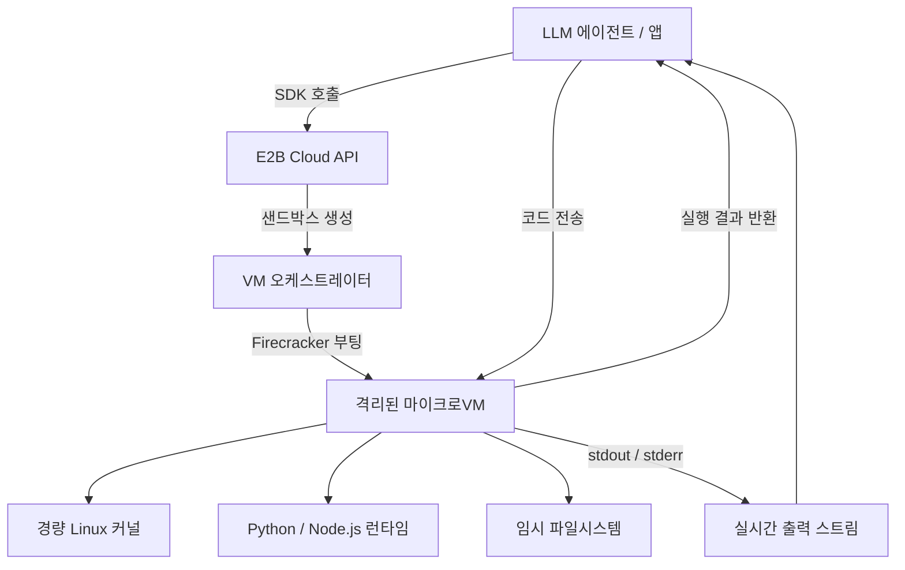
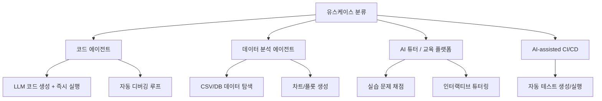

# E2B - AI 코드 실행 샌드박스

E2B(Execute to Build)는 AI 에이전트와 LLM 애플리케이션을 위한 클라우드 기반 코드 실행 샌드박스 플랫폼이다. LLM이 생성한 코드를 격리된 환경에서 안전하게 실행할 수 있도록 Firecracker(파이어크래커) 마이크로VM(microVM) 기술을 기반으로 한다. OpenAI Code Interpreter의 오픈소스 대안으로 시작되어, 현재는 프로덕션 AI 에이전트에서 널리 활용되는 핵심 인프라 컴포넌트로 자리잡았다.

## 정체성

| 항목 | 내용 |
|------|------|
| 공식 명칭 | E2B (Execute to Build) |
| 회사 | E2B, Inc. |
| 오픈소스 여부 | SDK 오픈소스 (`e2b-dev/e2b-code-interpreter`), 클라우드 인프라 SaaS |
| 주요 라이선스 | Apache 2.0 (SDK) |
| 출시 | 2023년 (공개 베타), 2024년 GA |
| 가격 모델 | 사용량 기반 과금 (컴퓨팅 시간 + 스토리지) / 무료 티어 제공 |
| 공식 문서 | https://e2b.dev/docs |

## 핵심 아키텍처



위 다이어그램은 SDK 호출부터 Firecracker VM 생성, 코드 실행, 결과 반환까지의 전체 흐름을 보여준다.

## 핵심 기능

### 1. 격리 샌드박스 (Isolated Sandbox)
각 실행 요청은 독립된 Firecracker 마이크로VM 위에서 동작한다. 마이크로VM은 전통적인 컨테이너(Docker)보다 강력한 하드웨어 수준 격리를 제공하며, KVM(커널 기반 가상머신)을 활용한다. 샌드박스 간 네트워크 격리, 파일시스템 격리, 프로세스 격리가 기본 보장된다.

### 2. 빠른 기동 시간 (Fast Boot)
Firecracker는 AWS Lambda에서 검증된 마이크로VM 기술로, 일반 VM 대비 부팅 시간이 100-300ms 수준이다. AI 에이전트가 코드를 생성하고 즉시 실행 피드백을 받는 루프에서 지연이 최소화된다.

### 3. 코드 인터프리터 SDK
`e2b-code-interpreter` 패키지는 Jupyter 노트북과 유사한 셀 단위 실행 방식을 제공한다. 이전 셀의 변수/상태가 다음 셀에서 유지되는 세션 방식으로, 멀티스텝 데이터 분석이나 이터레이티브 디버깅에 적합하다.

```python
from e2b_code_interpreter import Sandbox

# 샌드박스 생성 (기본 환경: Python 3.11)
with Sandbox() as sandbox:
    # 코드 실행 - 세션 상태 유지
    execution = sandbox.run_code("x = 42")
    
    # 이전 변수 참조 가능
    result = sandbox.run_code("print(x * 2)")
    print(result.text)  # 84
    
    # 파일 업로드 및 처리
    sandbox.files.write("/data/input.csv", open("local.csv", "rb").read())
    result = sandbox.run_code("import pandas as pd; df = pd.read_csv('/data/input.csv'); print(df.head())")
```

### 4. 파일시스템 접근
샌드박스 내부로 파일 업로드, 샌드박스에서 파일 다운로드가 SDK를 통해 직접 지원된다. AI 에이전트가 데이터셋을 업로드하고, 처리 결과 파일을 다운받는 패턴이 자연스럽게 구성된다.

### 5. 패키지 설치
런타임 중 `pip install` 명령을 코드 내에서 실행할 수 있으며, 커스텀 Docker 이미지를 기반으로 한 샌드박스 템플릿도 지원한다.

```python
# 런타임 패키지 설치
sandbox.run_code("!pip install matplotlib seaborn")
sandbox.run_code("""
import matplotlib.pyplot as plt
import seaborn as sns
import numpy as np

data = np.random.randn(100)
sns.histplot(data)
plt.savefig('/output/plot.png')
""")

# 결과 이미지 다운로드
png_bytes = sandbox.files.read("/output/plot.png")
```

### 6. 멀티언어 지원
Python이 기본이지만 Node.js, JavaScript, Bash 등도 실행 가능하다. 각 런타임별 전용 SDK 메서드를 제공한다.

### 7. 스트리밍 출력
`run_code()` 호출 시 `on_stdout`, `on_stderr` 콜백으로 실시간 스트리밍을 지원한다. 장시간 실행되는 ML 학습 스크립트의 진행 로그를 실시간으로 받아 사용자에게 전달하는 패턴에 유용하다.

```python
def 출력_핸들러(메시지):
    print(f"[샌드박스] {메시지}")

sandbox.run_code(
    "for i in range(10): print(f'Step {i}')",
    on_stdout=출력_핸들러
)
```

## 차별점 - 경쟁 도구 비교

| 항목 | E2B | Modal | AWS Lambda | Docker |
|------|-----|-------|-----------|--------|
| 격리 수준 | VM (Firecracker) | VM (gVisor/Firecracker) | VM | 컨테이너 (네임스페이스) |
| 부팅 속도 | 100-300ms | 200-500ms | 수십ms (웜) | 수백ms (이미지 풀) |
| AI 코드 실행 특화 | 네 (세션 유지, REPL) | 일반 목적 | 일반 목적 | 일반 목적 |
| Jupyter 세션 | 지원 | 미지원 | 미지원 | 별도 구성 필요 |
| 오픈소스 SDK | 네 | 네 | 아니오 | 아니오 |
| GPU 지원 | 제한적 | 풍부 (A100/H100) | 아니오 | 호스트 의존 |
| 최대 실행 시간 | 24시간 (샌드박스) | 무제한 (태스크) | 15분 | 무제한 |

E2B의 핵심 차별점은 **AI 에이전트를 위한 세션 유지형 REPL(Read-Eval-Print Loop)** 환경이다. 단순 함수 실행이 아니라 변수/임포트 상태가 유지되는 인터랙티브 인터프리터를 제공한다는 점이 Modal이나 Lambda 같은 서버리스 함수 플랫폼과 다르다.

## 실무 사용 가이드

### 에이전트 코드 실행 패턴

LLM이 생성한 코드를 안전하게 실행하는 가장 일반적인 패턴:

```python
from e2b_code_interpreter import Sandbox
import anthropic

client = anthropic.Anthropic()

def 에이전트_코드_실행_루프(사용자_질문: str) -> str:
    """LLM이 코드를 생성하고 샌드박스에서 실행하는 루프"""
    
    with Sandbox() as sandbox:
        메시지들 = [{"role": "user", "content": 사용자_질문}]
        
        while True:
            응답 = client.messages.create(
                model="claude-opus-4-5",
                max_tokens=4096,
                tools=[{
                    "name": "코드_실행",
                    "description": "Python 코드를 실행하고 결과를 반환한다",
                    "input_schema": {
                        "type": "object",
                        "properties": {
                            "code": {"type": "string", "description": "실행할 Python 코드"}
                        },
                        "required": ["code"]
                    }
                }],
                messages=메시지들
            )
            
            if 응답.stop_reason == "end_turn":
                # 텍스트 응답 추출
                return next(
                    블록.text for 블록 in 응답.content
                    if hasattr(블록, "text")
                )
            
            # 도구 호출 처리
            도구_결과들 = []
            for 블록 in 응답.content:
                if 블록.type == "tool_use" and 블록.name == "코드_실행":
                    실행_결과 = sandbox.run_code(블록.input["code"])
                    출력 = 실행_결과.text or 실행_결과.error or "(출력 없음)"
                    도구_결과들.append({
                        "type": "tool_result",
                        "tool_use_id": 블록.id,
                        "content": 출력
                    })
            
            메시지들.append({"role": "assistant", "content": 응답.content})
            메시지들.append({"role": "user", "content": 도구_결과들})

# 사용 예시
결과 = 에이전트_코드_실행_루프("피보나치 수열의 첫 20개 값을 계산하고 시각화해줘")
print(결과)
```

### 커스텀 샌드박스 템플릿

ML 라이브러리가 사전 설치된 커스텀 환경을 만들 수 있다:

```dockerfile
# Dockerfile (e2b.toml과 함께 저장)
FROM e2bdev/code-interpreter:latest

RUN pip install \
    torch torchvision \
    transformers datasets \
    scikit-learn xgboost \
    pandas numpy matplotlib seaborn
```

```toml
# e2b.toml
[template]
dockerfile = "Dockerfile"
name = "ml-sandbox"
```

```bash
# 커스텀 템플릿 빌드 및 배포
e2b template build
```

```python
# 커스텀 템플릿 사용
from e2b_code_interpreter import Sandbox

with Sandbox(template="ml-sandbox") as sandbox:
    # PyTorch가 이미 설치된 환경
    result = sandbox.run_code("""
import torch
model = torch.nn.Linear(10, 1)
print(f'모델 파라미터 수: {sum(p.numel() for p in model.parameters())}')
""")
```

### 장기 실행 샌드박스

데이터 전처리나 모델 파인튜닝같은 장시간 작업:

```python
# 샌드박스를 컨텍스트 매니저 없이 사용 (명시적 생명주기 관리)
from e2b_code_interpreter import Sandbox

sandbox = Sandbox(timeout=3600)  # 1시간 타임아웃

try:
    # 데이터셋 업로드
    with open("large_dataset.parquet", "rb") as f:
        sandbox.files.write("/data/dataset.parquet", f.read())
    
    # 장시간 처리 시작
    sandbox.run_code("""
import pandas as pd
df = pd.read_parquet('/data/dataset.parquet')
result = df.groupby('category').agg({'value': ['mean', 'std', 'count']})
result.to_csv('/output/result.csv')
print('처리 완료')
""", timeout=2400)
    
    # 결과 다운로드
    output_data = sandbox.files.read("/output/result.csv")
    
finally:
    sandbox.close()
```

## E2B가 적합한 유스케이스



**가장 적합한 상황:**
- AI 에이전트가 코드를 생성하고 결과를 보면서 수정하는 반복 루프
- 사용자 제공 코드를 안전하게 실행해야 하는 플랫폼 (다중 테넌트)
- 데이터 분석 + 시각화를 자동화하는 에이전트
- 코딩 교육 플랫폼에서 실습 채점

## 한계 및 트레이드오프

### 성능 제약
- **GPU 미지원 (기본):** Firecracker는 GPU 패스스루(passthrough)를 기본 지원하지 않는다. GPU가 필요한 ML 추론은 [[modal-com-runtime]]이나 [[inferless-deployment]] 같은 GPU 특화 플랫폼을 고려해야 한다.
- **메모리 제한:** 기본 샌드박스는 메모리가 제한적이다. 대용량 모델 로딩은 불가.
- **콜드 스타트:** 100-300ms 부팅은 일반 컨테이너보다 빠르지만 웜 Lambda 함수보다는 느리다.

### 비용 구조
- 계산 시간과 저장 용량에 따라 과금. 대량의 단발성 실행이 많으면 비용이 빠르게 증가할 수 있다.
- 무료 티어는 작은 규모의 개발/테스트에 적합하지만 프로덕션에는 부족.

### 네트워크 정책
- 샌드박스에서 외부 인터넷 접근은 기본 허용되어 있으나, 악의적 코드의 네트워크 공격 벡터에 주의 필요.
- 엔터프라이즈 플랜에서 네트워크 격리 옵션 지원.

### 상태 비저장 재시작
- 샌드박스 종료 시 파일시스템과 메모리 상태는 모두 삭제된다. 영구 저장이 필요하면 외부 스토리지 (S3, [[modal-volumes-storage]] 등)와 연계해야 한다.

## E2B Desktop Sandbox (데스크톱 샌드박스)

2024년 말 공개된 데스크톱 환경 샌드박스. 완전한 Linux 데스크톱 GUI를 샌드박스 내에서 실행하고, 스크린샷/클릭/키 입력을 API로 제어할 수 있다. 브라우저 자동화나 GUI 기반 소프트웨어 테스팅 에이전트에 활용된다. [[browser-automation-agents]] 참조.

## 에코시스템 통합

E2B는 주요 AI 프레임워크들과 공식 통합을 제공한다:

- **LangChain:** `langchain-e2b` 패키지로 LangChain 도구 인터페이스 제공
- **CrewAI:** CrewAI 도구 목록에서 E2B 샌드박스 직접 사용 가능
- **OpenAI Assistants API:** Code Interpreter 대체제로 활용
- **Mastra:** [[mastra.md]] 에이전트 워크플로우에서 코드 실행 도구로 연동

## 관련 문서

- [[modal-volumes-storage]] - Modal Volumes 영구 스토리지 (E2B 임시 FS의 보완재)
- [[inferless-deployment]] - 서버리스 GPU 추론 (E2B가 미지원하는 GPU 워크로드)
- [[modal-com-runtime]] - Modal 범용 클라우드 런타임
- [[microvm-agent-sandboxes]] - 마이크로VM 기반 에이전트 샌드박스 개요
- [[wasm-agent-sandboxing]] - WebAssembly 기반 샌드박스 대안
- [[openai-agents-sdk-sandbox]] - OpenAI Agents SDK 샌드박스
- [[browser-automation-agents]] - 브라우저 자동화 에이전트
