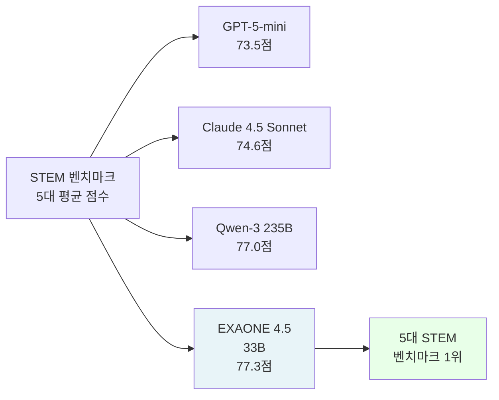
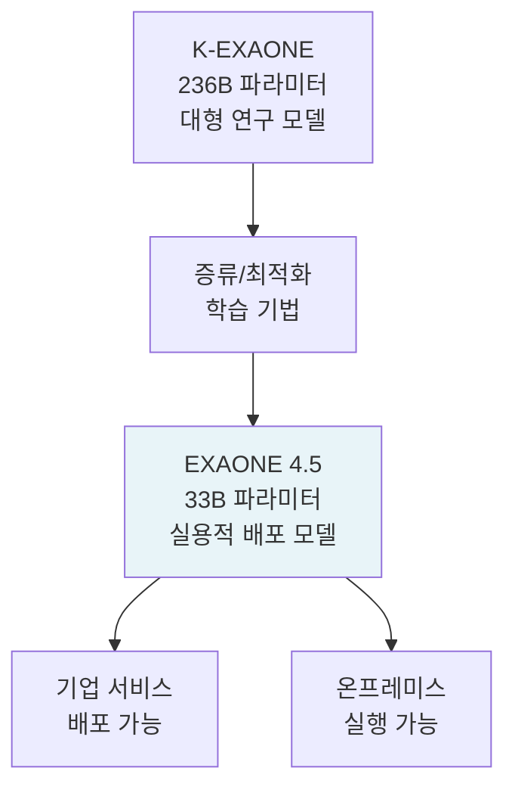
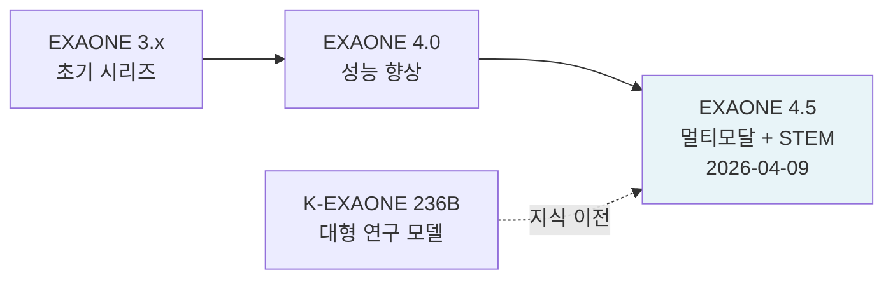

# EXAONE 4.5 - LG AI 연구소 33B 멀티모달 STEM 추론 모델

EXAONE 4.5는 2026년 4월 9일 LG AI 연구소가 발표한 33B 파라미터 멀티모달(텍스트+이미지) 언어 모델이다. 5대 STEM(과학·기술·공학·수학) 벤치마크 평균 77.3점으로 GPT-5-mini(73.5), Claude 4.5 Sonnet(74.6), Qwen-3 235B(77.0)을 상회하며, 한국 AI 연구소의 플래그십 모델로 자리매김했다. K-EXAONE(236B)의 1/7 크기로 유사 성능을 달성한 것이 핵심 성과다.

## 개요

| 항목 | 내용 |
|------|------|
| 발표일 | 2026년 4월 9일 |
| 개발사 | LG AI 연구소 |
| 파라미터 | 33B |
| 모달리티 | 텍스트 + 이미지 (멀티모달) |
| STEM 벤치마크 | 77.3점 (5대 평균) |
| 비교 대상 | K-EXAONE 236B의 1/7 크기로 유사 성능 |
| 포지셔닝 | 한국 AI 연구소 플래그십 |

## 성능 포지셔닝



33B라는 비교적 소형 모델이 235B MoE(Qwen-3 235B)와 GPT-5-mini를 STEM 벤치마크에서 능가한다는 점이 주목받는다.

## 5대 STEM 벤치마크

EXAONE 4.5가 우위를 보인 5대 STEM 벤치마크는 수학, 과학, 코딩, 추론 등 기술적 능력을 측정한다. 구체적 벤치마크 명칭은 LG AI 연구소 공식 발표 자료 참조 권장 [교차검증 필요].

모델이 특히 강점을 보이는 영역:
- **수학 추론**: 복잡한 수학 문제 풀이 및 증명
- **과학 QA**: 물리, 화학, 생물학 지식 기반 문답
- **코딩**: 알고리즘 구현 및 기술 면접형 문제
- **논리 추론**: 다단계 추론 체인 구성

## 크기 효율성: 33B가 236B를 대체하는 방법

### K-EXAONE 236B와의 관계

LG AI 연구소는 기존에 K-EXAONE 236B 대형 모델을 운용해왔다. EXAONE 4.5는 그 1/7 크기(33B)로 유사한 STEM 성능을 달성했다. 이는 [[knowledge-distillation]] 또는 데이터 효율적 학습 기법을 통해 이루어졌을 가능성이 높다 [교차검증 필요].



### 실용적 함의

33B 파라미터는:
- 고사양 소비자 GPU(48-80GB VRAM) 또는 2-4개 전문 GPU에서 서빙 가능
- 기업 온프레미스 배포 현실적
- 클라우드 서빙 비용이 대형 모델 대비 7배 이하

## 멀티모달 능력

EXAONE 4.5는 텍스트와 이미지를 함께 처리하는 멀티모달 입력을 지원한다. STEM 맥락에서의 멀티모달 활용 예시:

- 수식이 포함된 과학 논문 이미지 분석
- 공학 도면/다이어그램 해석
- 수학 문제 이미지에서 텍스트 추출 후 풀이
- 실험 결과 그래프 해석

## 한국 AI 생태계 맥락

EXAONE 4.5는 한국 AI 산업의 맥락에서 다음 의의를 갖는다:

1. **LG의 AI 역량 과시**: LG전자, LG화학 등 LG 그룹 계열사의 AI 전환을 지원하는 기반 모델
2. **한국어 특화 가능성**: EXAONE 시리즈는 한국어-영어 이중언어 능력을 중시해왔으며, 4.5도 이를 계승 [교차검증 필요]
3. **글로벌 경쟁**: GPT-5-mini, Claude 4.5 Sonnet 대비 STEM에서 우위를 공식 주장하는 첫 국내 모델

## [[meta-llama]]와의 관계

EXAONE 4.5는 Meta의 [[meta-llama]] 아키텍처를 기반으로 하거나, 유사한 트랜스포머 아키텍처를 채택했을 가능성이 있다 [교차검증 필요]. LG AI 연구소는 공개 LLM 아키텍처를 기반으로 내부 학습 파이프라인을 적용하는 방식을 사용해온 것으로 알려져 있다.

## EXAONE 시리즈 진화



## 실무 활용 시나리오

### LG 그룹 내부 활용

- LG전자 스마트 가전 제품 개발 지원 (기술 문서 분석, 코드 생성)
- LG화학 연구 데이터 분석 및 논문 요약
- LG CNS IT 서비스 자동화

### 외부 API 서빙

LG AI 연구소는 EXAONE API를 외부에 제공할 것으로 예상된다. STEM 특화 성능은 교육, 연구, 기술 기업 고객에게 경쟁력 있다.

```python
# EXAONE 4.5 API 활용 예시 (공식 API 출시 전, 개략적 패턴)
import httpx

client = httpx.Client(base_url="https://api.lgai.ai/v1")  # 가상 엔드포인트

response = client.post("/chat/completions", json={
    "model": "exaone-4.5-33b",
    "messages": [
        {
            "role": "user",
            "content": [
                {"type": "text", "text": "이 회로 다이어그램을 분석하고 잠재적 결함을 찾아줘."},
                {"type": "image_url", "image_url": {"url": "data:image/jpeg;base64,..."}}
            ]
        }
    ]
})
```

## 왜 중요한가

EXAONE 4.5는 여러 관점에서 주목할 이정표다:

1. **33B로 77.3점**: 크기 대비 성능의 새 기준을 제시하며, STEM 특화 학습의 효과 입증
2. **국내 연구 기관의 프론티어 경쟁**: 한국 AI 연구소가 글로벌 프론티어 모델 수준의 성능을 공식 벤치마크에서 달성
3. **멀티모달 STEM 융합**: 이미지+텍스트로 실제 과학기술 문서 처리가 가능한 모델

## 관련 문서

- [[meta-llama]] - 기반 아키텍처 계보
- [[knowledge-distillation]] - 대형 모델에서 소형 모델로 능력 이전 기법
- [[multimodal-llm]] - 멀티모달 언어 모델 개념
- [[qwen-3-6]] - 동시기 비교 대상 오픈소스 모델 (STEM 경쟁)
- [[exaone-architecture]] - EXAONE 내부 구조 상세 (향후 작성 예정)
