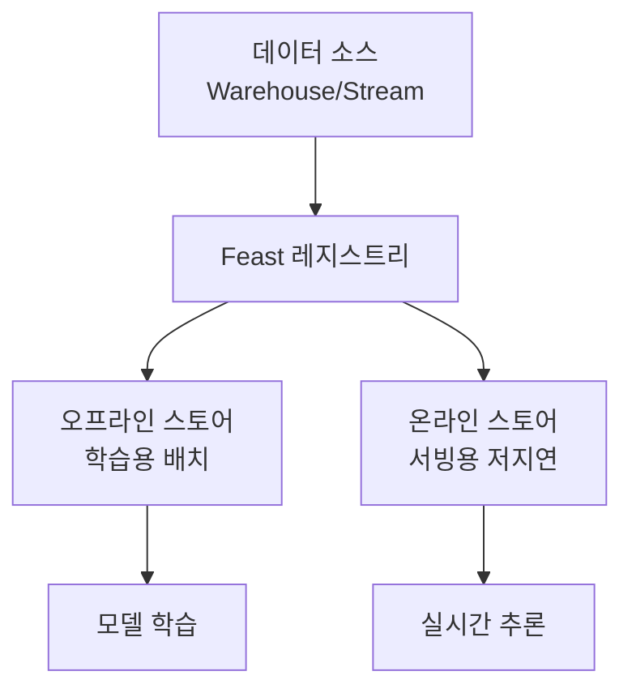

# Feast

ML 모델을 위한 피처 저장/관리/서빙 오픈소스 피처 스토어. 학습과 서빙 사이의 **피처 일관성(training-serving skew)**을 보장하고, 팀 간 피처 재사용을 가능하게 한다.

## 핵심 가치

- **Training-Serving Skew 방지**: 동일 피처 정의를 학습과 서빙에서 재사용
- **피처 카탈로그**: 팀 간 피처 공유 및 발견
- **시점 정확성(Point-in-Time)**: 학습 시 미래 데이터 유출 방지

## 관련 문서

- [[mlflow]] -- MLflow
- [[model-serving]] -- 모델 서빙
- [[feature-engineering]] -- 특성 공학
