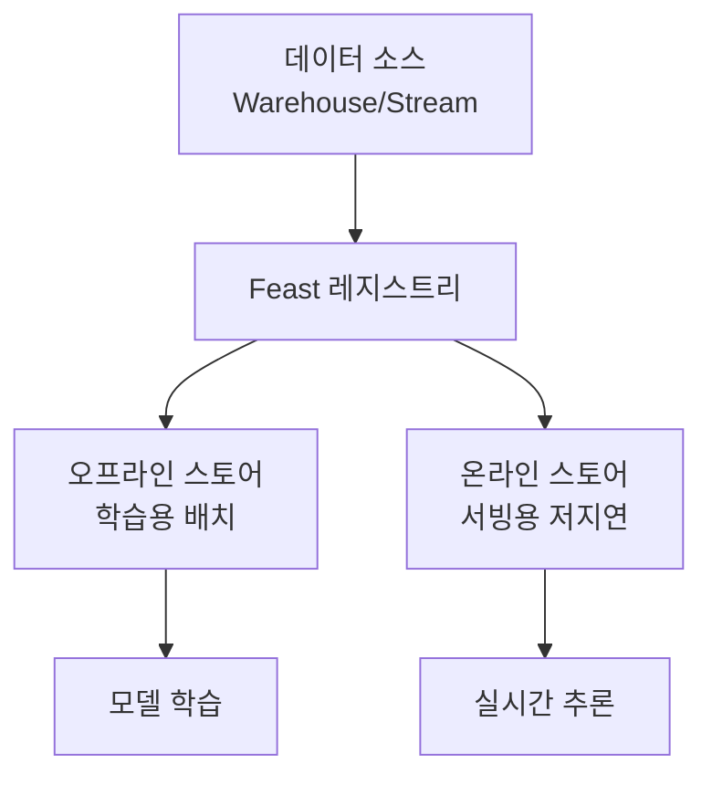
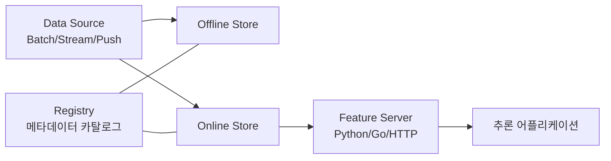

# Feast

ML 모델을 위한 피처 저장/관리/서빙 오픈소스 피처 스토어. 학습과 서빙 사이의 **피처 일관성(training-serving skew)**을 보장하고, 팀 간 피처 재사용을 가능하게 한다. 원래 Gojek + Google이 공동 개발했고 이후 Linux Foundation AI & Data 산하 인큐베이션 프로젝트로 자리잡았으며, 상용 호스팅 버전인 Tecton과 차별화된 오픈소스 라우트로 운영된다.



## 핵심 가치

- **Training-Serving Skew 방지**: 동일 피처 정의를 학습과 서빙에서 재사용
- **피처 카탈로그**: 팀 간 피처 공유 및 발견
- **시점 정확성(Point-in-Time)**: 학습 시 미래 데이터 유출 방지
- **멀티 백엔드**: Warehouse, Stream, Vector DB까지 통합 가능한 추상화 레이어

## 아키텍처: 4대 컴포넌트

Feast 공식 문서는 크게 네 개 컴포넌트(+ Compute Engine, Provider, Authorization Manager, OpenTelemetry Integration)를 핵심으로 정의한다.



- **Offline Store**: 학습용 배치 피처 데이터의 출처. 시점 정확 조인(Point-in-Time Join)을 책임진다. 지원 백엔드는 Snowflake, BigQuery, Redshift, DuckDB, Dask, Spark, PostgreSQL, Trino, Athena, Clickhouse, Azure Synapse, Ray 등이며 Remote Offline / Hybrid 옵션도 제공한다.
- **Online Store**: 서빙 시 저지연(< 10ms) 룩업을 담당하는 키-값 저장소. 공식 문서가 명시하는 옵션은 Redis, DynamoDB, Bigtable, PostgreSQL, MySQL, Cassandra/Astra, Couchbase, Hazelcast, ScyllaDB, MongoDB, SQLite, Snowflake, Dragonfly, HBase, Datastore, SingleStore 등이며 벡터 검색을 위한 Elasticsearch, Qdrant, Milvus, Faiss까지 포함한다. 이 점에서 [[agentic-rag]] 시나리오에도 활용 가능하다.
- **Registry**: Feature View / Entity / Data Source / Feature Service 정의의 메타데이터 카탈로그. 파일 기반 / SQL 기반 백엔드를 지원하며 팀 단위 검색·거버넌스의 단일 진실 소스(SoT)다.
- **Feature Server**: Python(메인) 또는 Go(알파)로 구현된 피처 서빙 서버. SDK 호출 외에 HTTP/REST(또는 gRPC)로 외부 어플리케이션이 직접 호출할 수 있어 [[model-serving]] 스택과 자연스럽게 결합된다.

## 핵심 추상화 (Python 데코레이터)

Feast는 모든 도메인 개체를 Python 데코레이터로 선언한다.

```python
from datetime import timedelta
from feast import Entity, FeatureView, Field, FileSource
from feast.types import Float32, Int64

driver = Entity(name="driver", join_keys=["driver_id"])

driver_stats_source = FileSource(
    path="data/driver_stats.parquet",
    timestamp_field="event_timestamp",
)

driver_stats_fv = FeatureView(
    name="driver_hourly_stats",
    entities=[driver],
    ttl=timedelta(days=1),
    schema=[
        Field(name="conv_rate", dtype=Float32),
        Field(name="acc_rate", dtype=Float32),
        Field(name="avg_daily_trips", dtype=Int64),
    ],
    source=driver_stats_source,
)
```

- **Entity**: 피처가 설명하는 대상(예: driver, user). join key를 통해 데이터 소스와 결합된다.
- **Data Source**: FileSource(Parquet), BigQuerySource, KafkaSource, KinesisSource, PushSource 등. 배치-스트림 동시 지원.
- **Feature View**: 한 데이터 소스에서 파생된 feature들의 집합. TTL, 스키마, 태그가 부여된다. **Batch / Stream Feature View** 두 모드를 지원하며, Stream Feature View는 Spark 등 실행 엔진으로 변환을 수행한다.
- **On-Demand Feature View**: `@on_demand_feature_view` 데코레이터로 요청 시 계산되는 피처. 다른 Feature View 출력 + 요청 입력을 받아 Pandas/Polars 함수로 변환한다. [[feature-engineering]] 파이프라인의 마지막 단계를 서빙 경로에 위치시킨다.

```python
@on_demand_feature_view(
    sources=[driver_hourly_stats_view, input_request],
    schema=[Field(name="transformed_conv_rate", dtype=Float32)],
)
def transformed_conv_rate(features_df: pd.DataFrame) -> pd.DataFrame:
    df = pd.DataFrame()
    df["transformed_conv_rate"] = features_df["conv_rate"] * features_df["acc_rate"]
    return df
```

## Push API와 실시간 피처

스트리밍·이벤트성 피처는 Push Source로 처리한다. 호출 한 번으로 온라인/오프라인 양쪽에 동시 적재할 수 있다.

```python
fs.push(
    "driver_stats_push_source",
    feature_data_frame,
    to=PushMode.ONLINE_AND_OFFLINE,
)
```

- `PushMode.ONLINE`(기본), `PushMode.OFFLINE`, `PushMode.ONLINE_AND_OFFLINE` 3가지 모드.
- `batch_source`를 선택적으로 지정해 시점 정확 학습 데이터 생성에도 활용. 임베딩처럼 학습이 끝난 후 생성되는 피처는 batch_source 없이도 사용 가능.

## 프로덕션 배포 패턴

- **Feature Server**: Kubernetes에서 Python(또는 Go) 서버를 배포하고, 추론 서비스가 HTTP로 `/get-online-features` 호출. P99 < 50ms 수준이 일반 목표.
- **Materialization Job**: 주기적으로 Offline → Online 동기화. Airflow/Prefect/Dagster ([[ai-data-pipeline-automation]]) 같은 오케스트레이터에서 `feast materialize-incremental` 호출.
- **RBAC + AuthZ**: Authorization Manager가 Feature View 단위 액세스 제어를 담당. 엔터프라이즈 환경의 데이터 거버넌스 요건 대응.
- **OpenTelemetry**: feature retrieval latency, freshness 등을 OTel로 export 가능. [[opentelemetry-genai-semconv]]와 결합 가능.

## Tecton(상용) vs Feast(오픈소스)

| 항목 | Feast | Tecton |
|------|-------|--------|
| 라이선스 | Apache 2.0 (오픈소스) | 상용 SaaS |
| 운영 책임 | 사용자 자체 호스팅 | 매니지드 |
| 변환 엔진 | Spark/Pandas, On-Demand FV | 자체 변환 엔진 (배치/스트림 통합) |
| 기능 범위 | 코어 피처 스토어 + 확장 | 피처 + 모니터링 + 거버넌스 통합 |
| Time-Travel SQL | 외부 Warehouse 의존 | 내장 |

Feast 창립 멤버 일부가 Tecton을 설립했으나, Feast는 Linux Foundation 산하에서 별도로 진화하며 점진적으로 벡터 스토어/AI agent 시나리오까지 확장되고 있다.

## 한계와 주의점

- **변환 자동 최적화 부재**: 복잡한 SQL 윈도우 함수나 CDC 스트림 조인은 Feast 자체가 아닌 외부 엔진(Spark, Flink)에 의존해야 한다.
- **시계열 윈도우 표현력 제한**: 슬라이딩/세션 윈도우 등은 Feature View 정의만으로는 표현 어려움. 대부분 사전 계산된 결과를 source에 적재하는 방식.
- **온라인 스토어 비용**: Redis/DynamoDB 같은 저지연 KV는 데이터량 증가에 따라 비용이 가파르게 증가. TTL 정책과 cold feature 분리가 필수.
- **레지스트리 일관성**: 다중 환경(dev/stage/prod)에서 레지스트리 동기화 정책을 별도 설계해야 함.
- **벡터 스토어 통합은 신생 영역**: Milvus/Faiss 등 벡터 백엔드는 안정성·성능 면에서 전용 솔루션 대비 trade-off 존재.

## 관련 문서

- [[mlflow]] -- MLflow (모델 레지스트리/실험 추적과 보완 사용)
- [[model-serving]] -- 모델 서빙 (Feature Server와 결합)
- [[feature-engineering]] -- 특성 공학
- [[ai-data-pipeline-automation]] -- 데이터 파이프라인 자동화
- [[agentic-rag]] -- 에이전틱 RAG (벡터 백엔드 활용)
- [[opentelemetry-genai-semconv]] -- OpenTelemetry GenAI 시맨틱 컨벤션
