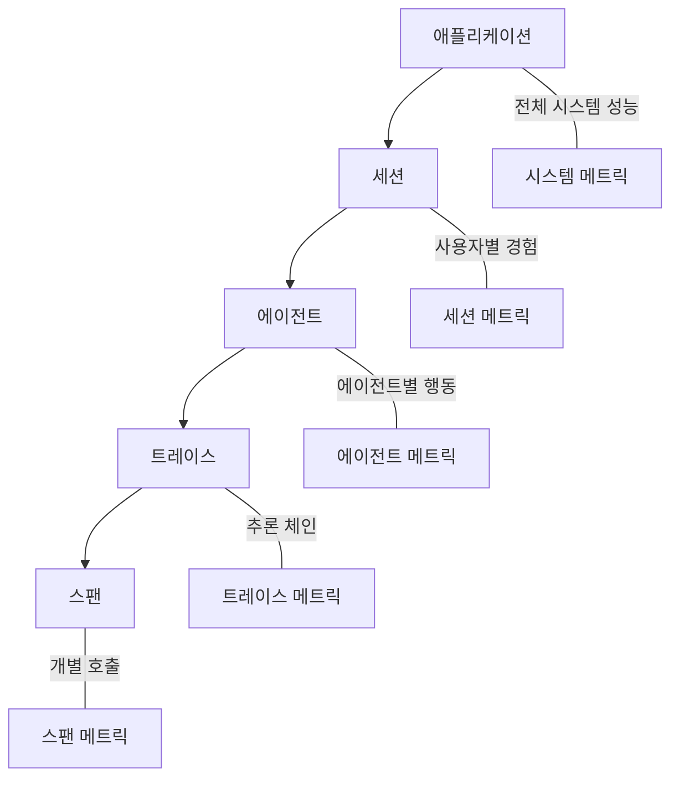
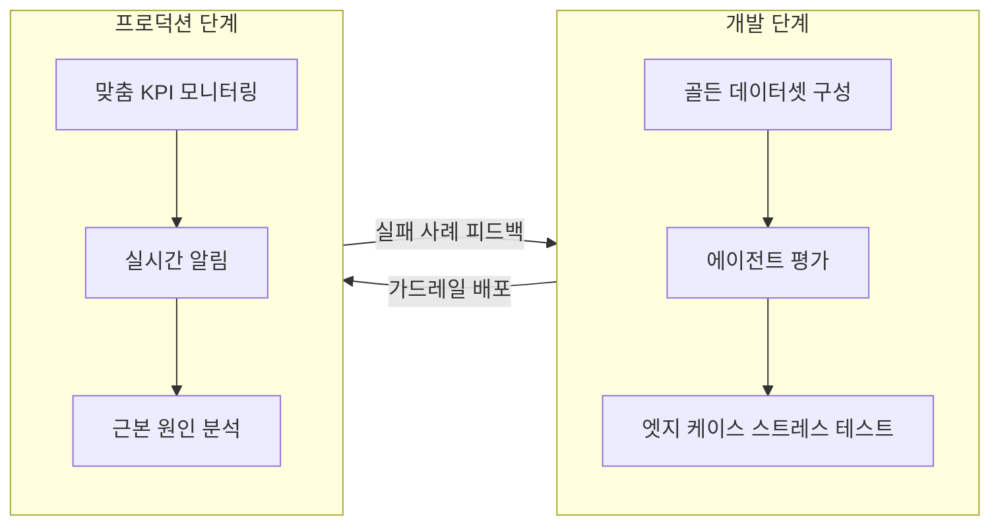

## 개요

Fiddler AI Control Plane은 엔터프라이즈급 AI 에이전트 옵저버빌리티, 가드레일, 컴플라이언스 모니터링을 통합 제공하는 플랫폼이다. 애플리케이션에서 스팬 단위까지 계층적 트레이스를 제공하며, 자체 개발한 Trust Models로 100ms 미만의 실시간 가드레일을 구현한다. "Native, not Additive" 원칙으로 외부 API 호출 없이 고객 환경 내에서 평가와 모니터링을 수행하여, 데이터 유출 위험을 제거한다. Nielsen, U.S. Navy, MasterCard 등이 도입했다.

## 핵심 기능

### 계층적 옵저버빌리티 (Hierarchical Observability)

다중 에이전트 시스템의 전체 실행 흐름을 5단계 계층으로 추적한다:

에이전트의 추론 체인, 도구 호출, 의사결정 경로를 마이크로 레벨에서 시스템 전체 수준까지 추적한다.

### Trust Models 가드레일

Fiddler의 핵심 차별점인 Trust Models는 업계 최고 속도의 가드레일을 제공한다:

| 지표 | Trust Models | 차순위 모델 | LLM-as-Judge |
|------|-------------|-----------|-------------|
| 응답 시간 | <100ms | 2.5배 느림 | 68배 느림 |
| 비용 | 기준 | - | 7-18배 비쌈 |
| 처리량 | 500만+/일 | - | - |

**"Native, not Additive"** 원칙:
- 외부 API 호출 없이 고객 환경 내에서 평가
- 제로 데이터 유출 (Zero data egress)
- 숨겨진 비용 없는 비용 효율적 솔루션

### 콘텐츠 안전성 영역

| 영역 | 기능 |
|------|------|
| 콘텐츠 안전 | 10가지 유형 유해 콘텐츠 탐지 (폭력, 혐오, 불법 등) |
| 애플리케이션 보안 | 프롬프트 인젝션 공격 차단, 시스템 무결성 유지 |
| 프라이버시 | PII/PHI 35개+ 개인정보 엔티티 탐지, HIPAA 준수 |
| 환각 방지 | 출처 기반 응답 검증, 신뢰도(Faithfulness) 점수 |

### 개발-프로덕션 통합 사이클

### 컴플라이언스 및 거버넌스

AI Governance, Risk Management, and Compliance(GRC) 모듈로 엔터프라이즈급 통제를 제공한다. 정부, 헬스케어, 보험 등 규제 산업에서 요구하는 감사 추적과 컴플라이언스 보고를 자동화한다.

## 기술 상세

### 지원 프레임워크

| 카테고리 | 지원 대상 |
|---------|---------|
| 표준 | OpenTelemetry (OTEL) |
| 에이전트 | LangGraph, AWS Bedrock/Strands, Google ADK |
| 클라우드 | AWS, GCP, Azure |
| 배포 | 클라우드, VPC, 온프레미스 |

### 경쟁 도구 비교

| 항목 | Fiddler AI | [[galileo-ai]] | [[arize-phoenix]] | [[braintrust]] |
|------|-----------|--------------|-----------------|---------------|
| 핵심 강점 | 계층적 트레이스 + Trust Models | Luna-2 실시간 평가 | 오픈소스 + OTel | 통합 평가 + 80x 쿼리 |
| 가드레일 속도 | <100ms | 내장 | 없음 | 없음 |
| 데이터 유출 | Zero egress | VPC 옵션 | 셀프호스팅 | SaaS |
| 컴플라이언스 | GRC 모듈 내장 | 없음 | 없음 | 없음 |
| 가격 | 엔터프라이즈 | 엔터프라이즈 | 오픈소스 무료 | Free 1M 스팬 |

## 도입 시 고려사항

**적합 케이스**:
- 규제 산업에서 AI 거버넌스와 컴플라이언스가 필수인 조직 (금융, 의료, 정부)
- 데이터 유출 리스크를 완전히 제거해야 하는 환경 (Zero data egress)
- 100ms 미만 응답 시간의 실시간 가드레일이 필요한 대규모 프로덕션
- 다중 에이전트 시스템의 계층적 모니터링이 필요한 경우

**제약사항**:
- 상용 제품으로 예산 제약 시 [[arize-phoenix]]나 [[langfuse]] 고려
- 오픈소스 커뮤니티 생태계는 Phoenix에 비해 제한적
- Trust Models의 도메인별 정확도는 사전 검증 필요

## 관련 문서

- [[galileo-ai]] - Galileo AI (LLM 평가 및 옵저버빌리티)
- [[arize-phoenix]] - Arize Phoenix (오픈소스 AI 관측)
- [[braintrust]] - Braintrust (AI 옵저버빌리티)
- [[ai-agent-guardrails]] - 에이전트 가드레일
- [[aws-agent-registry]] - AWS Agent Registry (에이전트 거버넌스)
