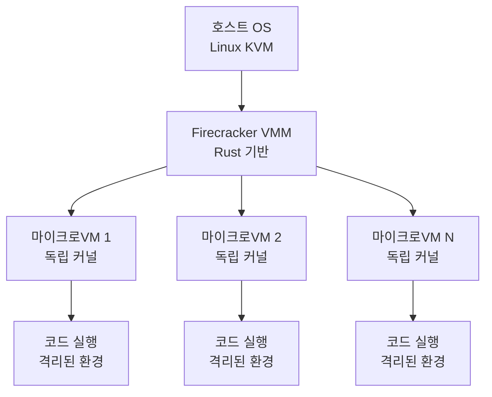
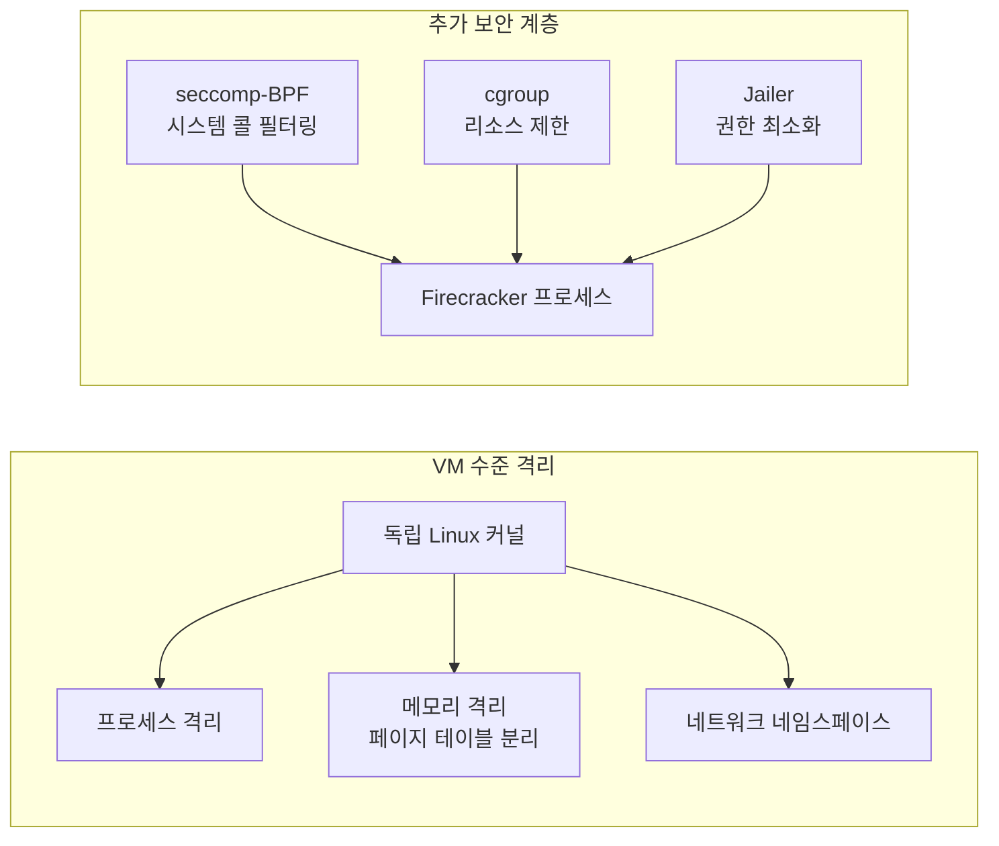
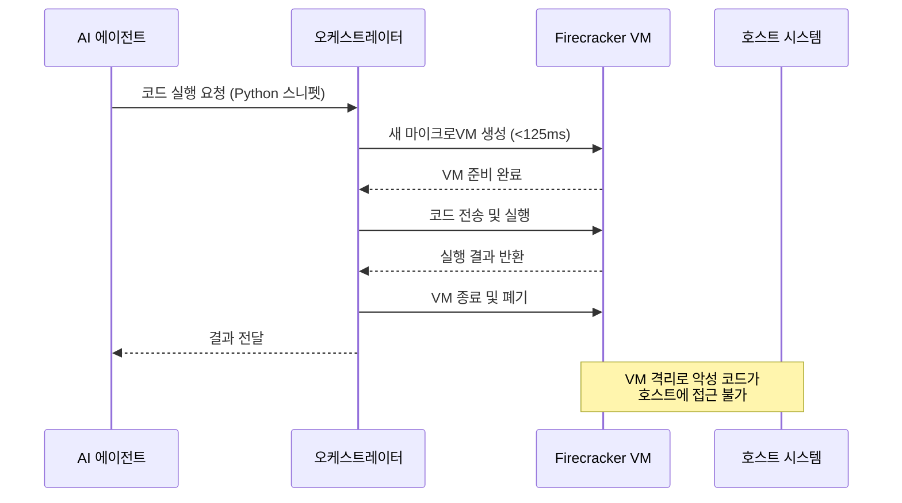
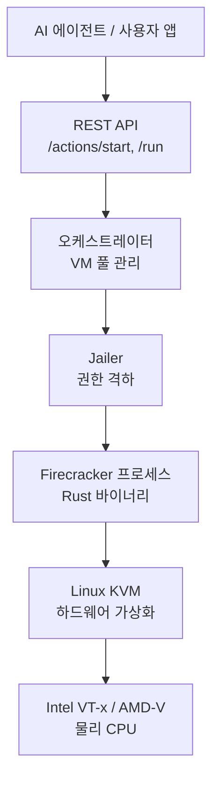

# Firecracker

Firecracker는 Amazon Web Services(AWS)가 2018년 오픈소스로 공개한 경량 VMM(Virtual Machine Monitor)이다. 컨테이너 수준의 빠른 시작 속도와 VM 수준의 강력한 격리를 동시에 제공하도록 설계됐으며, AI 에이전트의 코드 실행 샌드박스로 채택이 확산되고 있다.

## 아키텍처 하이레벨



Firecracker는 Linux KVM(Kernel-based Virtual Machine) 위에서 동작하는 사용자 공간 VMM이다. Rust로 작성되어 메모리 안전성을 보장하며, 공격 표면을 최소화하기 위해 레거시 장치 지원을 의도적으로 제거했다.

## 설계 원칙

### 1. 최소주의(Minimalism)

Firecracker는 의도적으로 기능을 제한한다. 전통적인 QEMU가 수백 가지 가상 장치를 지원하는 반면, Firecracker는 다음만 제공한다:

- 네트워크 인터페이스 (virtio-net)
- 블록 스토리지 (virtio-blk)
- 직렬 콘솔
- 타이머

USB, GPU 패스스루, 그래픽 어댑터 등은 없다. 이 최소주의가 보안 취약점 표면을 줄이고 시작 속도를 높이는 핵심이다.

### 2. 격리 계층



Firecracker는 VM 격리 외에도 Jailer라는 감시자 프로세스를 통해 Firecracker 자체를 낮은 권한으로 실행한다. VM이 탈출하더라도 호스트에 미치는 영향을 최소화하는 이중 격리 구조다.

### 3. 빠른 시작 (Fast Boot)

전통적인 VM 부팅은 수십 초가 걸리지만, Firecracker 마이크로VM은 125ms 이내에 부팅된다 (AWS 자체 측정값). 이는 다음 최적화 덕분이다:

- 최소한의 가상 장치만 초기화
- 커널은 사전 빌드된 경량 커널 이미지 사용
- rootfs는 ext4/squashfs 이미지 직접 마운트

## AWS 내 활용

Firecracker는 AWS의 다음 서비스를 내부적으로 구동한다:

- **AWS Lambda**: 각 함수 호출이 별도 마이크로VM에서 실행. 수천 개의 VM이 동일 호스트에서 동시에 동작
- **AWS Fargate**: 컨테이너를 실행하는 격리 레이어로 Firecracker 사용

AWS Lambda의 경우 단일 호스트에서 수천 개의 Firecracker VM이 동시에 실행되며, 각 VM은 수 MB의 메모리 오버헤드만 가진다.

## AI 코드 실행 샌드박스로의 적용

AI 에이전트가 코드를 생성하고 실행하는 워크플로에서 안전한 실행 환경이 필수적이다. Firecracker는 이 용도에서 가장 강력한 격리를 제공한다.



[[e2b-ai-sandbox]]는 Firecracker 위에 구축된 AI 코드 실행 샌드박스 서비스의 대표 사례다. 개발자가 AI 에이전트에서 코드 실행 기능을 쉽게 추가할 수 있도록 SDK와 API를 제공한다.

## [[code-interpreter]] 패턴과의 관계

[[code-interpreter]] 기능은 LLM이 생성한 코드를 실제로 실행하고 결과를 모델에 피드백하는 패턴이다. 이 패턴을 안전하게 구현하기 위해 다음 격리 수준이 고려된다:

| 격리 방식 | 보안 수준 | 시작 속도 | 복잡성 |
|-----------|----------|----------|--------|
| 프로세스 격리 (`subprocess`) | 낮음 | 즉시 | 단순 |
| Docker 컨테이너 | 중간 | 1-2초 | 보통 |
| gVisor (구글) | 높음 | 수백ms | 복잡 |
| Firecracker microVM | 매우 높음 | ~125ms | 복잡 |
| 전통 VM (QEMU) | 매우 높음 | 수십 초 | 매우 복잡 |

Firecracker는 VM 수준 보안을 컨테이너 수준 시작 속도로 제공하는 최적점이다.

## 기술 스택



### 핵심 구성 요소

- **Firecracker 바이너리**: Rust로 작성된 단일 실행 파일. AWS GitHub에 오픈소스 공개
- **Jailer**: VM 시작 전에 권한을 낮추고(setuid/setgid), cgroup과 네임스페이스를 설정
- **KVM**: 리눅스 커널 내장 하이퍼바이저. Firecracker는 이를 통해 하드웨어 가상화 활용
- **virtio**: 반가상화 I/O 인터페이스. 네트워크/블록 장치의 성능 최적화

## 운영 패턴

### VM 풀(Pool) 패턴

각 요청마다 VM을 새로 생성하면 125ms도 지연이 될 수 있다. 실용적인 패턴은 미리 VM을 생성해 풀(pool)에 보관하는 것이다:

```python
class FirecrackerPool:
    def __init__(self, pool_size: int = 10):
        self._available: list[FirecrackerVM] = []
        self._warm_up(pool_size)

    def _warm_up(self, n: int) -> None:
        for _ in range(n):
            vm = FirecrackerVM()
            vm.start()
            self._available.append(vm)

    def acquire(self) -> FirecrackerVM:
        if not self._available:
            vm = FirecrackerVM()
            vm.start()
            return vm
        return self._available.pop()

    def release(self, vm: FirecrackerVM) -> None:
        vm.reset()  # 상태 초기화
        self._available.append(vm)
```

### Snapshot/Restore (스냅샷/복원)

Firecracker는 VM 상태를 스냅샷으로 저장하고 복원하는 기능을 지원한다. Python 인터프리터가 로딩된 상태의 VM 스냅샷을 유지하면 사실상 0ms에 가까운 즉각 실행이 가능하다. AWS Lambda의 SnapStart 기능이 이 패턴을 활용한다.

## 보안 고려사항

Firecracker 사용 시 추가로 검토해야 할 보안 항목:

1. **VM 탈출 취약점**: VM이 호스트 KVM을 통해 탈출하는 공격 (역사적으로 드물지만 존재)
2. **사이드 채널 공격**: 스펙터(Spectre)/멜트다운(Meltdown) 계열 CPU 취약점 (커널 패치 필요)
3. **네트워크 격리**: AI 에이전트 코드가 외부 네트워크에 접근 가능한지 정책적으로 제어 필요
4. **리소스 고갈 공격**: cgroup으로 CPU/메모리 상한 반드시 설정

## 오픈소스 정보

- 저장소: `github.com/firecracker-microvm/firecracker`
- 라이선스: Apache 2.0
- 언어: Rust 100%
- AWS가 지속적으로 유지보수

## 관련 문서

- [[e2b-ai-sandbox]] - Firecracker 기반 AI 코드 실행 클라우드 서비스
- [[code-interpreter]] - LLM 코드 실행 패턴 일반론
