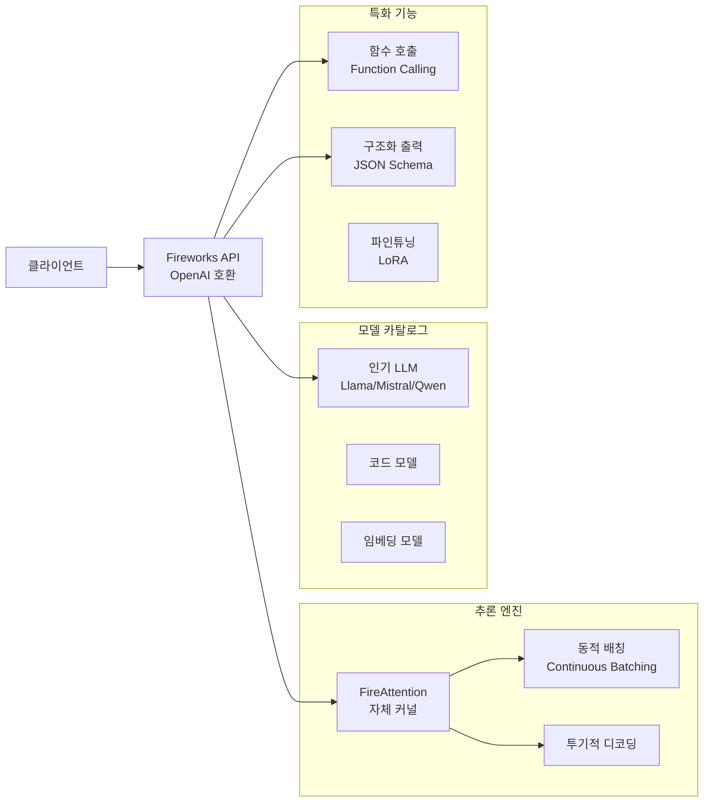
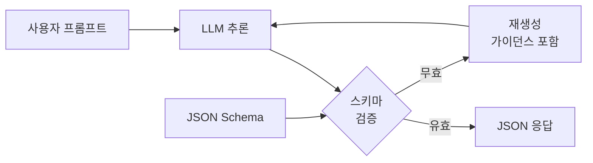

# Fireworks AI - 고속 오픈모델 추론 플랫폼

Fireworks AI는 오픈소스 LLM의 빠른 추론과 프로덕션급 신뢰성을 목표로 하는 추론 전용 플랫폼이다. 자체 개발한 추론 엔진 FireAttention을 중심으로, 함수 호출(function calling)과 구조화된 출력(structured output)에 특화된 기능을 제공한다. 파이어웍스(Fireworks)라는 이름처럼 "불꽃처럼 빠른 추론"이 브랜드 핵심이다.

## 플랫폼 개요



Fireworks AI의 차별점은 단순 모델 제공을 넘어, 에이전트(agent) 워크로드에 필요한 함수 호출과 구조화 출력을 최적화했다는 점이다.

## 핵심 기능

### FireAttention 추론 엔진

Fireworks AI가 자체 개발한 FireAttention은 FlashAttention 기반의 최적화 커널로, 특히 배치 추론(batch inference) 상황에서 높은 처리량을 목표로 한다.

주요 최적화 기법:

| 기법 | 설명 |
|------|------|
| 커스텀 CUDA 커널 | 어텐션 연산 IO 최적화 |
| 연속 배칭 | 요청 완료 즉시 새 요청 삽입, GPU 공백 최소화 |
| 투기적 디코딩 | 소형 드래프트 모델로 레이턴시 단축 |
| KV 캐시 관리 | paged attention으로 메모리 파편화 방지 |
| 멀티-LoRA 서빙 | 여러 LoRA 어댑터를 단일 GPU에서 동시 서빙 |

[[speculative-decoding]]과 [[kv-cache-optimization]]의 실전 구현체라 할 수 있다.

### 기본 API 사용법

```python
from openai import OpenAI

client = OpenAI(
    api_key="<fireworks-api-key>",
    base_url="https://api.fireworks.ai/inference/v1",
)

# 기본 Chat Completions
response = client.chat.completions.create(
    model="accounts/fireworks/models/llama-v3p1-70b-instruct",
    messages=[
        {"role": "user", "content": "Fireworks AI가 다른 추론 플랫폼과 차별화되는 점은?"},
    ],
    max_tokens=1024,
    temperature=0.7,
)
print(response.choices[0].message.content)

# 스트리밍
stream = client.chat.completions.create(
    model="accounts/fireworks/models/llama-v3p1-8b-instruct",
    messages=[{"role": "user", "content": "파이썬 asyncio 튜토리얼을 써줘."}],
    stream=True,
)
for chunk in stream:
    if chunk.choices[0].delta.content:
        print(chunk.choices[0].delta.content, end="", flush=True)
```

Fireworks AI SDK:

```python
import fireworks.client

fireworks.client.api_key = "<your-key>"

completion = fireworks.client.ChatCompletion.create(
    model="accounts/fireworks/models/mixtral-8x7b-instruct",
    messages=[{"role": "user", "content": "안녕하세요!"}],
)
```

### 함수 호출 (Function Calling)

Fireworks AI는 OpenAI 호환 함수 호출 인터페이스를 지원하며, 에이전트 워크로드에서의 신뢰성에 특화 최적화됐다:

```python
import json
from openai import OpenAI

client = OpenAI(
    api_key="<fireworks-api-key>",
    base_url="https://api.fireworks.ai/inference/v1",
)

# 도구(함수) 정의
tools = [
    {
        "type": "function",
        "function": {
            "name": "get_weather",
            "description": "특정 도시의 현재 날씨 정보를 가져옵니다",
            "parameters": {
                "type": "object",
                "properties": {
                    "city": {
                        "type": "string",
                        "description": "도시 이름 (예: 서울, 부산)",
                    },
                    "unit": {
                        "type": "string",
                        "enum": ["celsius", "fahrenheit"],
                        "description": "온도 단위",
                    },
                },
                "required": ["city"],
            },
        },
    }
]

messages = [{"role": "user", "content": "서울 날씨 알려줘."}]

response = client.chat.completions.create(
    model="accounts/fireworks/models/firefunction-v2",  # 함수 호출 특화 모델
    messages=messages,
    tools=tools,
    tool_choice="auto",
)

message = response.choices[0].message
if message.tool_calls:
    tool_call = message.tool_calls[0]
    args = json.loads(tool_call.function.arguments)
    print(f"함수 호출: {tool_call.function.name}({args})")
    # -> 함수 호출: get_weather({'city': '서울', 'unit': 'celsius'})
```

#### FireFunction-v2 모델

Fireworks AI는 함수 호출에 특화된 자체 파인튜닝 모델 **FireFunction-v2**를 제공한다. 오픈소스 모델 기반이면서 함수 호출 정확도를 높이기 위해 추가 학습된 모델이다.

[[function-calling]] 개념과 연관된 실전 구현체다.

### 구조화 출력 (Structured Output)

JSON Schema를 지정하면 모델이 반드시 해당 스키마에 맞는 JSON을 출력한다:

```python
from pydantic import BaseModel
from typing import List

class ResearchSummary(BaseModel):
    title: str
    key_findings: List[str]
    methodology: str
    limitations: str
    conclusion: str

response = client.chat.completions.create(
    model="accounts/fireworks/models/llama-v3p1-70b-instruct",
    messages=[
        {
            "role": "user",
            "content": "다음 논문을 요약해줘: [논문 텍스트]",
        }
    ],
    response_format={
        "type": "json_object",
        "schema": ResearchSummary.model_json_schema(),
    },
)

import json
result = ResearchSummary(**json.loads(response.choices[0].message.content))
print(result.key_findings)
```

구조화 출력 구현 방식:



내부적으로 문법 기반 제약(grammar-based constrained decoding)을 사용해 출력이 항상 유효한 JSON이 되도록 보장한다. [[outlines]] 라이브러리와 유사한 접근법이다.

### 멀티-LoRA 서빙

Fireworks AI의 독특한 기능 중 하나는 단일 GPU 인스턴스에서 여러 LoRA 어댑터를 동시에 서빙하는 것이다:

```mermaid
flowchart TD
    subgraph GPU 인스턴스 (단일)
        Base[베이스 모델\nLlama-3-70B 가중치]
        LoRA1[LoRA A\n고객서비스 특화]
        LoRA2[LoRA B\n코딩 특화]
        LoRA3[LoRA C\n의료 특화]
    end

    Req1[요청 1: 고객서비스] --> LoRA1
    Req2[요청 2: 코드 생성] --> LoRA2
    Req3[요청 3: 의료 상담] --> LoRA3

    LoRA1 --> Base
    LoRA2 --> Base
    LoRA3 --> Base
```

베이스 모델 가중치는 공유하고, 요청마다 적절한 LoRA 어댑터를 동적으로 적용한다. 여러 특화 모델을 운용하면서도 GPU 비용을 줄이는 효과가 있다.

### 모델 배포 (Deployed Models)

자체 파인튜닝 모델을 Fireworks AI에 배포하려면:

```python
# Fireworks SDK로 모델 파일 업로드 및 배포
# (실제 CLI/API 기반 - 세부 프로세스는 공식 문서 참조)
```

배포된 모델은 동일한 API 인터페이스로 호출 가능하며, 멀티-LoRA 구조 덕분에 여러 어댑터를 효율적으로 관리할 수 있다.

## 경쟁 플랫폼과 비교

| 기능 | Fireworks AI | [[together-ai-inference\|Together AI]] | [[groq-cloud-api\|Groq]] | [[anyscale-platform\|Anyscale]] |
|------|-------------|------------|------|----------|
| 추론 속도 | 매우 빠름 | 빠름 | 최고속(LPU) | 빠름 |
| 함수 호출 최적화 | 특화 (FireFunction) | 기본 지원 | 기본 지원 | 기본 지원 |
| 구조화 출력 | 네이티브 지원 | 기본 지원 | 제한적 | 지원 |
| 멀티-LoRA 서빙 | 지원 | 미지원 | 미지원 | 지원 |
| 파인튜닝 | 지원 | 지원 (더 다양) | 미지원 | 지원 |
| 오픈모델 다양성 | 50+ | 200+ | 제한 | 제한 |
| 에이전트 워크로드 | 특화 | 일반적 | 일반적 | 일반적 |

### Fireworks AI가 적합한 경우

- LLM 에이전트 시스템에서 함수 호출을 대량으로 처리할 때
- JSON Schema 기반의 구조화 출력이 필수일 때
- 여러 특화 모델(멀티-LoRA)을 비용 효율적으로 운용할 때
- OpenAI 코드를 오픈모델로 전환하되 함수 호출 신뢰성이 중요할 때

### Together AI가 더 적합한 경우

- 더 다양한 모델을 탐색하고 비교하고 싶을 때
- RedPajama 데이터셋 등 오픈소스 생태계 연계가 필요할 때
- 이미지 생성 등 멀티모달 태스크까지 커버하고 싶을 때

## 실무 사용 가이드

### 에이전트 루프에서의 사용 예시

```python
from openai import OpenAI
import json

client = OpenAI(
    api_key="<fireworks-api-key>",
    base_url="https://api.fireworks.ai/inference/v1",
)

def run_agent_loop(user_query: str, tools: list, max_turns: int = 5) -> str:
    """함수 호출 에이전트 루프"""
    messages = [{"role": "user", "content": user_query}]

    for turn in range(max_turns):
        response = client.chat.completions.create(
            model="accounts/fireworks/models/firefunction-v2",
            messages=messages,
            tools=tools,
            tool_choice="auto",
        )

        message = response.choices[0].message
        messages.append(message.model_dump())

        if not message.tool_calls:
            # 최종 응답
            return message.content

        # 도구 실행
        for tool_call in message.tool_calls:
            result = execute_tool(
                tool_call.function.name,
                json.loads(tool_call.function.arguments),
            )
            messages.append({
                "role": "tool",
                "tool_call_id": tool_call.id,
                "content": json.dumps(result),
            })

    return "최대 턴 수 초과"
```

이 패턴은 [[agent-assistant-asymmetric]]에서 설명하는 오케스트레이터-도구 패턴의 전형적인 구현이다.

### 비용 최적화

- **모델 크기 선택**: 간단한 함수 호출에는 8B 모델, 복잡한 추론에는 70B 모델
- **스트리밍 활용**: 스트리밍 응답으로 사용자 체감 레이턴시 단축
- **배치 처리**: 비실시간 작업은 배치 API로 묶어 처리 (비용 절감)
- **캐싱**: 동일 프롬프트 반복 요청 시 프롬프트 캐싱 활용

## 한계 / 트레이드오프

| 항목 | 내용 |
|------|------|
| 모델 다양성 | Together AI 대비 지원 모델 수 적음 |
| 이미지/멀티모달 | 텍스트 LLM 중심, 이미지 생성 제한 |
| 지역(Region) 선택 | AWS us-east 중심 |
| 파인튜닝 복잡도 | 멀티-LoRA 설정이 상대적으로 복잡 |
| 공식 문서 | 일부 고급 기능의 문서화가 부족할 수 있음 |
| 신생 플랫폼 리스크 | 스타트업으로 장기 안정성 불확실 |

## 관련 문서

- [[together-ai-inference]] - 더 다양한 모델과 파인튜닝 옵션을 제공하는 경쟁 플랫폼
- [[groq-cloud-api]] - LPU 기반 초고속 추론 (레이턴시 최우선 시나리오)
- [[anyscale-platform]] - Ray 기반 분산 ML, 대규모 배포에 적합
- [[function-calling]] - 함수 호출 개념 및 패턴
- [[outlines]] - 구조화 출력(constrained decoding) 오픈소스 라이브러리
- [[peft-library]] - LoRA 파인튜닝 기반 라이브러리
