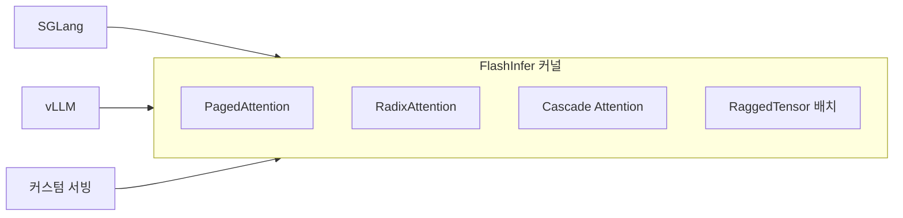

# FlashInfer

LLM 추론 서빙에 특화된 유연한 어텐션 커널 라이브러리. [[paged-attention|PagedAttention]], RadixAttention, Cascade Attention 등 다양한 서빙 패턴을 네이티브 지원한다. [[sglang|SGLang]]의 기본 어텐션 백엔드.

## FlashAttention과의 차이

| 측면 | FlashAttention | FlashInfer |
|------|---------------|------------|
| 초점 | 학습+추론 범용 | **서빙 전용 최적화** |
| KV 캐시 | 연속 메모리 | Paged/Ragged 지원 |
| 배치 | 고정 크기 | 가변 길이 배치 네이티브 |
| 통합 | 독립 커널 | 서빙 프레임워크 백엔드 |

## 관련 문서

- [[flash-attention]] -- FlashAttention
- [[sglang]] -- SGLang
- [[paged-attention]] -- PagedAttention
- [[model-serving]] -- 모델 서빙
