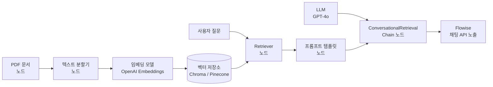

# Flowise

LLM 애플리케이션을 코딩 없이 드래그 앤 드롭으로 구성할 수 있는 비주얼 빌더. 2023년에 오픈소스로 공개되었으며, 내부적으로 [[langchain]]을 기반으로 한다. 노드(Node)를 캔버스에 배치하고 연결하면 RAG 파이프라인, 챗봇, 에이전트를 시각적으로 구성할 수 있다.

## 프로젝트 개요

| 항목 | 내용 |
|---|---|
| 이름 | Flowise |
| 개발사 | Flowise AI |
| 공개 | 2023년 |
| 언어 | Node.js (TypeScript), React |
| 라이선스 | Apache 2.0 |
| 저장소 | github.com/FlowiseAI/Flowise |
| GitHub Stars | 35K+ (2026년 기준) |
| 내부 엔진 | LangChain.js |

## 핵심 개념: 노드 기반 플로우

Flowise의 UI는 **캔버스**와 **노드**로 구성된다. 각 노드는 LangChain의 컴포넌트(모델, 벡터 저장소, 프롬프트, 체인 등)를 시각적으로 표현한다. 노드의 출력 핀을 다른 노드의 입력 핀에 연결해 데이터 흐름을 정의한다.



위 플로우는 PDF 기반 RAG 챗봇을 Flowise에서 구성하는 전형적인 패턴이다.

## 주요 노드 카테고리

| 카테고리 | 포함 노드 예시 |
|---|---|
| LLMs | OpenAI, Azure OpenAI, Anthropic, Ollama, HuggingFace |
| Chat Models | GPT-4o, Claude, Gemini, Llama 3 |
| Embeddings | OpenAI Embeddings, HuggingFace, Ollama |
| Vector Stores | Chroma, Pinecone, Qdrant, Weaviate, Supabase |
| Document Loaders | PDF, Docx, Web Scraper, Notion, S3 |
| Text Splitters | Recursive, Character, Markdown |
| Chains | Conversational Retrieval QA, LLM Chain, SQL Chain |
| Agents | ReAct Agent, Conversational Agent, OpenAI Functions Agent |
| Memory | Buffer Memory, Redis Memory, Zep Memory |
| Tools | Web Browser, Calculator, Custom Tool |

## [[dify]]와의 비교

Flowise와 [[dify]]는 모두 비주얼 LLM 빌더 범주에 속하지만 대상 사용자와 설계 철학이 다르다.

| 항목 | Flowise | [[dify]] |
|---|---|---|
| 내부 엔진 | LangChain.js | 자체 엔진 (Python) |
| 대상 사용자 | 개발자 / 기술적 비개발자 | 비개발자 포함 폭넓은 사용자 |
| UI 철학 | 플로우 그래프 (노드 연결) | 앱 빌더 (워크플로우 + UI 템플릿) |
| 커스텀 코드 | 커스텀 Tool 노드로 지원 | Python/JS 코드 블록 노드 |
| 관리 기능 | 기본 수준 | API 관리, 사용량 통계, 팀 협업 |

## API 노출 및 임베딩

완성된 플로우는 자동으로 REST API 엔드포인트로 노출된다. 발급받은 API 키로 외부 애플리케이션에서 호출하거나, 제공되는 Embed Script로 웹사이트에 챗봇 위젯을 삽입할 수 있다.

```bash
# Flowise API 호출 예시
curl -X POST http://localhost:3000/api/v1/prediction/{chatflowId} \
  -H "Authorization: Bearer <API_KEY>" \
  -d '{"question": "이 문서의 주요 내용은?"}'
```

## 자체 호스팅 구성

Docker로 간단하게 설치할 수 있다.

```bash
docker run -d \
  -p 3000:3000 \
  -v ~/.flowise:/root/.flowise \
  flowiseai/flowise
```

SQLite(기본), MySQL, PostgreSQL을 데이터베이스로 선택할 수 있다.

## 실무 활용 패턴

1. **내부 문서 챗봇 프로토타이핑**: 개발자가 코드 작성 없이 RAG 챗봇을 신속하게 구성해 비개발자 팀원에게 데모
2. **비개발자의 LLM 실험**: 마케터, 기획자가 프롬프트 엔지니어링을 시각적으로 실험
3. **멀티 에이전트 워크플로우**: Agent 노드를 연결해 태스크를 분기하는 복잡한 플로우 구성

## 관련 문서

- [[dify]] - 대안적 비주얼 LLM 빌더 (더 광범위한 사용자 대상)
- [[langchain]] - Flowise의 내부 엔진
- [[rag-pipeline]] - 검색 증강 생성 파이프라인 개념
- [[chroma-db]] - Flowise에서 많이 사용되는 벡터 저장소
