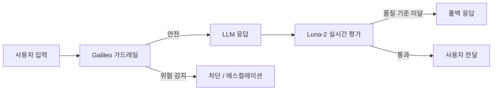
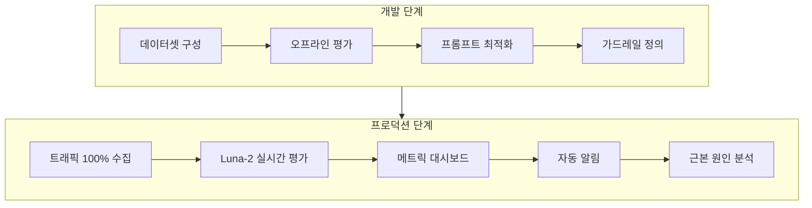

## 개요

Galileo AI는 LLM 애플리케이션과 AI 에이전트를 위한 신뢰성 평가 및 옵저버빌리티 플랫폼이다. Google AI, Apple Siri, Google Brain 출신 전문가들이 창립했으며, 6,800만 달러를 조달했다. 핵심 차별점은 자체 개발한 Luna-2 소형 평가 모델로, 기존 LLM-as-Judge 방식 대비 200ms 이하 지연 시간과 $0.02/백만 토큰이라는 극적으로 낮은 비용으로 트래픽 100%를 실시간 평가한다. HP, Twilio, Reddit, Comcast 등 엔터프라이즈 고객을 보유하고 있다.

## 핵심 기능

### Luna-2 평가 모델

Galileo의 독점 기술인 Luna-2는 Llama 3B/8B 기반의 소형 평가 모델이다. 비용이 높은 LLM-as-Judge(GPT-4 등을 평가자로 사용하는 방식)를 컴팩트한 전용 모델로 압축하여, 기존 대비 97% 낮은 비용으로 운영한다.

| 지표 | Luna-2 | LLM-as-Judge |
|------|--------|-------------|
| 지연 시간 | <200ms | 수 초 |
| 비용 | $0.02/백만 토큰 | 수 달러/백만 토큰 |
| 모니터링 범위 | 트래픽 100% | 샘플링 기반 |

### 실시간 옵저버빌리티

수백만 개의 시그널, 모델, 프롬프트, 함수, 컨텍스트, 데이터셋, 트레이스를 분석하여 에이전트 동작을 추적한다. 20개 이상의 사전 구축 평가 메트릭을 제공한다:

- **Tool Selection Quality**: 에이전트의 도구 선택 적절성 평가
- **Tool Call Error Detection**: 도구 호출 오류 감지
- **Session Success Tracking**: 세션 단위 성공/실패 추적
- **Context Adherence**: RAG 워크플로우에서 청크 수준의 컨텍스트 충실도

실패 패턴을 자동 감지하고 구체적인 개선 방안을 제시한다.

### 가드레일

오프라인 평가를 프로덕션 가드레일로 전환하여, 유해 응답이 사용자에게 도달하기 전에 차단한다.

가드레일이 제어하는 영역:
- 유해 콘텐츠 차단
- 도구 접근 제한
- 에스컬레이션 경로 제어
- PII/PHI 유출 방지

### 평가 엔지니어링

RAG, 에이전트, 안전성, 보안 관련 20개 이상의 사전 구축 평가 지표를 제공한다. 사용자 정의 평가 구성도 가능하여, 도메인별 품질 기준을 설정할 수 있다.

## 기술 상세

### 평가 파이프라인

### 배포 옵션

| 방식 | 설명 |
|------|------|
| SaaS | Galileo 클라우드에서 호스팅 |
| Virtual Private Cloud | 고객 VPC 내 배포 |
| 온프레미스 | 완전 격리 환경 배포 |

### 경쟁 도구 비교

| 항목 | Galileo AI | [[braintrust]] | [[arize-phoenix]] |
|------|-----------|---------------|-----------------|
| 핵심 강점 | Luna-2 실시간 평가 | 통합 평가 + 80x 쿼리 | 오픈소스 + OTel |
| 평가 모델 | Luna-2 (자체 SLM) | 코드 기반 / Loop AI | 코드 기반 |
| 실시간 가드레일 | 내장 | 없음 | 없음 |
| 비용 | 유료 (엔터프라이즈) | Free 1M 스팬 | 오픈소스 무료 |
| 배포 옵션 | SaaS/VPC/온프레미스 | SaaS/Enterprise | 셀프호스팅 |

## 도입 시 고려사항

**적합 케이스**:
- 트래픽 100%를 실시간으로 평가해야 하는 대규모 프로덕션 환경
- LLM-as-Judge 비용을 극적으로 줄이고 싶은 조직
- 실시간 가드레일이 필수인 규제 산업 (금융, 의료, 보험)
- 비기술 팀원도 평가 기준을 이해하고 모니터링해야 하는 환경

**제약사항**:
- 오픈소스가 아닌 상용 제품으로, 예산 제약 시 [[arize-phoenix]]나 [[langfuse]] 고려
- Luna-2 모델의 도메인별 정확도는 사전 검증 필요

## 관련 문서

- [[arize-phoenix]] - Arize Phoenix (오픈소스 AI 관측)
- [[braintrust]] - Braintrust (AI 옵저버빌리티)
- [[langfuse]] - Langfuse (오픈소스 LLM 옵저버빌리티)
- [[fiddler-ai]] - Fiddler AI Control Plane (에이전트 옵저버빌리티)
- [[ai-agent-guardrails]] - 에이전트 가드레일
