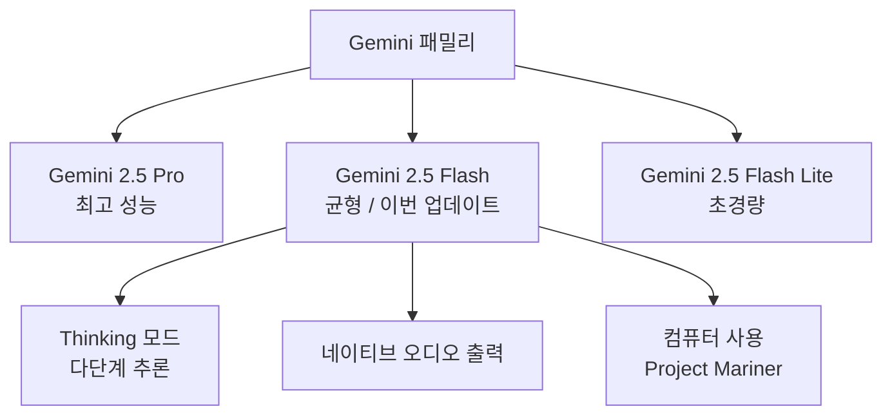
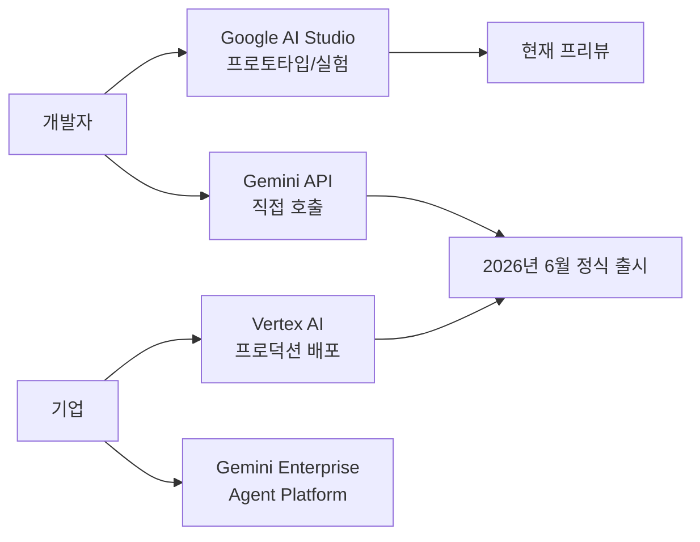

# Gemini 2.5 Flash Thinking

Gemini 2.5 Flash Thinking은 Google DeepMind가 2026년 4월 22일 발표한 [[gemini-models]] 패밀리의 최신 업데이트 버전이다. 비용 효율성과 강화된 추론(thinking) 능력을 결합한 모델로, 엔터프라이즈 및 개발자 워크로드에 최적화됐다. [[reasoning-llm]] 패러다임을 경량 모델에 통합한 사례로 주목받는다.

---

## 아키텍처 위치



Gemini 2.5 Flash는 Pro와 Flash Lite 사이 균형 지점에 위치하며, 이번 업데이트로 Thinking 모드, 네이티브 오디오 출력, 컴퓨터 사용 기능이 추가됐다.

---

## 핵심 사양

| 항목 | 값 |
|------|-----|
| 컨텍스트 창 | 1,000,000 토큰 (1M) |
| 입력 가격 | $0.30 / 1M 토큰 |
| 출력 가격 | $2.50 / 1M 토큰 |
| 정식 출시 예정 | 2026년 6월 초 |
| 접근 경로 | Google AI Studio, Vertex AI |

Gemini 2.5 Pro와 동일한 1M 토큰 컨텍스트 창을 유지하면서 토큰당 비용을 대폭 낮췄다. Pro 대비 출력 가격은 수배 저렴하므로 높은 처리량이 필요한 시나리오(배치 요약, 코드 생성 파이프라인)에 유리하다.

---

## 신기능 상세

### 1. Thinking 모드 (사고 체인 추론)

Thinking 모드는 응답 전에 내부 추론 단계(chain-of-thought)를 거치는 방식으로, 복잡한 수학 문제나 다단계 코딩 작업에서 정확도를 높인다. [[reasoning-llm]] 문서에서 다루는 o1/o3 계열 모델과 유사한 방향이지만, Flash 가격대에서 활성화할 수 있다는 점이 차별점이다.

- 응답 품질과 지연 시간 사이 트레이드오프가 존재
- `thinkingBudget` 파라미터로 추론 토큰 수 직접 제어 (Flash 기준 0~24576 토큰 범위, 0이면 thinking 비활성화, -1이면 dynamic thinking 모드 — 모델이 요청 복잡도에 따라 자동 조절). 출처: `ai.google.dev/gemini-api/docs/thinking`
- 수학, 코딩, 다단계 추론 벤치마크에서 Flash Lite 대비 유의미한 향상

### 2. 네이티브 오디오 출력 (Native Audio Output)

텍스트-투-스피치(TTS) 후처리 없이 모델이 직접 오디오 스트림을 생성한다. 음성 어시스턴트, 팟캐스트 자동화, 접근성 도구 등에 활용할 수 있다. Gemini 2.5 Pro에도 동일 기능이 추가됐으며, Flash 버전에서도 동등한 오디오 품질을 목표로 한다.

### 3. 컴퓨터 사용 (Computer Use) - Project Mariner 통합

Project Mariner는 Google의 컴퓨터 사용(computer use) 리서치 프로젝트다. Gemini 2.5 Flash에 이 기능이 통합되어 웹 브라우저 조작, 파일 관리, UI 자동화 등 에이전트형 작업을 수행할 수 있다. Anthropic Claude의 Computer Use, Microsoft의 [[project-astra-android-agent]] 유사 기능과 경쟁하는 포지션이다.

- 탭 탐색, 폼 입력, 스크린 캡처 기반 UI 인식 포함
- [[gemini-enterprise-agent-platform]]에서 에이전트 태스크 실행에 활용됨

### 4. 고급 보안 세이프가드 (Advanced Security Safeguards)

Gemini 2.5 Pro와 동일 수준의 안전 필터 강화 버전이 적용됐다. 유해 콘텐츠 필터링, 프롬프트 인젝션 방어, 개인정보 누출 방지 레이어가 포함된다.

---

## 배포 경로



2026년 4월 현재 API 프리뷰 단계이며, 6월 초 Google AI Studio와 Vertex AI 정식 출시가 예정됐다. [[gemini-enterprise-agent-platform]]에서 에이전트 내부 모델로도 사용된다.

---

## Flash vs Pro 비교

| 항목 | Gemini 2.5 Flash | Gemini 2.5 Pro |
|------|------------------|----------------|
| 용도 | 비용 효율, 높은 처리량 | 최고 성능, 복잡한 추론 |
| 컨텍스트 | 1M 토큰 | 1M 토큰 |
| 출력 가격 (대략) | $2.50/1M | 더 높음 |
| Thinking 모드 | 지원 | 지원 |
| 컴퓨터 사용 | 지원 | 지원 |
| 네이티브 오디오 | 지원 | 지원 |
| 추천 시나리오 | 배치 처리, RAG, 에이전트 루프 | 복잡한 분석, 창의적 작업 |

---

## 실무 활용 패턴

### 비용 최적화 라우팅

```python
import google.generativeai as genai

def select_model(task_complexity: str) -> str:
    """
    태스크 복잡도에 따라 모델 선택.
    flash = 배치/단순 추론, pro = 고난도 분석
    """
    if task_complexity in ("high", "critical"):
        return "gemini-2.5-pro"
    return "gemini-2.5-flash"

model_id = select_model("medium")
model = genai.GenerativeModel(model_id)
response = model.generate_content("요약해줘: ...")
```

### Thinking 모드 활성화

Gemini 2.5 시리즈는 `thinkingConfig.thinkingBudget` 파라미터로 thinking을 제어한다 (Gemini API `generateContent` 호출 내). 0이면 비활성, -1이면 dynamic thinking, 1~24576이면 명시적 토큰 한도. `thinkingLevel`은 2.5 시리즈에서 지원되지 않는다. 자세한 사양은 [Gemini API thinking docs](https://ai.google.dev/gemini-api/docs/thinking) 참조.

---

## Gemini 패밀리 맥락

[[gemini-models]]에서 전체 Gemini 버전 계보를 다루고 있다. 2.5 세대는 2025년 말부터 출시된 '사고 모델' 시대를 대표하며, Flash는 2.0 Flash에서 이어지는 고속/저비용 라인이다.

---

## 관련 문서

- [[gemini-models]] - Gemini 전체 패밀리 개요
- [[reasoning-llm]] - 사고 체인 추론 모델 일반 개념
- [[gemini-enterprise-agent-platform]] - Flash를 내부 모델로 활용하는 에이전트 플랫폼
- [[project-astra-android-agent]] - 컴퓨터 사용 기능 연계 리서치 프로젝트
- [[google-tpu-8t-8i]] - Flash 추론을 지원하는 Google 차세대 가속기
