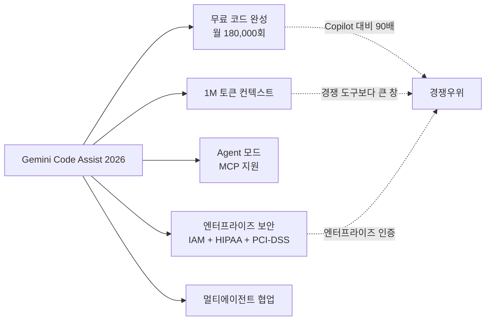
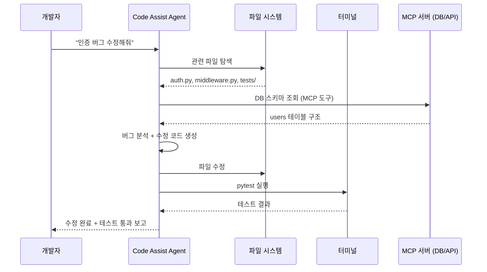
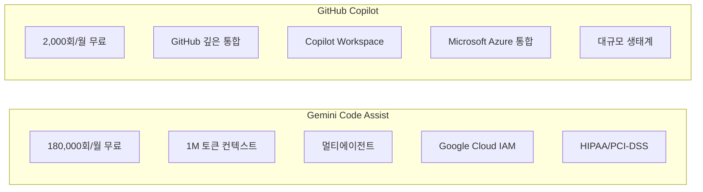

# Gemini Code Assist 2026

Gemini Code Assist는 Google의 엔터프라이즈 AI 코딩 도구로, 2026년 현재 [[github-copilot]]에 대항하는 주요 경쟁자 포지션을 확립했다. 단순한 [[code-completion]] 도구를 넘어 복수의 전문 에이전트가 협업하는 멀티에이전트 코딩 어시스턴트로 진화하고 있다.

---

## 핵심 포지셔닝



---

## 주요 기능

### 1. 대규모 무료 코드 완성

월 180,000회 코드 완성을 무료로 제공한다. GitHub Copilot 무료 티어(2,000회/월) 대비 약 90배 수준이다. 이는 소규모 팀이나 스타트업이 비용 부담 없이 AI 코딩 어시스턴트를 도입하는 진입 장벽을 낮추는 전략이다.

| 항목 | Gemini Code Assist (무료) | GitHub Copilot (무료) |
|------|---------------------------|----------------------|
| 코드 완성 / 월 | 180,000회 | 2,000회 |
| 채팅 요청 / 월 | 제한 있음 | 제한 있음 |
| 컨텍스트 창 | 1M 토큰 | 제한적 |
| Agent 모드 | 지원 | 지원 (제한적) |

### 2. 1M 토큰 컨텍스트 창

[[gemini-models]]의 1M 토큰 컨텍스트를 코딩 도구에서 직접 활용한다. 대형 코드베이스를 잘라서 보내지 않고 전체 리포지토리 규모의 파일을 컨텍스트에 포함할 수 있다.

**실무 의미**:
- 수십 개 파일이 연관된 리팩토링 시 전체 의존성 파악
- 레거시 코드베이스의 패턴을 학습해 일관성 있는 코드 생성
- 대규모 테스트 스위트 분석 후 버그 원인 추적

### 3. Agent 모드 (MCP 지원)

Agent 모드는 코드 생성 이상의 작업을 수행한다. 파일 시스템 탐색, 터미널 명령 실행, 외부 도구 호출을 에이전트가 순차적으로 처리한다.



MCP 서버 지원으로 데이터베이스, 내부 API, Jira, GitHub Issues 등 외부 컨텍스트를 에이전트 루프 내에서 직접 조회할 수 있다.

### 4. 멀티에이전트 협업 아키텍처

Gemini Code Assist는 "단일 에이전트 + 다양한 도구" 대신 **역할별 전문 에이전트 협업** 접근법을 채택한다.

| 에이전트 역할 | 담당 |
|--------------|------|
| 개발자 에이전트 | 코드 생성, 리팩토링, 구현 |
| 테스터 에이전트 | 테스트 케이스 작성, 실행, 커버리지 분석 |
| 보안 분석가 에이전트 | 취약점 스캔, SAST, 보안 가이드라인 준수 확인 |
| 문서화 에이전트 | 도크스트링, README, API 문서 자동 작성 |

이 구조는 대규모 코드 변경 시 각 전문 에이전트가 병렬로 작업한 뒤 오케스트레이터가 결과를 통합한다. [[multi-agent-orchestration]]의 실제 코딩 도구 적용 사례다.

---

## Google Cloud IAM 통합

엔터프라이즈 환경에서 코딩 도구의 접근 제어는 보안의 핵심이다.

- **조직 정책 연동**: 어떤 개발자가 어떤 코드베이스에서 Code Assist를 사용할 수 있는지 제어
- **감사 로그**: 모든 코드 생성 요청과 결과를 Cloud Audit Logs에 기록
- **VPC Service Controls**: 민감 코드베이스에 대한 외부 접근 차단
- **Service Account 기반 MCP 인증**: 에이전트가 내부 시스템에 접근할 때 서비스 계정 자격증명 자동 주입

---

## 컴플라이언스 인증

| 인증 | 상태 |
|------|------|
| HIPAA (의료) | 지원 |
| PCI-DSS v4 (금융) | 지원 |
| SOC 2 Type II | [교차검증 필요] |
| ISO 27001 | [교차검증 필요] |

헬스케어·금융 업종은 코딩 도구도 규정 준수 인증이 필요하다. GitHub Copilot 엔터프라이즈와 동일 시장을 공략하는 포지션이다.

---

## IDE 지원

| IDE | 지원 여부 |
|-----|----------|
| VS Code | 지원 |
| JetBrains (IntelliJ, PyCharm 등) | 지원 |
| Cloud Shell Editor | 지원 (기본 내장) |
| Neovim / Vim | [교차검증 필요] |

---

## [[github-copilot]] 과의 비교



- **Gemini Code Assist 우위**: 무료 한도, 컨텍스트 창 크기, Google Cloud 네이티브 통합
- **Copilot 우위**: GitHub Pull Request 통합, 기존 MSFT 생태계 사용자 기반, 더 성숙한 에코시스템

---

## 실무 도입 시나리오

### 시나리오 1: 레거시 코드 마이그레이션

```
목표: Python 2 → Python 3 마이그레이션
활용: 1M 토큰 컨텍스트로 전체 코드베이스 로드
에이전트: 개발자 에이전트(변환) + 테스터 에이전트(검증) 동시 실행
```

### 시나리오 2: 보안 취약점 스캔 및 수정

```
목표: OWASP Top 10 취약점 자동 탐지·수정
활용: 보안 분석가 에이전트 전담 실행
MCP: OWASP DB, CVE 데이터베이스 연결
결과: PR 자동 생성 + 보안 보고서 문서화
```

---

## 관련 문서

- [[gemini-models]] - Code Assist 기반 언어 모델
- [[github-copilot]] - 주요 경쟁 제품
- [[code-completion]] - AI 코드 완성 일반 개념
- [[gemini-enterprise-agent-platform]] - Code Assist가 속한 더 넓은 Gemini 에이전트 에코시스템
- [[multi-agent-orchestration]] - Code Assist의 멀티에이전트 아키텍처 기반 개념
