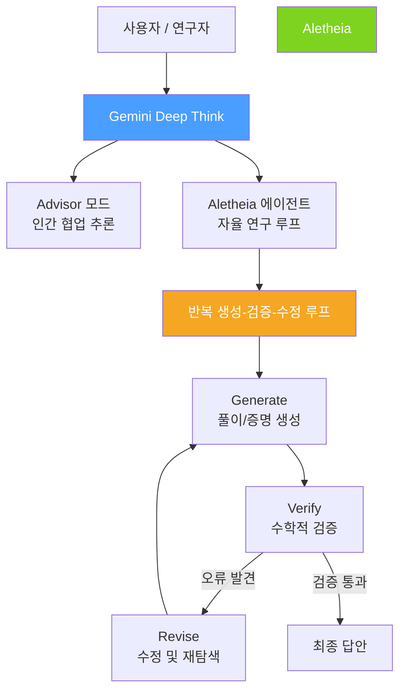
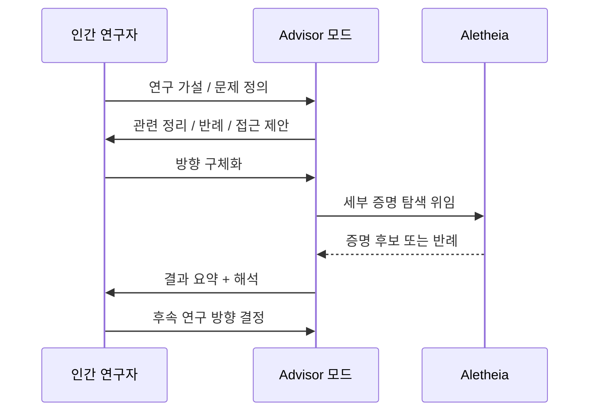

# Gemini Deep Think

Google DeepMind가 개발한 **확장 추론(extended reasoning) 시스템**. 표준 LLM 추론을 넘어 수학, 물리학, 컴퓨터과학 등 고난도 STEM 분야에서 전문가 수준의 문제 해결을 목표로 한다. 특히 자율 연구 에이전트 **Aletheia**를 통해 수학 미해결 문제를 해결하는 성과를 거뒀다.

## 아키텍처 개요

## 핵심 구성 요소

### Aletheia - 자율 연구 에이전트

Aletheia는 Deep Think 위에 구축된 **자율 수학 연구 에이전트**. 다음 루프를 반복하며 미해결 문제에 접근한다:

1. **Generate**: 초기 증명 경로 또는 풀이 전략 생성
2. **Verify**: 수학적 형식 검증기(formal verifier) 또는 내부 비평으로 정확성 검사
3. **Revise**: 오류가 발견되면 전략을 수정하거나 새로운 방향 탐색
4. **종료 조건**: 검증을 통과하거나 사전 정의된 반복 한도 도달

주목할 성과: **Erdős 미해결 문제** 중 일부를 해결. 수십 년간 수학자들이 풀지 못한 조합론 문제에서 새로운 구성적 증명을 발견.

### Advisor 모드

인간 연구자와의 **협업 추론** 모드. Aletheia의 완전 자율과 달리, 사람이 방향을 제시하고 Deep Think가 세부 추론을 담당한다.

- 연구자가 가설을 제시하면 Deep Think가 반례나 지지 증거를 탐색
- 반복적 대화로 연구 방향을 정제
- 인간의 직관 + AI의 계산력 조합

### Balanced Prompting

Deep Think 특유의 프롬프트 설계 원칙. 과도한 탐색(exploration)과 과도한 수렴(exploitation)의 균형을 맞춰 추론 품질을 안정화한다.

- 문제 유형에 따라 탐색 깊이를 동적으로 조정
- 이미 검증된 부분은 재탐색하지 않도록 상태 관리

## 벤치마크 성과

| 벤치마크 | 성과 |
|---------|------|
| IMO-ProofBench Advanced | **90%** (국제수학올림피아드 수준 증명 문제) |
| PhD 수준 문제 확장 평가 | 전문가 수준 성능 확인 |
| Erdős 미해결 문제 | 선별적 해결 (조합론 분야) |
| 수학-물리-CS 교차 문제 | 도메인 간 추론 통합 능력 시연 |

IMO-ProofBench Advanced 90%는 기존 AI 시스템 대비 획기적인 수치로, 올림피아드 수준 수학 문제에서 증명의 형식적 정확성까지 검증한 결과다.

## 인간-AI 협업 모델

Deep Think가 제안하는 과학 연구 패러다임:

핵심 철학: AI가 연구를 "대체"하는 것이 아니라 인간의 직관과 경험을 **증폭(amplify)**하는 도구로 동작.

## 적용 가능 도메인

| 도메인 | 활용 방식 |
|--------|----------|
| 수학 (수론/조합론) | 증명 탐색, 추측(conjecture) 검증 |
| 이론 물리학 | 방정식 유도, 시뮬레이션 설계 검증 |
| 컴퓨터과학 | 알고리즘 증명, 복잡도 분석 |
| 신약 개발 | 분자 구조 추론, 결합 경로 탐색 |

## 한계 및 주의사항

- 검증기(verifier)의 정확도에 최종 성능이 의존 (잘못된 검증 = 잘못된 결론)
- 매우 긴 추론 체인은 계산 비용이 높음
- 완전히 새로운 개념 창안보다는 기존 지식의 조합과 검증에 강점
- 현재 수학/STEM 특화 - 일반 언어 이해 태스크와는 성격이 다름

## 관련 문서

- [[gemini-3-1-pro]]
- [[arc-agi-2]]
- [[long-horizon-rl-training-for-agents]]
- [[are-gaia2-paper]]
