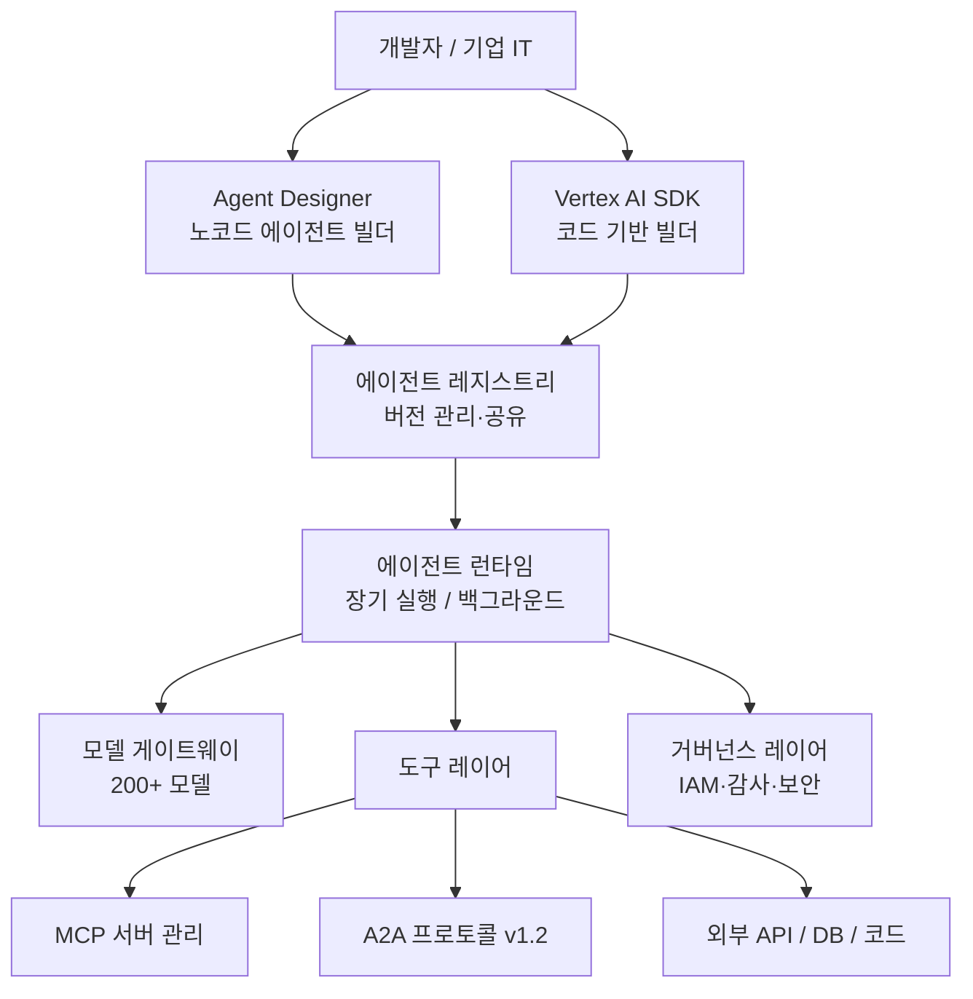
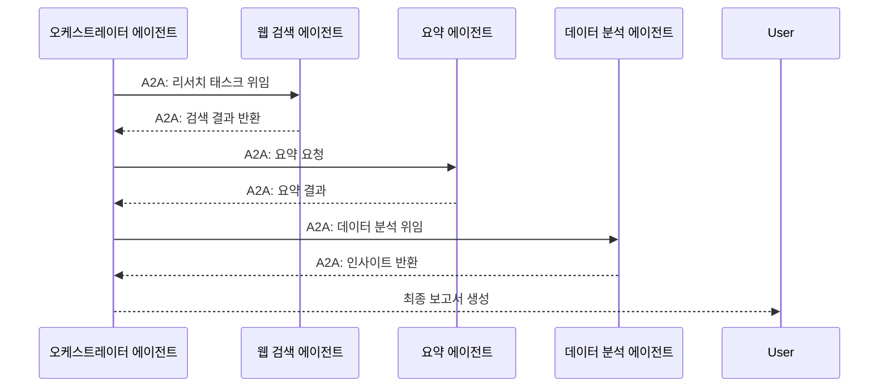

# Gemini Enterprise Agent Platform

Gemini Enterprise Agent Platform은 Google Cloud Next '26(2026년 4월 22-23일)에서 발표된 Google Cloud의 통합 에이전트 개발·운영·거버넌스 플랫폼이다. 기존 Vertex AI를 계승하면서 에이전트 빌드-테스트-배포-모니터링-거버넌스를 단일 환경으로 통합했다. [[multi-agent-orchestration]]을 프로덕션에서 운영하는 데 필요한 인프라를 풀스택으로 제공한다.

---

## 플랫폼 아키텍처

플랫폼은 빌드-런타임-거버넌스 세 레이어로 구성된다. 개발자는 노코드 Agent Designer 또는 SDK로 에이전트를 만들고, 런타임이 장기 실행 태스크를 관리하며, 거버넌스 레이어가 접근 제어·감사·규정 준수를 담당한다.

---

## 핵심 기능

### 1. Agent Designer (노코드 에이전트 빌더)

드래그앤드롭 방식으로 에이전트 플로를 구성하는 시각적 인터페이스다. 개발자가 아닌 비즈니스 분석가, 운영팀도 에이전트 워크플로를 설계할 수 있다.

- 사전 빌드된 도구 커넥터(Google Drive, BigQuery, Salesforce 등)
- 에이전트 체인 시각화 편집
- 테스트 시뮬레이터 내장
- [[multi-agent-orchestration]] 패턴을 시각적으로 구현

### 2. 장기 실행 에이전트 (Long-running Agents)

기존 API 호출 기반 에이전트는 단일 요청-응답 사이클에 묶였다. Gemini Enterprise Agent Platform은 백그라운드에서 수 시간 또는 수 일에 걸쳐 실행되는 에이전트를 지원한다.

- 작업 상태 영속화(state persistence)
- 중간 결과 체크포인트
- 에러 복구 및 재시작
- 비동기 완료 알림(웹훅 또는 Pub/Sub)

실무 예시: "다음 주 이사회 자료를 자동으로 수집-요약-슬라이드 생성"하는 워크플로가 수 시간에 걸쳐 실행된다.

### 3. 모델 게이트웨이 (200+ 모델)

단일 API 엔드포인트로 200개 이상의 모델에 접근한다.

| 모델 카테고리 | 포함 모델 예시 |
|--------------|----------------|
| Google 자사 | Gemini 2.5 Flash/Pro, Imagen 3, Veo |
| 서드파티 | Claude (Anthropic), Llama, Mistral |
| 특수 목적 | 코드 특화, 임베딩, 분류 모델 |
| 오픈소스 | Nemotron 3 (NVIDIA), Gemma 3 |

[[gemini-models]] 외에도 경쟁사 모델을 포함하는 멀티모델 전략으로, 특정 태스크에 최적 모델을 자동 선택하는 모델 라우팅 기능도 제공한다. [교차검증 필요 - 자동 라우팅 기능 상세]

### 4. MCP 서버 관리

Model Context Protocol(MCP) 서버를 플랫폼 수준에서 등록·관리한다.

- MCP 서버 레지스트리: 조직 내 승인된 MCP 서버 카탈로그
- 에이전트에서 MCP 도구를 선언적으로 연결
- 보안 자격증명 관리(시크릿 자동 주입)
- 트래픽 모니터링 및 레이트 리미팅

### 5. A2A 프로토콜 내장

Agent-to-Agent(A2A) 프로토콜 v1.2가 플랫폼에 네이티브로 내장됐다. 내부 에이전트 간, 그리고 외부 파트너 에이전트 간 표준화된 통신이 가능하다.

---

## Vertex AI와의 관계

Gemini Enterprise Agent Platform은 Vertex AI를 대체하는 것이 아니라 에이전트 계층에서 Vertex AI 위에 올라타는 구조다.

| 레이어 | 담당 |
|--------|------|
| Vertex AI | 모델 학습, 파인튜닝, MLOps, 데이터 파이프라인 |
| Gemini Enterprise Agent Platform | 에이전트 오케스트레이션, 장기 실행, MCP, A2A |
| Google Cloud 인프라 | 컴퓨트(TPU/GPU), 스토리지, 네트워크 |

기존 Vertex AI 투자를 유지하면서 에이전트 기능만 플랫폼으로 확장하는 전략이다. Vertex AI ML Pipeline은 훈련·배포에, Agent Platform은 에이전트 운영에 각각 최적화됐다.

---

## 거버넌스 및 보안

엔터프라이즈 컴플라이언스 요구 사항을 지원하는 거버넌스 레이어가 내장됐다.

- **Google Cloud IAM 통합**: 에이전트별 권한 세분화, 조직 정책(Org Policy)과 연동
- **감사 로그(Audit Logs)**: 모든 에이전트 실행, 도구 호출, 모델 요청을 Cloud Audit Logs에 기록
- **데이터 레지던시**: 특정 리전에서만 에이전트 실행 강제 가능
- **VPC Service Controls**: 외부 인터넷 트래픽 차단 후 프라이빗 엔드포인트로만 모델 접근
- **HIPAA / PCI-DSS 준수**: 헬스케어·금융 업종 규정 준수 인증 포함 [교차검증 필요 - 인증 범위 공식 확인 권장]

---

## NVIDIA와의 협업

Google Cloud Next '26에서 NVIDIA와의 전략적 파트너십이 발표됐다. Gemini Enterprise Agent Platform에 NVIDIA Nemotron 3 오픈 모델 패밀리가 통합되고, NVIDIA NeMo Agent Toolkit이 플랫폼의 에이전트 관찰가능성(observability)·지속 학습 레이어로 사용된다.

- Nemotron 3 Nano/Super/Ultra 모델이 모델 게이트웨이를 통해 접근 가능
- NeMo 프레임워크 기반 파인튜닝 워크플로 연동
- NVIDIA Hopper/Blackwell GPU에서 최적화된 추론 지원

---

## 경쟁 포지션

| 플랫폼 | 벤더 | 특징 |
|--------|------|------|
| Gemini Enterprise Agent Platform | Google Cloud | MCP+A2A 내장, 200+ 모델, 노코드 빌더 |
| Azure AI Foundry | Microsoft | Copilot 생태계, Phi 모델, 온디바이스 연동 |
| AWS Bedrock Agents | Amazon | Step Functions 연동, Titan 모델 |
| Salesforce Agentforce | Salesforce | CRM 특화, 비즈니스 프로세스 최적화 |

[[multi-agent-orchestration]] 개념 페이지에서 각 플랫폼의 아키텍처 접근 방식을 비교하고 있다.

---

## 실무 고려 사항

**도입 전 체크리스트**

1. 기존 Vertex AI 워크로드 마이그레이션 계획 수립
2. MCP 서버 카탈로그 정의 (조직 승인 도구 목록)
3. A2A 에이전트 카드 서명 인증서 관리 방안
4. 장기 실행 에이전트의 비용 모델 이해 (실행 시간 × 토큰 소비)
5. 감사 로그 보존 정책 및 SIEM 연동

---

## 관련 문서

- [[gemini-models]] - 플랫폼 내 Gemini 모델 패밀리
- [[multi-agent-orchestration]] - 다중 에이전트 오케스트레이션 일반 개념
- [[gemini-2-5-flash-thinking]] - 플랫폼 내 핵심 경량 추론 모델
- [[google-tpu-8t-8i]] - 플랫폼 인프라를 지원하는 8세대 TPU
