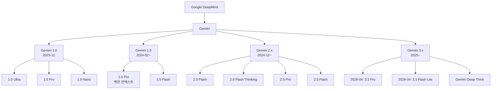
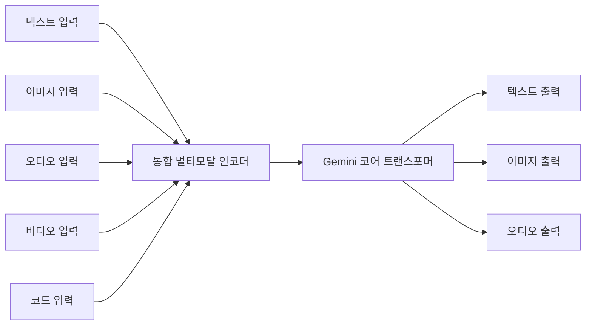

# Gemini 모델 패밀리

Gemini는 Google DeepMind가 개발한 멀티모달 네이티브(multimodal-native) 대형 언어 모델 패밀리다. 2023년 12월 Gemini 1.0 출시 이후, 텍스트·이미지·오디오·비디오·코드를 처음부터 통합 처리하도록 설계된 아키텍처를 기반으로 빠르게 진화하고 있다. Google의 내부 TPU 인프라와 긴밀히 통합되어 있으며, Google Cloud Vertex AI, AI Studio, 제품 내 Gemini API를 통해 제공된다.

## Gemini 모델 계통도



## 버전별 주요 특성

### Gemini 1.0 (2023년 12월)

Google이 GPT-4에 대응해 출시한 첫 번째 Gemini 세대. 텍스트, 이미지, 오디오, 비디오, 코드를 처음부터 멀티모달로 처리.

| 모델 | 컨텍스트 | 주요 용도 |
|------|---------|---------|
| 1.0 Ultra | 32K | 최고 성능, 복잡한 추론 |
| 1.0 Pro | 32K | API 상업 배포 표준 |
| 1.0 Nano | 4K | 기기 내(on-device) 추론 |

- MMLU, HumanEval 등 주요 벤치마크에서 GPT-4와 경쟁
- Nano는 Pixel 8 Pro에 탑재 → 기기 내 AI 기능 최초 상업화

### Gemini 1.5 (2024년 2~6월)

**1M 토큰 컨텍스트 윈도우**가 핵심 혁신. 기존 모델 대비 30~60x 확장.

| 모델 | 컨텍스트 | 특징 |
|------|---------|------|
| 1.5 Pro | 1M 토큰 | 장문 맥락 이해, 대용량 문서 분석 |
| 1.5 Flash | 1M 토큰 | 고속/저비용, Pro의 경량 버전 |

1M 컨텍스트의 실용적 의미:
- 700,000 단어 분량의 책 전체
- 30,000줄의 코드베이스
- 1시간 이상의 비디오 (멀티모달)

MoE(Mixture of Experts) 아키텍처 도입으로 컨텍스트 확장 대비 비용 효율 달성. [[transformer-architecture]] 참조.

### Gemini 2.0 (2024년 12월~)

에이전틱(agentic) AI 시대를 위한 세대. 멀티모달 출력(이미지 생성, TTS)과 실시간 처리 강화.

| 모델 | 특징 |
|------|------|
| 2.0 Flash | 2.0의 표준 모델, 1.5 Pro 대비 저비용·고성능 |
| 2.0 Flash Thinking | 추론 시간 확장(extended thinking) 실험 버전 |
| 2.5 Pro | 코딩·수학 강화, 향상된 추론 |
| 2.5 Flash | 비용 효율 최적화 |

2.0 Flash의 주요 기능:
- **멀티모달 출력**: 텍스트뿐 아니라 이미지, 오디오 직접 생성
- **실시간 스트리밍**: Live API로 오디오·비디오 실시간 처리
- **도구 호출 강화**: 구글 검색 내장, 코드 실행 샌드박스

### Gemini 3.x (2025~2026)

[[gemini-3-1-pro]]와 [[gemini-3-1-flash-lite]] 참조.

- 3.1 Pro: 추론 능력과 장기 컨텍스트 처리의 차세대 기준점
- 3.1 Flash Lite: 비용 효율 극단화, 엣지/임베디드 배포 목표
- [[gemini-deep-think]]: 체인-오브-소트(Chain-of-Thought) 강화 추론 특화 변형

## 아키텍처 특징

### 멀티모달 네이티브 설계



기존 LLM+어댑터 방식과 달리 각 모달리티가 동일한 트랜스포머 레이어를 공유한다. 이로 인해 텍스트-이미지, 오디오-텍스트 등 크로스 모달 이해가 자연스럽게 발생한다.

### TPU 최적화

Gemini는 Google의 TPU v4/v5p 클러스터에서 학습·추론 최적화. TPU Pod의 ICI(Inter-Chip Interconnect)로 수천 칩을 단일 컴퓨팅 공간으로 활용.

JAX + XLA 컴파일러 스택이 기반. PyTorch 기반 모델과 달리 정적 그래프 최적화가 더 공격적으로 적용된다.

### 1M 컨텍스트 기술

Gemini 1.5의 1M 컨텍스트는 다음 기술로 달성:

- **MoE (Mixture of Experts)**: 활성 파라미터를 줄여 장문 처리 효율화
- **Ring Attention** 류의 분산 어텐션: TPU Pod 내에서 시퀀스를 분할 처리
- **청크 어텐션 최적화**: 긴 컨텍스트에서 전체 어텐션 대신 효율적 근사

## 제품군 및 API

### Google AI Studio

개발자 대상 무료/저비용 실험 플랫폼. Gemini API 키 발급, 프롬프트 테스트, 파인튜닝 인터페이스 제공.

### Vertex AI (Google Cloud)

엔터프라이즈 배포 플랫폼:
- **Grounding**: 구글 검색 실시간 연동으로 최신 정보 반영
- **Fine-tuning**: 커스텀 데이터로 Gemini 파인튜닝
- **RAG 파이프라인**: Vector Search + Gemini 통합

### Gemini API 핵심 파라미터

```python
import google.generativeai as genai

genai.configure(api_key="YOUR_API_KEY")
model = genai.GenerativeModel("gemini-2.5-pro")

# 기본 생성
response = model.generate_content(
    "설명해줘",
    generation_config=genai.types.GenerationConfig(
        temperature=0.7,
        top_p=0.95,
        top_k=40,
        max_output_tokens=8192,
    ),
)

# 멀티모달 입력
import PIL.Image
img = PIL.Image.open("chart.png")
response = model.generate_content(["이 차트를 분석해줘:", img])

# 구조화된 출력 (JSON 스키마)
from pydantic import BaseModel

class Analysis(BaseModel):
    summary: str
    key_points: list[str]
    confidence: float

response = model.generate_content(
    "분석 결과를 JSON으로:",
    generation_config=genai.types.GenerationConfig(
        response_mime_type="application/json",
        response_schema=Analysis,
    ),
)
```

## Gemini vs 경쟁 모델 포지셔닝

| 기준 | Gemini 2.5 Pro | GPT-4o | Claude 3.7 Sonnet |
|------|---------------|--------|-------------------|
| 코딩 | 매우 강함 (SWE-bench 상위) | 강함 | 강함 |
| 수학·추론 | 강함 | 강함 | 강함 |
| 멀티모달 | 네이티브, 강함 | 강함 | 텍스트 중심 |
| 컨텍스트 | 1M+ 토큰 | 128K | 200K |
| 가격 | 중간 | 중간 | 중간 |
| 도구 연동 | Google 서비스 통합 | OpenAI 생태계 | Anthropic 생태계 |

주의: 벤치마크는 시점에 따라 변동이 크며 동일한 태스크 분포에서만 유효하다.

## Gemma: Gemini의 오픈 웨이트 버전

Google은 Gemini 아키텍처를 기반으로 오픈 웨이트 모델 Gemma 시리즈를 별도로 공개했다:

- Gemma 1.1: 2B, 7B
- Gemma 2: 2B, 9B, 27B
- Gemma 3: 1B, 4B, 12B, 27B (멀티모달)

Gemma 모델은 상업 이용 가능 라이선스로 배포되어 자체 호스팅, 파인튜닝에 활용 가능하다.

## 에이전트 생태계 통합

Gemini는 [[claude-code]] 등 AI 코딩 에이전트와 경쟁하며 자체 에이전트 생태계를 구축하고 있다:

- **Google Agent Development Kit (ADK)**: Gemini 기반 에이전트 빌드 프레임워크
- **Gemini Live**: 실시간 양방향 대화 기능
- **Project Astra**: 지속 멀티모달 에이전트 연구 프로젝트
- **NotebookLM**: Gemini 기반 연구 보조 도구

## 관련 문서

- [[gemini-3-1-pro]] - Gemini 3.1 Pro 상세
- [[gemini-3-1-flash-lite]] - Gemini 3.1 Flash Lite 상세
- [[gemini-deep-think]] - Gemini Deep Think 추론 모드
- [[claude-code]] - Anthropic Claude Code (경쟁 AI 코딩 에이전트)
- [[google-adk]] - Google Agent Development Kit
- [[transformer-architecture]] - Gemini 기반 아키텍처 개요
- [[gemma-4]] - Gemini 기반 오픈 웨이트 모델 Gemma
