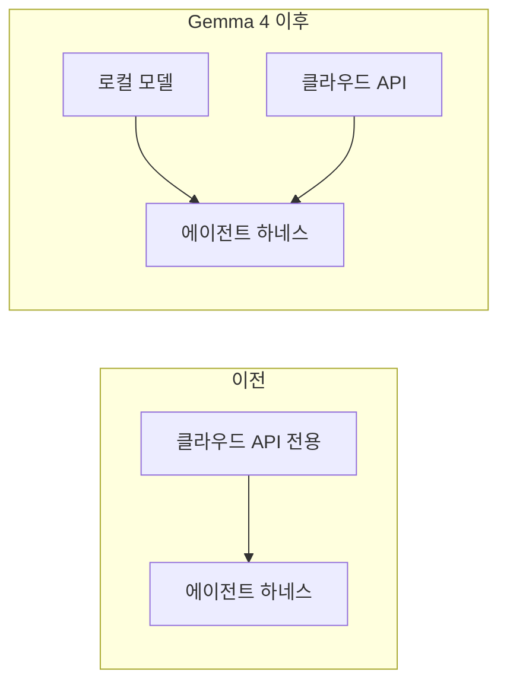

# Gemma 4 로컬 에이전트 추론

Google의 Gemma 4(2026년 4월)는 로컬 도구 호출(tool calling)이 에이전트 하네스를 엔드투엔드로 구동할 수 있는 수준에 도달한 **최초의 오픈 웨이트 모델 패밀리**다.

## 왜 중요한가

이전 세대 Gemma 3의 tau2-bench 점수 6.6%에서 Gemma 4 31B Dense가 **86.4%**로 도약. 이는 오픈 웨이트 모델로 [[codex-cli|Codex CLI]] 같은 에이전트 하네스를 실용적으로 구동할 수 있음을 의미한다.

**비용과 프라이버시**: 클라우드 API 없이 로컬에서 에이전트 작업 수행 가능. 코드가 외부로 나가지 않는다.

## 모델 변종

| 변종 | 파라미터 | 활성 파라미터 | 특성 |
|------|---------|------------|------|
| 31B Dense | 31B | 31B | 전체 성능, VRAM 많이 필요 |
| **26B MoE** | 26B | **3.8B** | 로컬 개발 최적. 32GB Apple Silicon에서 Metal 오프로딩으로 구동. 31B의 **97%** 에이전트 성능 |

26B MoE가 로컬 개발의 스위트 스팟이다.

## 셋업 경로

### 1. llama.cpp (Apple Silicon 추천)

```bash
codex --oss -m gemma4:31b
```

NVIDIA GB10에서는 Ollama v0.20.5가 첫 번째 안정 경로.

### 2. Ollama (제한 있음)

2026년 4월 기준 Ollama의 Gemma 4 도구 호출 파서가 불안정:
- 스트리밍 모드에서 도구 호출 콘텐츠가 `tool_calls` 배열 대신 `reasoning` 필드로 잘못 라우팅
- **스트리밍을 끄면** 동작하지만 응답 지연 증가

### 설정 주의사항

- `stream_idle_timeout_ms`: 최소 1,800,000 (30분)으로 설정
- ggml 0.9.11 (Homebrew build 8680) 기준 벤치마크
- **빌드 회귀 주의**: b8680 이후 마스터 빌드에서 M4 생성 속도 ~27 tok/s -> ~8 tok/s (3.3x 회귀)

## 로컬 에이전트의 의의



- 오픈 웨이트 모델의 도구 호출 성숙도가 에이전트 하네스 구동 가능 수준에 도달
- 소비자 하드웨어(32GB MacBook)에서 MoE 변종으로 실용적 에이전트 경험
- 비용, 프라이버시, 오프라인 작업의 이점
- [[codex-cli|Codex CLI]]의 `--oss` 플래그로 로컬 모델 직접 지원

## 관련 문서

- [[codex-cli]] -- Codex CLI 엔티티
- [[how-coding-agents-work]] -- 코딩 에이전트 동작 원리
- [[coding-agents-landscape]] -- 코딩 에이전트 지형도
