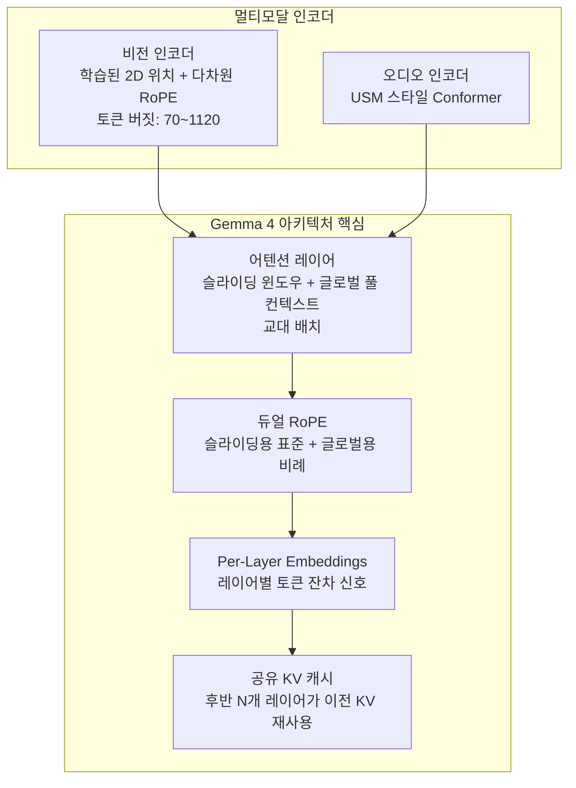

## 개요

Google Gemma 4는 2026년 4월 2일 공개된 Google DeepMind의 최신 오픈소스 모델 패밀리이다. Apache 2.0 라이선스로 완전 개방되어 상업적 사용이 자유롭다. 4개 사이즈(E2B, E4B, 26B MoE, 31B Dense)로 제공되며, 네이티브 멀티모달(이미지, 비디오, 오디오), 최대 256K 컨텍스트 윈도우, 140개 이상 언어를 지원한다. "고급 추론과 에이전틱 워크플로우를 위해 설계된 가장 지능적인 오픈 모델"을 표방한다.

## 핵심 특징

- **4개 모델 변형**: 온디바이스(E2B)부터 최대 성능(31B Dense)까지 스펙트럼 커버
- **Apache 2.0**: 제한 없는 상업적 사용 가능
- **네이티브 멀티모달**: 이미지, 비디오, 오디오 입력 통합 지원
- **확장된 사고(Extended Thinking)**: 멀티모달 입력에서도 추론 체인 활성화 가능
- **객체 탐지/GUI 감지**: 네이티브 JSON 출력으로 바운딩 박스 예측
- **함수 호출/도구 사용**: 멀티모달 입력과 결합한 에이전틱 워크플로우

## 모델 변형

| 모델 | 유효 파라미터 | 총 파라미터 | 컨텍스트 | 아키텍처 | 오디오 |
|---|---|---|---|---|---|
| E2B | 2.3B | 5.1B(임베딩 포함) | 128K | Dense | 지원 |
| E4B | 4.5B | 8B(임베딩 포함) | 128K | Dense | 지원 |
| 26B A4B | 4B 활성화 | 26B | 256K | MoE | 미지원 |
| 31B | 31B | 31B | 256K | Dense | 미지원 |

## 아키텍처

### 듀얼 어텐션 패턴

로컬 슬라이딩 윈도우 어텐션과 글로벌 풀 컨텍스트 어텐션을 교대로 배치한다. E2B/E4B는 512 토큰 슬라이딩 윈도우, 대형 모델은 1024 토큰 윈도우를 사용한다. 각 어텐션 타입에 별도의 RoPE 설정을 적용하여(표준 RoPE + 비례 RoPE) 단거리/장거리 의존성을 동시에 포착한다.

### Per-Layer Embeddings (PLE) 상세

PLE는 두 가지 컴포넌트로 구성된다:
- **토큰 정체성 컴포넌트**: 임베딩 룩업 테이블
- **맥락 인식 컴포넌트**: 메인 임베딩의 학습된 프로젝션

각 디코더 레이어가 전용 토큰별 벡터를 수신하여 레이어별 특화가 가능하다. 멀티모달 입력의 경우 PLE는 패드 토큰 ID를 사용하여 중립 신호를 전달한다. 적은 파라미터 비용으로 레이어 간 표현력을 높이는 효율적 설계다.

### 공유 KV 캐시 상세

후반 `num_kv_shared_layers`개 레이어가 자체 K/V 프로젝션을 계산하지 않고, 동일 어텐션 타입의 마지막 비공유 레이어에서 K/V를 재사용한다. 장문 컨텍스트 및 온디바이스 추론에서 품질 저하를 최소화하면서 메모리와 연산을 절감한다.

## 벤치마크 성능

| 벤치마크 | 31B | 26B A4B | E4B | E2B |
|---|---|---|---|---|
| MMLU Pro | 85.2% | 82.6% | 69.4% | 60.0% |
| AIME 2026 | 89.2% | 88.3% | 42.5% | 37.5% |
| GPQA Diamond | 84.3% | 82.3% | 58.6% | 43.4% |
| LiveCodeBench v6 | 80.0% | 77.1% | 52.0% | 44.0% |
| Codeforces ELO | 2150 | 1718 | 940 | 633 |
| MMMU Pro (비전) | 76.9% | 73.8% | 52.6% | 44.2% |
| Long Context (128K) | 66.4% | 44.1% | 25.4% | 19.1% |

LMArena 텍스트 점수: 31B ~1452, 26B A4B ~1441 (4B 활성 파라미터로 인상적)

## 기술 상세

### 비전 인코더 상세

학습된 2D 위치 + 다차원 RoPE를 사용하며, 가변 종횡비(variable aspect ratio)를 보존한다. 토큰 버짓을 70, 140, 280, 560, 1120 중 선택 가능하여 속도/메모리/품질 트레이드오프를 조절한다. 객체 탐지, GUI 감지, OCR을 네이티브 JSON 출력으로 수행한다.

### MoE vs Dense

26B A4B 변형은 토큰당 4B 파라미터만 활성화하는 Mixture-of-Experts 구조로, 26B 총 파라미터 중 소수만 사용하면서 31B Dense에 근접하는 성능을 제공한다(LMArena 1441 vs 1452). 31B Dense는 최대 성능이 필요한 경우에 적합하다. 파레토 프론티어 관점에서 MoE 모델은 동일 추론 비용 대비 최고 효율을 달성한다.

### 배포 옵션

- **Hugging Face transformers**: `pip install -U transformers`
- **llama.cpp**: 로컬 추론, Jan/LM Studio/Open Code 에이전트 호환
- **transformers.js**: 브라우저/WebGPU에서 멀티모달 지원
- **MLX**: Apple Silicon 최적화, TurboQuant으로 4배 메모리 절감
- **mistral.rs**: Rust 기반, 모든 모달리티 지원
- **ONNX**: 크로스 플랫폼 엣지 배포

### 파인튜닝

Hugging Face TRL, Google Vertex AI, Unsloth Studio를 통한 파인튜닝 지원. TRL은 이미지 포함 도구 응답 학습을 지원하여 로보틱스, 웹 브라우징, 시뮬레이터 환경에서의 시각 피드백 학습이 가능하다.

## 관련 문서

- [[gemini-3-1-pro]] - Google의 상용 프론티어 모델
- [[gemini-3-1-flash-lite]] - Google의 경량 효율 모델
- [[qwen3-6-plus]] - Alibaba의 경쟁 오픈소스 모델
- [[deepseek-v3-2]] - DeepSeek의 경쟁 오픈소스 모델
