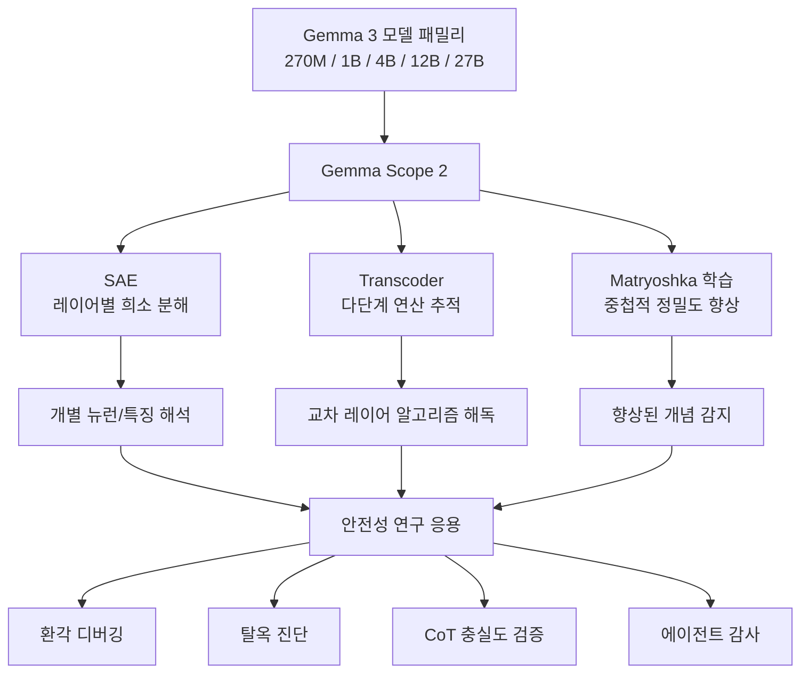

# Gemma Scope 2

Google DeepMind이 공개한 역대 최대 규모의 오픈소스 해석가능성(interpretability) 릴리스다. Gemma 3 모델 패밀리(270M-27B) 전체 레이어에 대한 Sparse Autoencoder(SAE)와 Transcoder를 제공하며, Matryoshka 학습 기법으로 해석 정밀도를 크게 높였다.

## 왜 지금 중요한가

2025년 12월 공개된 Gemma Scope 2는 단일 AI 연구소가 내놓은 해석가능성 도구 중 최대 규모로, 약 110 페타바이트의 데이터와 1조 개 이상의 학습된 파라미터를 포함한다. [[mechanistic-interpretability-2026|기계적 해석가능성]]이 MIT Tech Review 2026 10대 혁신 기술로 선정된 시점에서, 이 도구는 연구 커뮤니티가 대규모 모델의 내부를 실제로 들여다볼 수 있는 핵심 인프라 역할을 한다.

## 핵심 구성요소

### Sparse Autoencoder (SAE)

SAE는 모델 내부의 밀집(dense) 활성화를 희소(sparse)한 형태로 확장하여, 각 뉴런이 어떤 개념을 인코딩하는지 해석 가능하게 만드는 도구다. Gemma Scope 2에서는 Gemma 3의 모든 레이어에 대해 SAE를 제공한다.

### Transcoder

Transcoder는 단일 레이어를 넘어 여러 레이어에 걸친 다단계 연산을 추적한다. Skip-transcoder와 cross-layer transcoder를 통해 모델이 수행하는 복잡한 알고리즘을 레이어 간에 걸쳐 해독할 수 있다.

### Matryoshka 학습

러시아 인형처럼 중첩된 학습 기법으로, SAE가 더 유용한 개념을 감지하고 모델 결함을 더 정확하게 식별할 수 있도록 한다. 기존 SAE 대비 해석 정밀도가 크게 향상되었다.

## 아키텍처 개요

## 대표 레퍼런스

- [Gemma Scope 2 블로그 -- Google DeepMind](https://deepmind.google/blog/gemma-scope-2-helping-the-ai-safety-community-deepen-understanding-of-complex-language-model-behavior/)
- [Gemma Scope 모델 페이지 -- Google DeepMind](https://deepmind.google/models/gemma/gemma-scope/)
- [Gemma Scope 2 기술 논문 (PDF)](https://storage.googleapis.com/deepmind-media/DeepMind.com/Blog/gemma-scope-2-helping-the-ai-safety-community-deepen-understanding-of-complex-language-model-behavior/Gemma_Scope_2_Technical_Paper.pdf)

## AI 안전성 응용

Gemma Scope 2가 직접적으로 지원하는 안전성 연구 영역은 다음과 같다:

| 응용 영역 | 설명 |
|-----------|------|
| 환각(Hallucination) 디버깅 | 모델이 사실과 다른 출력을 생성하는 내부 경로 추적 |
| 탈옥(Jailbreak) 진단 | 안전 가드레일을 우회하는 입력의 내부 처리 패턴 분석 |
| 아첨(Sycophancy) 감지 | 사용자 의견에 부당하게 동조하는 내부 메커니즘 식별 |
| CoT 충실도 검증 | 명시된 추론 과정과 실제 내부 상태 간의 괴리 탐지 |
| 에이전트 감사 | AI 에이전트의 의사결정 경로를 내부 표현 수준에서 추적 |
| 거부(Refusal) 메커니즘 | 유해 요청 거부 시 활성화되는 내부 회로 분석 |

## Gemma Scope 1과의 비교

| 항목 | Gemma Scope 1 | Gemma Scope 2 |
|------|---------------|---------------|
| 대상 모델 | Gemma 2 | Gemma 3 (270M-27B) |
| 도구 | SAE만 제공 | SAE + Transcoder |
| 학습 기법 | 표준 SAE 학습 | Matryoshka 학습 |
| 분석 범위 | 레이어 단위 | 레이어 단위 + 교차 레이어 |
| 챗 모델 지원 | 제한적 | 채팅 튜닝 모델 전용 도구 포함 |

## 접근 방법

- **Hugging Face**: SAE 및 Transcoder 아티팩트 다운로드
- **Neuronpedia**: Gemma 3 특징을 인터랙티브하게 탐색하는 데모
- **Colab 노트북**: 바로 시작할 수 있는 튜토리얼 환경

## 관련 페이지

- [[circuit-tracing|Circuit Tracing & Attribution Graphs]]
- [[mechanistic-interpretability-2026|기계적 해석가능성 2026 돌파]]
- [[representation-engineering|Representation Engineering & Activation Steering]]
- [[ai-safety-alignment-2026|AI 안전성 정렬 2026]]
