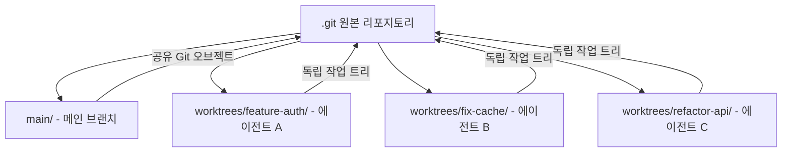

# Git Worktree Isolation for Parallel Coding Agents

각 에이전트에게 독립된 git worktree를 할당해 파일 충돌 없이 병렬 작업하게 하는 격리 패턴.

## 개념

`git worktree`는 하나의 git 리포지토리에서 여러 브랜치를 **동시에 서로 다른 디렉토리에** 체크아웃하는 기능이다. 코딩 에이전트 맥락에서는 "에이전트 하나 = worktree 하나 = 독립 브랜치"로 매핑하면 에이전트 간 파일 충돌이 완전히 사라진다.



각 worktree는 자체 작업 디렉토리를 가지지만 `.git` 오브젝트 저장소는 공유한다. 따라서 디스크 공간 낭비 없이 완전한 파일 시스템 격리를 달성한다.

## 기본 명령

```bash
# worktree 생성
git worktree add ../worktrees/feature-auth -b feature/auth

# 현재 worktree 목록
git worktree list

# worktree 제거 (브랜치 작업 완료 후)
git worktree remove ../worktrees/feature-auth
```

## Claude Code에서의 지원

Claude Code는 worktree 기반 병렬 에이전트 실행을 공식 지원한다:

- **`--worktree` 플래그**: 서브에이전트 실행 시 자동 worktree 생성
- **`.claude/worktrees/` 디렉토리**: worktree 구성을 선언적으로 관리
- **`WorktreeCreate` / `WorktreeRemove` 훅**: worktree 생성·삭제 이벤트에 스크립트 연결
- **`isolation: worktree`** 서브에이전트 프론트매터: 해당 서브에이전트가 자체 worktree에서 실행됨을 선언

## Cursor 3.0에서의 지원

[[cursor-cloud-agents-and-parallel-worktree-agents|Cursor 3.0]]은 `/worktree` 명령을 코어 기능으로 내장했다. UI에서 명령 하나로 worktree 생성 + 에이전트 할당이 완료된다.

## 병렬 에이전트 격리 전략 비교

| 전략 | 격리 수준 | 설정 복잡도 | 컨텍스트 공유 |
|---|---|---|---|
| Git Worktree | 파일 시스템 | 낮음 | Git 오브젝트 공유 |
| 별도 클론 | 완전 격리 | 중간 | 없음 |
| microVM / 컨테이너 | OS 수준 | 높음 | 없음 |
| 단일 디렉토리 | 없음 | 없음 | 완전 공유 (충돌 위험) |

## 실무 패턴

### 패턴 1: 기능 병렬 개발
```
main/           <- 안정 브랜치
worktrees/
  feature-auth/ <- 에이전트 A: 인증 구현
  feature-search/ <- 에이전트 B: 검색 구현
  feature-dashboard/ <- 에이전트 C: 대시보드 구현
```
각 에이전트가 완료되면 `git merge` 또는 PR로 통합.

### 패턴 2: best-of-n 경쟁
동일 태스크를 여러 에이전트가 독립 worktree에서 시도한 후, 평가 기준(테스트 통과, 코드 품질 등)으로 최선 선택.

### 패턴 3: 검토(review) 에이전트 격리
구현 에이전트의 worktree를 읽기 전용으로 마운트하여 별도 검토 에이전트가 코드를 분석하되 수정하지 못하게 제한.

## 주의사항

- **브랜치 충돌**: 같은 브랜치를 두 worktree에서 체크아웃하면 오류 발생. 각 worktree마다 고유 브랜치 필수.
- **공유 설정 파일**: `.env`, `settings.json` 등 리포 루트의 공유 파일은 worktree 간에도 공유된다. 에이전트별 설정이 필요하면 worktree 내 오버라이드 파일 사용.
- **정리(cleanup)**: 작업 완료 후 `git worktree remove`로 정리하지 않으면 스테일(stale) worktree가 누적된다.

## 왜 중요한가

Claude Code가 공식 지원하고, Cursor 3.0도 `/worktree` 명령을 코어로 흡수하면서 "서브에이전트 하나당 worktree 하나" 패턴이 2026년 표준 병렬 실행 방식으로 굳어졌다.

## 대표 레퍼런스

- [Claude Code Common Workflows -- Worktrees](https://code.claude.com/docs/en/common-workflows)
- [Claude Code Hooks Reference](https://code.claude.com/docs/en/hooks)
- [Create custom subagents (Claude Code)](https://code.claude.com/docs/en/sub-agents)
- [Cursor 3.0 Changelog](https://cursor.com/changelog/3-0)

## 2026-05-06 보강 — Production 운영 디테일과 Catastrophic Bug

### 격리 보장 — 한계

> "A worktree is a second working directory pointing at the same Git repository,
> locked to a different branch."

격리되는 것:

- 각 worktree 가 자체 filesystem view (특정 branch)
- 파일 edit 는 완전 분리
- 다른 worktree 에서의 commit 은 즉시 visible (shared `.git`)

**격리 안 되는 것** (중요):

- process: 같은 환경 변수
- 로컬 DB / 로컬 file 외부 자원
- network port (수동 분리 필요)
- system 단위 자원 (cron, daemon)

→ worktree 는 **process isolation 이 아니다**. multi-agent 실행 시 sandbox layer
([[agent-sandbox-infrastructure]]) 를 별도로 추가해야 한다.

### Parallel Agent 실용 ceiling

> "Three to five concurrent Agents in my experience, before things get unwieldy.
> The bottleneck is rarely Git."

→ rate limit, review overhead, port collision 이 filesystem 보다 먼저 hard limit.

### Setup Tax (실비용)

새 worktree 는 gitignored 파일 부재:

- `node_modules/`, `.venv/`, package cache
- build artifact (`dist/`, `.next/`, `__pycache__/`)
- `.env*` secret

> "Budget several minutes of setup per worktree on a modern monorepo"

→ 자동화 스크립트 필요 (`.env` copy, install, port 할당).

### Production-grade Setup Script (Augment Code)

```bash
#!/usr/bin/env bash
set -euo pipefail
TASK_ID="${1:?Usage: $0 <task-id> [base-branch]}"
BASE_BRANCH="${2:-main}"
REPO_ROOT="$(git rev-parse --show-toplevel)"
TREES_DIR="${REPO_ROOT}/.trees"

sanitize_branch_name() {
  echo "$1" | sed 's/[^a-zA-Z0-9-]/-/g' | cut -c1-50
}

BRANCH_NAME="agent/$(sanitize_branch_name "${TASK_ID}")"
WORKTREE_PATH="${TREES_DIR}/${TASK_ID}"

mkdir -p "${TREES_DIR}"
grep -qxF '.trees/' "${REPO_ROOT}/.gitignore" \
  || echo '.trees/' >> "${REPO_ROOT}/.gitignore"

git fetch origin "${BASE_BRANCH}"
git worktree add -b "${BRANCH_NAME}" \
  "${WORKTREE_PATH}" "origin/${BASE_BRANCH}"

cd "${WORKTREE_PATH}"
npm ci --prefer-offline
[ -f "${REPO_ROOT}/.env.local" ] && cp "${REPO_ROOT}/.env.local" .env.local

# 결정론적 port 할당 (branch 명 hash → 3100~9999 범위)
PORT=$(( 3100 + $(echo "${BRANCH_NAME}" | cksum | cut -d' ' -f1) % 6899 ))
echo "DEV_PORT=${PORT}" >> .env.local
echo "Ready: cd ${WORKTREE_PATH} (port ${PORT})"
```

### 자동 Cleanup Script (merged branch)

```bash
git fetch origin main
git worktree list --porcelain | grep "^worktree " | awk '{print $2}' | while read -r path; do
  [ "${path}" = "$(git rev-parse --show-toplevel)" ] && continue
  branch=$(git -C "${path}" branch --show-current 2>/dev/null || echo "")
  if [ -n "${branch}" ]; then
    if git merge-base --is-ancestor "${branch}" origin/main 2>/dev/null; then
      git worktree remove "${path}" --force
      git branch -D "${branch}" 2>/dev/null || true
    fi
  fi
done
git worktree prune
```

### 일반적 Pitfall 5종

1. **Submodule 비용 증폭**: 각 worktree 가 자체 submodule set → 디스크 사용
   multiplied. `git submodule update --init --recursive` 명시 필요.
2. **Hook 실행 실패**: `.git/hooks/` 공유, 새 worktree 의 `node_modules` 부재로
   hook 실패. bootstrap 완료 후 commit 또는 `extensions.worktreeConfig`.
3. **Cross-worktree 경고 부재**: 두 worktree 가 같은 파일 수정해도 git 이 경고
   안 함 → strict file domain 분담 + `git config rerere.enabled true`.
4. **IDE 지원 갭**: pre-2026.1 JetBrains, pre-2025-07 VS Code 는 worktree 부분
   지원.
5. **Locked worktree**: `git worktree lock` 된 상태는 `git worktree remove`
   거부 → unlock 필요.

### Catastrophic Bug — Claude Code Issue #48927

#### 재현 (2026-04-16, v2.1.109, Opus, Ubuntu)

1. branch `dev/mode-2` 에서 Claude Code session 시작
2. `isolation: worktree` 로 4 개 parallel subagent 발사 (Layer 1)
3. 약 15 분 대기, main working dir 에 결과 생성
4. 4 개 commit 만들기
5. 두 번째 4 개 parallel subagent 발사 (Layer 2)
6. 약 8 분 후 모든 git 명령: `fatal: not a git repository`

#### 파괴된 것

- `.git/` 디렉토리 완전 사라짐
- 원본 source code 삭제
- `docs/`, `tests/`, config, `README.md` 삭제
- Layer 1 의 4 개 commit (push 안 했으므로 unrecoverable)
- 살아남은 것: Layer 2 가 만든 `install.sh`, `uninstall.sh`, `pyproject.toml` 일부

#### Root Cause

- worktree cleanup race condition / path confusion
- main repository root 를 isolated worktree dir 로 오인하고 삭제
- parallel cleanup 의 race

#### 권장 Fix (issue 작성자)

1. **main `.git/` 절대 삭제 금지** — explicit guard
2. cleanup path 가 `.claude/worktrees/` 하위인지 validate
3. cleanup 전: 해당 path 가 진짜 worktree 인가 (즉 `.git` 이 file → main repo
   pointer) 확인
4. parallel cleanup serialize

#### 관련 issue

- #38287 — worktree cleanup 이 unmerged commit branch 무성서 삭제
- #29110 — spawned agent 의 worktree data loss
- #12586 — 사용자 동의 없는 worktree 생성
- #37331 — Claude 가 모든 파일 삭제, `.git` 교체

### Worktree Hardening — 운영 권장

#### 1. Path validation guard

```bash
# pseudo-code in agent harness
ALLOWED_PREFIX=".trees/"
case "${cleanup_path}" in
  "${ALLOWED_PREFIX}"*) ;;  # OK
  *) echo "REFUSE: cleanup outside ${ALLOWED_PREFIX}"; exit 1 ;;
esac

# 또한 .git 이 directory 인 path 에서 cleanup 절대 금지
if [ -d "${cleanup_path}/.git" ]; then
  echo "REFUSE: target has .git directory (not a worktree)"; exit 1
fi
```

#### 2. Pre-cleanup snapshot

- worktree 작업 시작 전 main repo 의 `.git` 를 별도 backup
- 또는 critical work 는 항상 push 후 cleanup

#### 3. Serialize cleanup

- parallel subagent 끝난 후 cleanup 은 sequential
- cleanup 완료 후 다음 layer launch

#### 4. Disposable container 결합

- worktree + container 결합 시 host filesystem 격리
- container 내부에서 cleanup 실패해도 host repo 무사

### 실측 효과

> "Real-world testing showed 3.2x faster feature delivery, zero merge conflicts
> from parallel agents, and a 40% reduction in manual code review cycles because
> each agent's output was isolated and testable before integration."

## 관련 문서

- [[cursor-cloud-agents-and-parallel-worktree-agents|Cursor Cloud Agents & Parallel Worktree Agents]]
- [[subagents|Subagents & Multi-Agent Orchestration]]
- [[claude-code-hooks-system|Claude Code Hooks System]]
- [[agent-sandbox-infrastructure]] — process isolation 보강 layer
- [[parent-child-spawn-pattern]] — subagent spawn 패턴
- [[claude-code-permission-modes]] — worktree 작업 시 permission 정책
