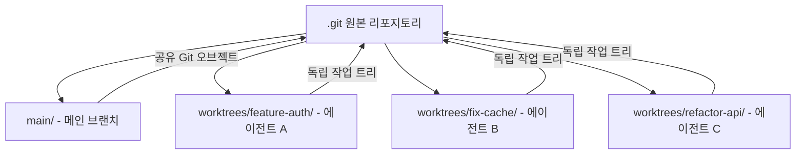

# Git Worktree Isolation for Parallel Coding Agents

각 에이전트에게 독립된 git worktree를 할당해 파일 충돌 없이 병렬 작업하게 하는 격리 패턴.

## 개념

`git worktree`는 하나의 git 리포지토리에서 여러 브랜치를 **동시에 서로 다른 디렉토리에** 체크아웃하는 기능이다. 코딩 에이전트 맥락에서는 "에이전트 하나 = worktree 하나 = 독립 브랜치"로 매핑하면 에이전트 간 파일 충돌이 완전히 사라진다.



각 worktree는 자체 작업 디렉토리를 가지지만 `.git` 오브젝트 저장소는 공유한다. 따라서 디스크 공간 낭비 없이 완전한 파일 시스템 격리를 달성한다.

## 기본 명령

```bash
# worktree 생성
git worktree add ../worktrees/feature-auth -b feature/auth

# 현재 worktree 목록
git worktree list

# worktree 제거 (브랜치 작업 완료 후)
git worktree remove ../worktrees/feature-auth
```

## Claude Code에서의 지원

Claude Code는 worktree 기반 병렬 에이전트 실행을 공식 지원한다:

- **`--worktree` 플래그**: 서브에이전트 실행 시 자동 worktree 생성
- **`.claude/worktrees/` 디렉토리**: worktree 구성을 선언적으로 관리
- **`WorktreeCreate` / `WorktreeRemove` 훅**: worktree 생성·삭제 이벤트에 스크립트 연결
- **`isolation: worktree`** 서브에이전트 프론트매터: 해당 서브에이전트가 자체 worktree에서 실행됨을 선언

## Cursor 3.0에서의 지원

[[cursor-cloud-agents-and-parallel-worktree-agents|Cursor 3.0]]은 `/worktree` 명령을 코어 기능으로 내장했다. UI에서 명령 하나로 worktree 생성 + 에이전트 할당이 완료된다.

## 병렬 에이전트 격리 전략 비교

| 전략 | 격리 수준 | 설정 복잡도 | 컨텍스트 공유 |
|---|---|---|---|
| Git Worktree | 파일 시스템 | 낮음 | Git 오브젝트 공유 |
| 별도 클론 | 완전 격리 | 중간 | 없음 |
| microVM / 컨테이너 | OS 수준 | 높음 | 없음 |
| 단일 디렉토리 | 없음 | 없음 | 완전 공유 (충돌 위험) |

## 실무 패턴

### 패턴 1: 기능 병렬 개발
```
main/           <- 안정 브랜치
worktrees/
  feature-auth/ <- 에이전트 A: 인증 구현
  feature-search/ <- 에이전트 B: 검색 구현
  feature-dashboard/ <- 에이전트 C: 대시보드 구현
```
각 에이전트가 완료되면 `git merge` 또는 PR로 통합.

### 패턴 2: best-of-n 경쟁
동일 태스크를 여러 에이전트가 독립 worktree에서 시도한 후, 평가 기준(테스트 통과, 코드 품질 등)으로 최선 선택.

### 패턴 3: 검토(review) 에이전트 격리
구현 에이전트의 worktree를 읽기 전용으로 마운트하여 별도 검토 에이전트가 코드를 분석하되 수정하지 못하게 제한.

## 주의사항

- **브랜치 충돌**: 같은 브랜치를 두 worktree에서 체크아웃하면 오류 발생. 각 worktree마다 고유 브랜치 필수.
- **공유 설정 파일**: `.env`, `settings.json` 등 리포 루트의 공유 파일은 worktree 간에도 공유된다. 에이전트별 설정이 필요하면 worktree 내 오버라이드 파일 사용.
- **정리(cleanup)**: 작업 완료 후 `git worktree remove`로 정리하지 않으면 스테일(stale) worktree가 누적된다.

## 왜 중요한가

Claude Code가 공식 지원하고, Cursor 3.0도 `/worktree` 명령을 코어로 흡수하면서 "서브에이전트 하나당 worktree 하나" 패턴이 2026년 표준 병렬 실행 방식으로 굳어졌다.

## 대표 레퍼런스

- [Claude Code Common Workflows -- Worktrees](https://code.claude.com/docs/en/common-workflows)
- [Claude Code Hooks Reference](https://code.claude.com/docs/en/hooks)
- [Create custom subagents (Claude Code)](https://code.claude.com/docs/en/sub-agents)
- [Cursor 3.0 Changelog](https://cursor.com/changelog/3-0)

## 관련 문서

- [[cursor-cloud-agents-and-parallel-worktree-agents|Cursor Cloud Agents & Parallel Worktree Agents]]
- [[subagents|Subagents & Multi-Agent Orchestration]]
- [[claude-code-hooks-system|Claude Code Hooks System]]
