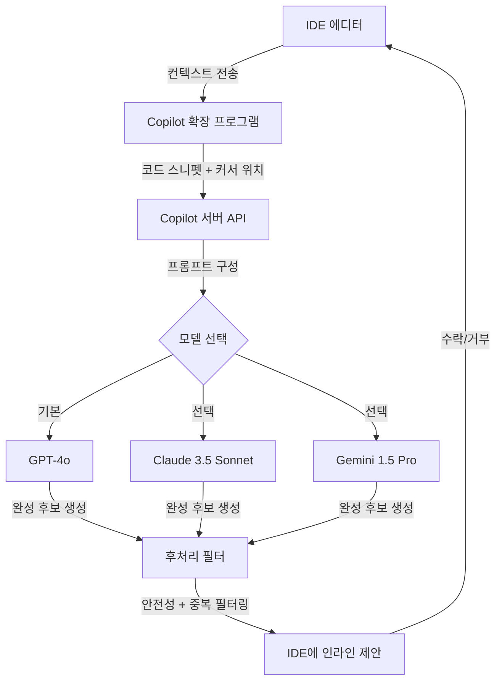
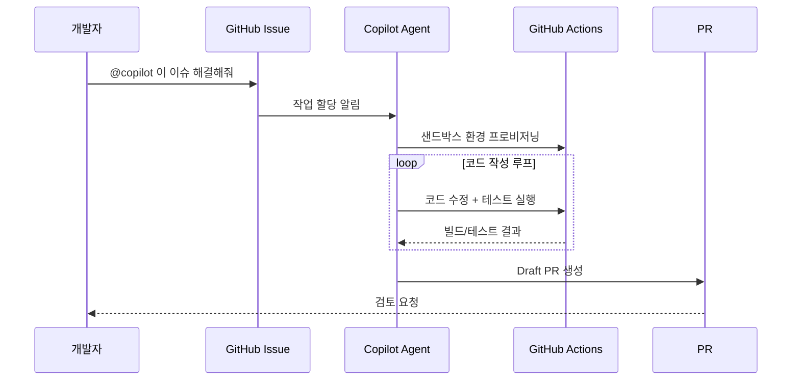

# GitHub Copilot

GitHub Copilot은 2021년 6월 GitHub과 OpenAI가 공동 출시한 AI 기반 코드 어시스턴트로, 현대 AI 코딩 도구 생태계의 시초가 된 제품이다. 자연어 주석과 함수 시그니처만으로 코드를 완성하는 "AI 페어 프로그래머" 개념을 대중화했다.

## 아키텍처 개요



위 다이어그램은 사용자의 IDE에서 입력이 발생할 때 Copilot 서버가 여러 모델 중 하나를 선택해 완성 후보를 생성하고, 후처리를 거쳐 IDE에 표시하는 전체 흐름을 보여준다.

## 역사와 모델 진화

### 세대별 타임라인

| 연도 | 버전 | 기반 모델 | 주요 특징 |
|------|------|-----------|-----------|
| 2021.06 | Technical Preview | OpenAI Codex | GitHub 내부 코드 12B 파라미터 파인튜닝 |
| 2022.06 | GA (일반 공개) | OpenAI Codex | 월 $10/$19, VSCode 정식 지원 |
| 2023.03 | Copilot X | GPT-4 | 채팅, PR 설명, 명령줄 통합 |
| 2023.07 | Copilot Chat GA | GPT-3.5/4 | IDE 내 대화형 Q&A |
| 2024.02 | 멀티모델 Preview | GPT-4o, Claude 3.5 | 모델 선택 옵션 추가 |
| 2024.05 | Workspace | GPT-4o | 다파일 편집, 에이전트 모드 Preview |
| 2025.02 | Copilot Edits GA | GPT-4o, Claude 3.5 Sonnet | 멀티파일 편집 GA |
| 2025.04 | Copilot Coding Agent | GPT-4.1 + Claude | GitHub Actions 기반 비동기 에이전트 |
| 2026.01 | 멀티모델 완전 개방 | GPT-5, Claude 3.7, Gemini 2.0 | 기업 단위 모델 정책 설정 |

### OpenAI Codex에서 멀티모델로

초기 Copilot은 OpenAI Codex(GPT-3 파인튜닝)에 독점 의존했다. 2023년 Codex API 지원 중단 이후 GPT-3.5-turbo, GPT-4로 전환했고, 2024년 멀티모델 정책을 도입하면서 Claude 3.5 Sonnet, Gemini 1.5 Pro를 선택 가능 모델로 추가했다. 2026년 기준 사용자는 개별 요청 단위로 모델을 선택하거나, 관리자가 조직 정책으로 허용 모델 목록을 제한할 수 있다.

## 핵심 기능

### 1. 인라인 완성 (Inline Completion)

편집기에서 타이핑하는 동안 회색 고스트 텍스트로 코드를 제안한다. FIM (Fill-in-the-Middle) 기법([[fill-in-the-middle]])을 사용해 커서 앞뒤 컨텍스트를 모두 활용한다.

```python
# 주석 기반 완성 예시
# 주어진 리스트에서 중복을 제거하고 정렬된 결과를 반환하는 함수
def deduplicate_and_sort(items: list) -> list:
    # Copilot이 아래를 제안:
    return sorted(set(items))
```

컨텍스트 윈도우에 포함되는 항목:
- 열린 파일의 현재 내용 (커서 위 약 2000 토큰)
- 커서 이후 내용 (약 500 토큰)
- 같은 디렉토리의 관련 파일 (스마트 선택)
- `.github/copilot-instructions.md` 저장소 커스텀 지침

### 2. Copilot Chat

IDE 사이드바 또는 인라인으로 대화형 Q&A를 지원한다.

```
/explain  - 선택한 코드 설명
/fix      - 버그 수정 제안
/tests    - 단위 테스트 생성
/doc      - 문서화 주석 작성
@workspace - 전체 저장소 컨텍스트로 질문
@github   - GitHub 이슈/PR 컨텍스트 포함
```

### 3. Copilot Edits (멀티파일 편집)

2025년 GA된 기능으로, 자연어 지시로 여러 파일에 걸친 코드 변경을 한 번에 수행한다. VS Code의 Edit Session API와 통합되며 diff 뷰로 변경 사항을 검토할 수 있다.

```
사용자: "UserService에 이메일 인증 기능을 추가하고 관련 테스트도 작성해줘"
Copilot Edits:
  - src/services/UserService.ts (수정)
  - src/services/EmailService.ts (신규)
  - tests/UserService.test.ts (수정)
  - tests/EmailService.test.ts (신규)
```

### 4. Copilot Coding Agent (비동기 에이전트)

2025년 출시된 에이전트 모드로, GitHub Issues에 `@copilot` 멘션 또는 Copilot 탭에서 작업을 할당하면 GitHub Actions 환경에서 자율적으로 코드를 작성하고 PR을 열어준다.



### 5. CLI 통합 (GitHub Copilot in the CLI)

터미널에서 자연어로 셸 명령을 생성한다.

```bash
# 설치
gh extension install github/gh-copilot

# 사용
gh copilot suggest "로컬 포트 3000에서 실행 중인 프로세스 종료"
# 출력: kill -9 $(lsof -t -i:3000)

gh copilot explain "git rebase -i HEAD~3"
```

## IDE 지원 현황

| IDE | 지원 기능 | 플러그인 방식 |
|-----|-----------|--------------|
| VS Code | 전체 기능 (Chat, Edits, Agent) | 공식 확장 |
| JetBrains 계열 | 전체 기능 | 공식 플러그인 |
| Neovim | 인라인 완성 | community plugin (`copilot.vim`) |
| Xcode | 인라인 완성, Chat | Xcode Extension (베타) |
| Visual Studio | Chat, 인라인 완성 | 공식 확장 |
| GitHub.com | PR 요약, 코드 리뷰 | 내장 |
| GitHub Codespaces | 전체 기능 | 내장 |

## 프롬프트 엔지니어링 - 저장소 커스텀 지침

`.github/copilot-instructions.md`에 저장소별 코딩 규약을 작성하면 모든 Copilot 응답에 시스템 컨텍스트로 포함된다.

```markdown
# Copilot 지침

## 코딩 스타일
- Python 3.12+ 문법 사용
- 모든 함수에 타입 힌트 필수
- docstring은 Google 스타일
- 로깅은 `structlog` 사용, `print()` 금지

## 프로젝트 구조
- 서비스 레이어는 `src/services/`
- 도메인 모델은 `src/domain/`
- 테스트는 pytest + factory_boy
```

## 경쟁 제품 비교

| 제품 | 강점 | 약점 | 차별화 포인트 |
|------|------|------|--------------|
| GitHub Copilot | GitHub 통합, 멀티모델, 에이전트 | 비용($10/$19/$39) | Issues/PR/Actions 에코시스템 |
| [[cursor]] | 로컬 파일 전체 인덱싱, Composer | GitHub 분리 | 코드베이스 전체 이해 |
| [[cline-claude-coder\|Cline]] | 오픈소스, 자체 모델 선택 | VSCode 전용 | MCP 통합, 완전 자율 에이전트 |
| [[continue-vscode-extension\|Continue]] | 완전 오픈소스, 자체 호스팅 | 설정 복잡 | 로컬 모델 지원 |
| [[codex-cli\|Codex CLI]] | 터미널 네이티브 | 에디터 통합 없음 | 셸 레벨 에이전트 |
| [[aider]] | Git 통합, 오픈소스 | TUI | 커밋 단위 변경 관리 |

자세한 AI 코딩 도구 생태계 비교는 [[coding-agents-landscape]] 참조.

## 가격 정책 (2026년 기준)

| 플랜 | 가격 | 대상 | 주요 제한 |
|------|------|------|-----------|
| Free | 무료 | 개인 | 월 2,000 완성, 50 채팅 |
| Pro | $10/월 | 개인 | 무제한 완성/채팅, 멀티모델 |
| Pro+ | $19/월 | 개인 파워유저 | 프리미엄 모델 우선 접근 |
| Business | $19/사용자/월 | 팀 | 관리자 정책, 감사 로그 |
| Enterprise | $39/사용자/월 | 기업 | 자체 지식베이스 인덱싱 |

## 보안과 프라이버시

- **코드 전송**: 제안 생성을 위해 주변 코드가 서버로 전송됨 (암호화 전송)
- **학습 데이터**: Business/Enterprise 플랜은 코드가 모델 학습에 사용되지 않도록 옵트아웃 기본값
- **Copilot 필터**: Public 코드와 일치하는 제안을 차단하는 중복 탐지 옵션 (저작권 위험 감소)
- **Secret 탐지**: GitHub Secret Scanning과 연동해 민감 정보 노출 경고

## 실무 활용 팁

### 효과적인 컨텍스트 제공

```python
# 나쁜 예 - 컨텍스트 부족
def process(data):
    pass

# 좋은 예 - 타입 힌트 + 주석으로 의도 명시
def process_user_events(
    events: list[UserEvent],
    start_date: datetime,
    end_date: datetime
) -> dict[str, int]:
    """날짜 범위 내 사용자 이벤트를 집계하여 이벤트 타입별 카운트를 반환한다."""
    pass
```

### 반복 패턴 활용

유사한 코드가 이미 파일에 있을 때 Copilot은 패턴을 학습하여 일관된 스타일로 완성한다. 첫 번째 메서드를 완전히 작성한 후 유사 메서드를 작성하면 효율이 높다.

### 테스트 주도 완성

```python
# 테스트 먼저 작성 -> Copilot이 구현 완성
def test_calculate_discount():
    assert calculate_discount(100, 0.1) == 90
    assert calculate_discount(200, 0.2) == 160
    assert calculate_discount(0, 0.5) == 0

# 위 테스트 후 함수 시그니처만 입력하면 구현을 완성해줌
def calculate_discount(price: float, rate: float) -> float:
```

## 관련 도구와 생태계

Copilot의 등장은 코드 완성 도구의 AI 전환을 촉발했고, 이후 [[cursor]], [[windsurf]], [[cline-claude-coder|Cline]] 등 다양한 AI 코딩 에디터가 등장했다. GitHub의 Actions/Issues/PR 에코시스템과의 깊은 통합은 Copilot만의 강점이다.

AI 코드 완성의 기술적 기반인 [[fill-in-the-middle]] 학습 방식과 [[code-completion]] 개념을 이해하면 Copilot 활용도를 높일 수 있다.

## 관련 문서

- [[cursor]] - AI 코딩 에디터, 코드베이스 전체 인덱싱
- [[continue-vscode-extension]] - 오픈소스 AI 코딩 어시스턴트
- [[cline-claude-coder]] - VSCode 자율 에이전트 플러그인
- [[codex-cli]] - OpenAI Codex 기반 터미널 에이전트
- [[coding-agents-landscape]] - AI 코딩 도구 생태계 전체 지도
- [[fill-in-the-middle]] - FIM 학습 기법 (코드 중간 채우기)
- [[claude-code]] - Anthropic의 AI 코딩 어시스턴트
- [[aider]] - 오픈소스 터미널 AI 코딩 도구
