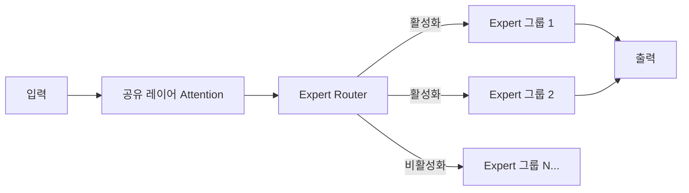

# GLM-5.1

2026년 4월 Z.ai(구 Zhipu)가 공개한 754B MoE 오픈소스 에이전틱 엔지니어링 모델.

## 개요

GLM-5.1은 중국 AI 기업 Z.ai(前 Zhipu AI)가 2026년 4월 7일 MIT 라이선스로 공개한 대규모 언어 모델이다. 총 754B 파라미터의 MoE(Mixture of Experts) 아키텍처를 채택했으며, 에이전틱 코딩에 특화된 장기 자율 실행 능력을 핵심 강점으로 내세운다.

## 핵심 사양

| 항목 | 값 |
|---|---|
| 총 파라미터 | 754B (MoE) |
| 라이선스 | MIT (완전 오픈소스) |
| 공개일 | 2026년 4월 7일 |
| SWE-bench Pro 점수 | 58.4점 (오픈소스 최초 1위) |
| 주요 특징 | 8시간 장시간 자율 코딩, 수백 라운드 RL 튜닝 |

[교차검증 필요] 활성화 파라미터 수, 정확한 컨텍스트 길이는 공식 HuggingFace 모델 카드에서 확인 권장.

## MoE 아키텍처 특성

754B 전체 파라미터 중 추론 시 일부 expert만 활성화하여 실제 연산량을 줄인다. 이는 모델 크기 대비 실용적인 추론 비용을 달성하는 MoE의 핵심 이점이다.

## 에이전틱 코딩 특화 설계

GLM-5.1의 차별점은 단순 코드 생성이 아닌 **장기 자율 실행(long-horizon autonomous coding)**이다:

- **8시간 자율 코딩**: 단발 생성이 아니라 실제 소프트웨어 개발 사이클(분석 -> 구현 -> 테스트 -> 디버깅)을 자율 수행
- **수백 라운드 RL 튜닝**: 단순 SFT(Supervised Fine-Tuning)를 넘어 강화학습(RL)으로 에이전틱 행동을 반복 최적화
- **도구 사용 능력**: 코드 실행, 파일 조작, 웹 검색 등 에이전트 도구 체인 운용

## SWE-bench Pro 성과

2026년 4월 기준 SWE-bench Pro 리더보드에서 오픈소스 최초 1위를 기록했다. 비교:

| 모델 | SWE-bench Pro | 상태 |
|---|---|---|
| GLM-5.1 | 58.4점 | 오픈소스 1위 |
| GPT-5.4 | 57.7점 | 상용 |
| [[claude-opus-4-6|Claude Opus 4.6]] | 57.3점 | 상용 |

[교차검증 필요] 리더보드는 시시각각 변동하므로 [Scale Labs 공식 리더보드](https://labs.scale.com/leaderboard/swe_bench_pro_public)에서 최신 수치 확인 필요.

## MIT 라이선스의 의미

상용 폐쇄 모델(GPT-5.4, Claude Opus 4.6)과 달리 MIT 라이선스는 다음을 허용한다:
- 로컬 호스팅 및 상업적 사용
- 모델 가중치 수정 및 재배포
- 사내 보안 요구사항이 있는 기업 도입

754B 규모 모델을 로컬 실행하려면 대규모 GPU 인프라가 필요하지만, [[교차검증 필요] Unsloth 등 양자화 도구를 통해 소비자급 하드웨어에서도 실험 가능한 버전 제공을 검토 중이라고 알려져 있다.

## 중국 빅테크 오픈소스 경쟁

[[qwen3-6-plus|Qwen3.6-Plus]](Alibaba)와 GLM-5.1(Z.ai)은 중국 빅테크 두 진영의 플래그십 경쟁을 보여준다:

| 항목 | GLM-5.1 | Qwen3.6-Plus |
|---|---|---|
| 라이선스 | MIT (완전 오픈소스) | 상용 API |
| 컨텍스트 | [교차검증 필요] | 1M 토큰 |
| 강점 | 에이전틱 코딩 | 멀티모달, Always-on Reasoning |
| 접근 방식 | 오픈소스 생태계 | 클라우드 API |

## 대표 자료

- [zai-org/GLM-5.1 -- Hugging Face](https://huggingface.co/zai-org/GLM-5.1)
- [GLM-5.1 Collection -- Hugging Face](https://huggingface.co/collections/zai-org/glm-51)
- [GLM-5.1 -- Unsloth Documentation](https://unsloth.ai/docs/models/glm-5.1)
- [SWE-Bench Pro Leaderboard -- Scale Labs](https://labs.scale.com/leaderboard/swe_bench_pro_public)

## 관련 문서

- [[qwen3-6-plus|Qwen3.6-Plus]]
- [[claude-opus-4-6|Claude Opus 4.6]]
- [[long-horizon-agent-benchmarks|Long-Horizon Agent Benchmarks]]
