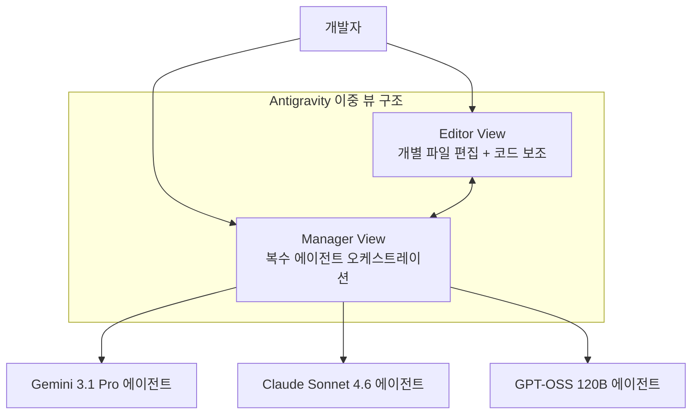
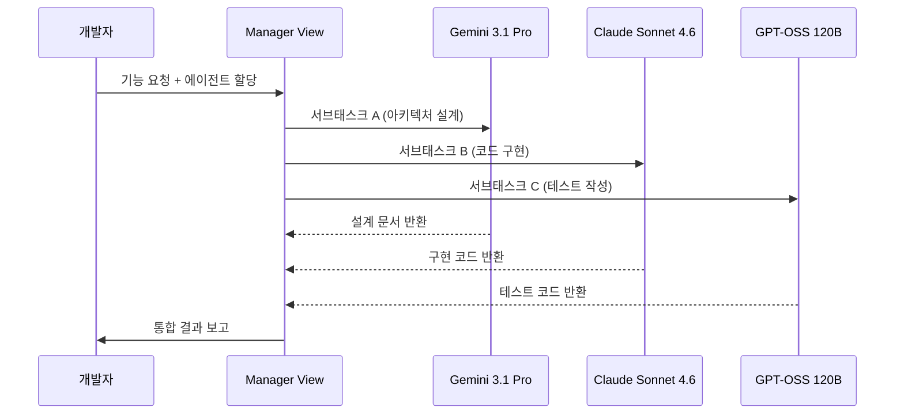
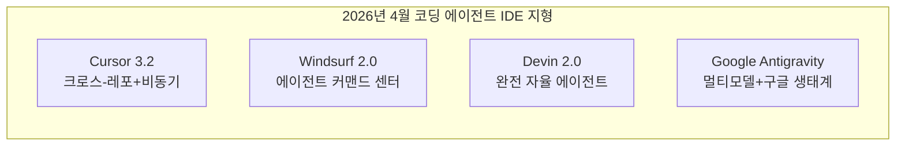

# Google Antigravity - 에이전트 퍼스트 AI IDE

## 제품 정체성

Google Antigravity는 Google이 2025년 11월 18일 발표하고 2026년 4월 현재 퍼블릭 프리뷰로 무료 제공 중인 **에이전트 퍼스트 IDE(agent-first IDE)**다. 기존 코딩 보조 도구(copilot)와 달리, 에이전트가 IDE의 1등 시민(first-class citizen)으로 설계된 개발 환경을 표방한다.

[[google-ai-studio-antigravity]] 참조: Google AI Studio와의 통합 경로 및 Gemini 모델 접근 방식을 다룬다.

## 핵심 아키텍처: 이중 뷰 구조

### Editor View (에디터 뷰)

전통적인 코드 편집 인터페이스에 인라인 AI 보조 기능을 통합한 뷰다. 기존 VS Code 류의 에디터와 유사하나, 에이전트가 파일을 능동적으로 수정·제안할 수 있는 권한을 갖는다.

**주요 기능:**
- 인라인 에이전트 제안 (코드 라인 옆에 에이전트 수정 제안 표시)
- 다중 파일 동시 수정 (에이전트가 연관 파일 자동 파악 후 일괄 수정)
- 코드 인텐트(intent) 기반 설명: "왜 이 코드가 이렇게 작성됐는지" 에이전트가 추론

### Manager View (매니저 뷰)

복수 에이전트를 병렬로 관리하는 오케스트레이션 인터페이스다. 각 에이전트에게 개별 태스크를 할당하고, 실행 상태·로그·결과를 중앙에서 모니터링한다.

**Manager View 작업 흐름:**

## 멀티모델 지원

Antigravity는 단일 모델에 종속되지 않는 **멀티모델 아키텍처**를 채택한다. 2026년 4월 기준 지원 모델:

| 모델 | 제공사 | 특화 영역 |
|------|--------|-----------|
| Gemini 3.1 Pro | Google (기본값) | 장문 컨텍스트, 멀티모달 |
| Claude Sonnet 4.6 | Anthropic | 코드 품질, 지시 따르기 |
| GPT-OSS 120B | OpenAI 오픈소스 | 범용 코딩 태스크 |

사용자는 태스크별로 최적의 모델을 선택하거나, Manager View에서 에이전트별로 다른 모델을 할당할 수 있다.

## 현재 상태 (2026년 4월)

### 강점

- **무료 퍼블릭 프리뷰**: 진입 장벽 없이 체험 가능
- **멀티모델**: 특정 벤더에 종속되지 않는 유연성
- **Google 생태계 통합**: Google Cloud, Firebase, BigQuery와의 연계 가능성

### 알려진 문제

2026년 4월 기준 사용자 리포트 기반 주요 이슈:
- **컨텍스트 메모리 에러**: 장시간 세션에서 에이전트가 이전 컨텍스트를 잃어버리는 버그
- **멀티 에이전트 동기화 지연**: Manager View에서 3개 이상의 에이전트 병렬 실행 시 응답 지연
- **코드베이스 인덱싱 속도**: 대형 모노레포 초기 인덱싱이 느림

이러한 안정성 문제는 퍼블릭 프리뷰 단계임을 감안해도 Cursor 3.2나 Windsurf 2.0 대비 성숙도 차이가 있음을 시사한다.

## 경쟁 구도 내 포지셔닝

**Antigravity의 차별화 포인트:**
1. **Google 생태계 레버리지**: GCP 기반 인프라를 코드와 직접 연결
2. **모델 중립성**: 특정 AI 제공사에 종속되지 않는 설계 철학
3. **에이전트 퍼스트 설계**: 나중에 에이전트를 추가한 것이 아닌, 처음부터 에이전트 중심으로 설계

**약점:**
- Google의 개발자 도구 시장에서의 역사적 약점 (Google Wave, Stadia 등 중단 사례)
- Cursor/VS Code 생태계 대비 확장 지원 미흡
- 2026년 4월 기준 베타 안정성 문제

## 배경: Google의 개발자 도구 전략

Google은 AI IDE 시장에서 뒤늦게 진입했다. VS Code 기반 GitHub Copilot(Microsoft)과 Cursor가 시장을 선점한 상황에서, Google은 처음부터 에이전트 중심으로 설계된 새로운 IDE로 차별화를 꾀하고 있다.

Gemini 3.1 Pro를 기본 모델로 탑재하되 Claude·GPT도 지원함으로써, Google AI 모델의 성능이 경쟁사 대비 부족하더라도 개발자가 최적 모델을 선택해 사용할 수 있는 구조를 만들었다.

## 왜 중요한가

Google Antigravity는 AI 코딩 도구 시장에서 **"에이전트가 IDE 설계의 기본 단위가 되어야 한다"**는 명제를 가장 명확하게 구현한 제품이다. Manager View를 통한 멀티 에이전트 오케스트레이션은 개발자가 에이전트 팀을 관리하는 미래 개발 패러다임의 초기 구현체다. 아직 안정성 문제가 있지만, Google의 자원과 Gemini 생태계를 고려할 때 향후 빠른 개선이 예상된다.

[[swe-bench-pro-contamination]]에서 다루는 벤치마크 신뢰성 문제는 Antigravity를 포함한 모든 AI 코딩 도구 평가에 적용된다.

## 관련 문서

- [[google-ai-studio-antigravity]] - Google AI Studio와 Antigravity 통합
- [[cursor-3-2-release]] - 경쟁사 Cursor 3.2
- [[windsurf-2-0-release]] - 경쟁사 Windsurf 2.0
- [[devin-2-0-release]] - 자율 에이전트 Devin 2.0
- [[swe-bench-pro-contamination]] - AI 코딩 도구 평가 기준 문제
