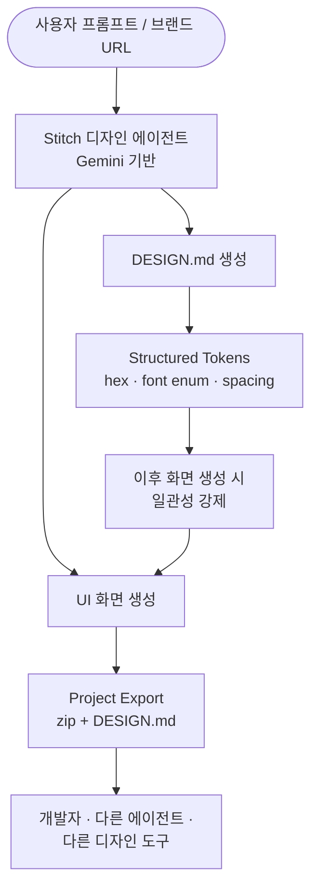
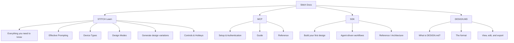

# Google Stitch

Google의 AI 기반 디자인 도구. "Stitch - Design with AI"라는 태그라인으로 제공되며, 내부 코드네임은 **Nemo**. Gemini 모델 계열(`gemini-2.5-flash-native-audio-preview-12-2025` 등)을 기반으로 UI를 생성한다.

## 개요

Stitch는 자연어 프롬프트에서 시작해 다음을 생성하는 디자인 에이전트다:
- UI 화면 (screen)
- [[DESIGN.md 포맷|DESIGN.md]] 디자인 시스템 문서
- 디바이스별 variants
- export 가능한 아티팩트

사용자는 "playful coffee shop ordering app with warm colors, rounded corners, and a friendly feel" 같은 **분위기(vibe) 프롬프트**로 시작할 수 있고, 기존 브랜드 URL/이미지에서 스타일을 추출할 수도 있다.

## 아키텍처 전반

중앙에 Stitch 에이전트가 있고, 디자인 시스템을 이중 표현(마크다운 + 토큰)으로 유지하면서 화면 생성과 export로 출력한다.

## 주요 기능

### 1. DESIGN.md 생성·편집·export
Stitch의 핵심 기능. 상세는 [[stitch design-md guide]] 참조. 세 가지 생성 경로:

| 경로 | 입력 | 결과 |
|------|------|------|
| 에이전트 생성 | 분위기 프롬프트 | 에이전트가 팔레트·타이포·가이드라인 생성 |
| 브랜딩 파생 | 기존 브랜드 URL 또는 이미지 | 팔레트·타이포·스타일 패턴 추출 |
| 수동 작성 | 사용자가 마크다운 직접 작성 | 정확한 디자인 선호 인코딩 |

### 2. Design System 패널
- 활성 디자인 시스템의 resolved 토큰 시각화
- color palette / typography / roundedness GUI 편집
- 프로젝트 기본값 지정 가능 (이후 화면에 자동 상속)

### 3. 화면(Screen) 생성
- "learn" 섹션의 문서 구조로 보아 **Device Types, Design Modes, Variants**를 지원 (모바일/데스크탑, 라이트/다크 등)
- 단일 화면에서 여러 variants 자동 생성

### 4. MCP 서버
- **Stitch MCP 서버**를 제공하여 외부 코딩 에이전트(Claude Code 등)에서 Stitch의 기능을 호출 가능
- Setup/Guide/Reference 3개 섹션의 MCP 문서 존재

### 5. SDK
- "Build your first design", "Use with AI SDK", "Agent-driven workflows"
- Edit screen, generate variants, download artifacts, extract themes
- Reference + Architecture 문서 제공

## 문서 사이트 구조

현재 위키에는 DESIGN.MD 섹션만 수집되어 있음. 나머지 섹션은 지식 갭.

## Portability 원칙

Stitch의 철학 중 가장 중요한 부분: **export된 DESIGN.md는 Stitch에 의존하지 않는다**.

> "The exported DESIGN.md is a standalone document. It doesn't depend on Stitch to be useful."

→ 다른 AI 에이전트(예: [[Claude Code]])에 그대로 넘길 수 있고, 팀 소스오브트루스 파일로 git에 커밋 가능. Figma 같은 클로즈드 생태계와 대비되는 특징.

## 경쟁·대안

- **Figma**: 전통적 디자인 도구. 시각 편집 강력하지만 AI 에이전트가 읽기 어려움. Stitch 출시 후 주가가 하락했다는 보도 있음 (2026-03 medium.com/@0xmega 기사 참조)
- **v0 (Vercel)**: 코드 중심 AI UI 생성. DESIGN.md 같은 portable 스펙은 없음
- **Lovable, Bolt.new**: 풀스택 AI 빌더. 디자인 시스템 관리보다 앱 빌드에 초점

## 지식 갭 (아직 수집 안 된 Stitch 기능)

- [ ] Effective Prompting 가이드
- [ ] Device Types / Design Modes / Variants 상세
- [ ] MCP 서버 setup·guide·reference
- [ ] SDK tutorial / agent-driven workflows
- [ ] Architecture 문서
- [ ] Controls & Hotkeys

## 관련 문서

- [[stitch design-md guide]]
- [[DESIGN.md 포맷]]
- [[ai-readable design system]]
- [[design tokens]]
- [[Claude Code]]
