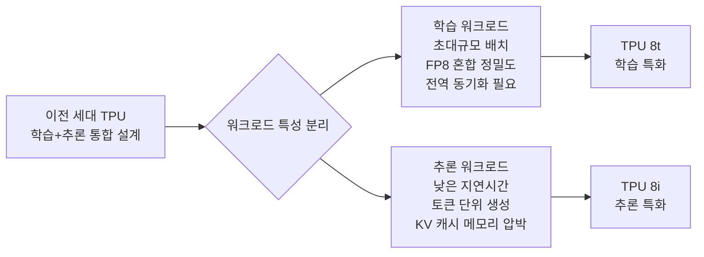
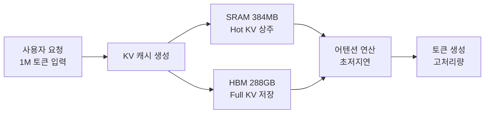
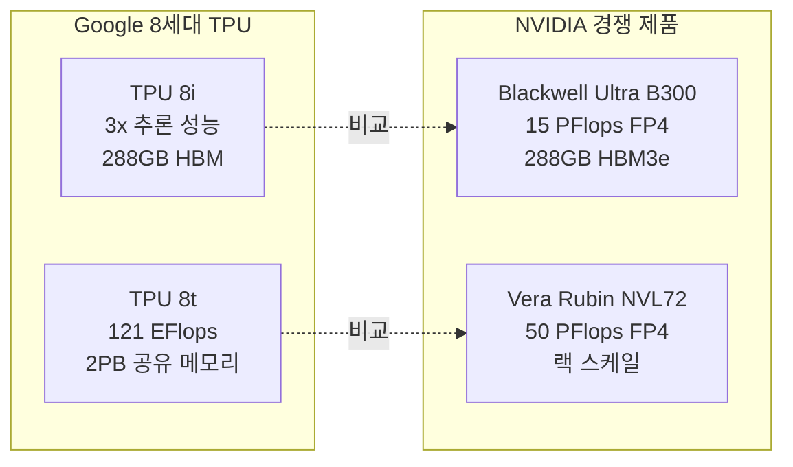

# Google TPU 8세대 (TPU 8t / TPU 8i)

Google이 2026년 4월 22일 Cloud Next '26에서 발표한 8세대 TPU(Tensor Processing Unit)로, 처음으로 **학습 전용(8t)** 과 **추론 전용(8i)** 두 개의 별도 칩을 동시 발표했다. 코드명 "Ironwood"로 불렸던 세대 번호를 공식 8세대로 확정한 발표이기도 하다. [[ai-accelerators]] 분야에서 NVIDIA Blackwell Ultra와 정면 대결하는 Google의 전략 자산이다.

이전 세대인 [[google-trillium-tpu-v6]](6세대, 2025년 GA)의 후계로, 학습/추론 워크로드가 분화됨에 따라 목적 특화 설계를 도입한 것이 핵심 전환점이다.

---

## 학습-추론 분리 설계 철학

기존 TPU 세대는 학습과 추론에 동일 칩을 사용했다. 8세대부터 Google은 워크로드 특성 차이가 충분히 커졌다고 판단하여 전용 설계를 채택했다. 이는 NVIDIA가 H100(학습)과 L40S(추론)를 별도 라인업으로 운영하는 전략과 유사하다.

---

## TPU 8t (학습 전용)

### 핵심 사양

| 항목 | 값 |
|------|-----|
| 최대 슈퍼파드 규모 | 9,600칩 |
| 슈퍼파드 컴퓨트 | 121 엑사플롭스 (FP8 기준 추정) |
| 슈퍼파드 공유 메모리 | 2 PB (페타바이트) |
| 이전 세대 대비 성능 | 7세대(Trillium) 대비 2.8배 |
| 인터커넥트 | ICI (Inter-Chip Interconnect) 고속 패브릭 |

### 설계 특징

**9,600칩 슈퍼파드**는 단일 글로벌 메모리 공간을 공유하는 초대형 클러스터로, 모델 병렬화(텐서·파이프라인·데이터 병렬)를 수작업 분산 없이 처리한다.

- 2PB 공유 메모리: 수조 파라미터 모델을 메모리 오프로딩 없이 상주 가능
- 121 엑사플롭스: GPT-4급 모델 학습 시간 대폭 단축
- ICI 저지연 연결: All-Reduce 통신 병목을 최소화하여 선형 확장성(linear scaling) 유지

### 활용 시나리오

- 100B+ 파라미터 기반 모델의 사전 학습(pre-training)
- Gemini 차세대 버전 학습 인프라
- 멀티모달(텍스트+이미지+오디오) 초대규모 학습 실험

---

## TPU 8i (추론 전용)

### 핵심 사양

| 항목 | 값 |
|------|-----|
| 온칩 SRAM | 384 MB |
| HBM 용량 | 288 GB |
| ICI 대역폭 | 19.2 Tb/s |
| 이전 세대 대비 추론 성능 | 3배 향상 |
| 설계 최적화 방향 | 낮은 지연시간, KV 캐시 최대화 |

### 설계 특징

추론은 학습과 달리 **배치당 토큰을 순차 생성**하므로 메모리 접근 패턴이 다르다. 8i는 다음을 최우선으로 설계했다.

- **큰 온칩 SRAM (384MB)**: KV 캐시의 Hot 데이터를 SRAM에 상주시켜 HBM 접근 횟수 감소
- **288GB HBM**: 긴 컨텍스트(1M 토큰)에서 발생하는 대용량 KV 캐시를 수용
- **19.2 Tb/s ICI 대역폭**: 멀티-칩 추론 시 KV 캐시 샤딩 및 분산 처리 효율 극대화

### 활용 시나리오

- Gemini API 프로덕션 서빙 (수백만 사용자 동시 요청)
- 장기 실행 에이전트 루프에서 반복 추론
- 배치 추론 파이프라인 (RAG 임베딩·리랭킹)

---

## 세대별 성능 진화

| 세대 | 이름 | 출시 | 주요 특징 |
|------|------|------|-----------|
| 5세대 | TPU v5e | 2023 | 효율 특화, GA |
| 6세대 | Trillium (v6e) | 2025 GA | v5e 대비 4.7배 컴퓨트, 91 엑사플롭스 클러스터 |
| 7세대 | (Ironwood 전신) | 미발표 | 내부 실험 단계로 추정 |
| 8세대 | 8t / 8i | 2026년 4월 발표 | 학습/추론 분리, 121 엑사플롭스, 3배 추론 성능 |

6세대 Trillium과 8세대의 중간 세대(7세대)에 대한 공개 정보는 확인되지 않음. Google이 세대 번호를 건너뛰었거나 내부 코드명만 사용했을 가능성이 있다. [교차검증 필요]

---

## NVIDIA와의 비교

- **TPU 8t vs Vera Rubin**: 둘 다 랙/클러스터 스케일 학습 목표. TPU 8t는 소프트웨어 통합(Gemini 에코시스템) 우위, NVIDIA는 CUDA 생태계 우위
- **TPU 8i vs Blackwell Ultra**: 추론 효율 경쟁. B300은 FP4 15 PFlops + 범용성, 8i는 Google 워크로드 최적화 + ICI 고대역폭

---

## 출시 타임라인

| 단계 | 시기 |
|------|------|
| 발표 | 2026년 4월 22일 (Cloud Next '26) |
| H2 2026 프리뷰 | 제한적 고객 접근 |
| 2027년 GA | Vertex AI 공개 접근 |

현재(2026년 4월) 정식 접근 불가 상태이며, 기존 워크로드는 [[google-trillium-tpu-v6]]를 사용해야 한다.

---

## 관련 문서

- [[ai-accelerators]] - AI 가속기 일반 개요 및 벤더 비교
- [[google-trillium-tpu-v6]] - 현재 상용 TPU 6세대 Trillium
- [[gemini-enterprise-agent-platform]] - 8t/8i 인프라 위에서 동작하는 에이전트 플랫폼
- [[gemini-2-5-flash-thinking]] - 8i 추론 칩에서 서빙되는 모델
