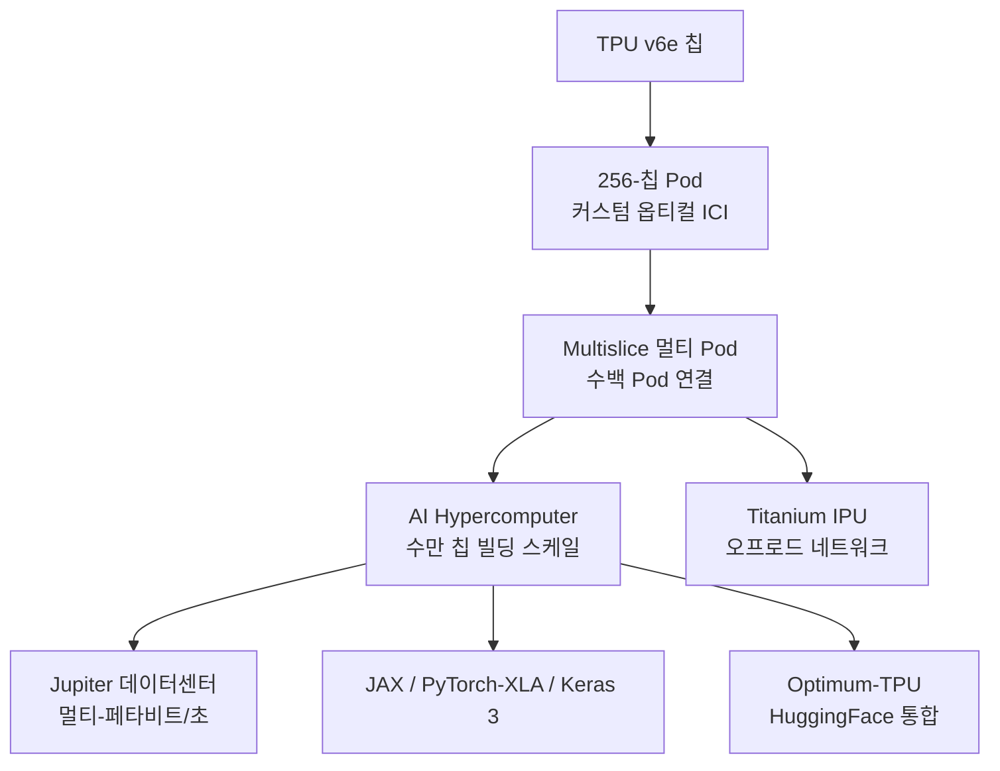

# Google Trillium (TPU v6)

Trillium은 Google Cloud의 6세대 TPU(Tensor Processing Unit)다. 2024년 5월 Google I/O에서 발표됐고, 같은 해 10월 프리뷰를 거쳐 12월 일반 가용성(GA)으로 출시됐다. 코드네임 v6e로 불리며, 5세대 v5e/v5p 대비 칩당 연산 4.7배, HBM 용량/대역폭 2배, ICI(Inter-Chip Interconnect) 대역폭 2배, 에너지 효율 67% 향상을 달성했다. Gemini 1.5 Flash·Imagen 3·Gemma 2 등 Google 자체 모델 학습/서빙에 사용되며, 후속 세대인 Ironwood(TPU v7)가 2025년 4월 발표되면서 추론 시대(age of inference)를 위한 가속기로 진화 중이다.

## 핵심 사양

| 항목 | Trillium (v6e) | TPU v5e 대비 |
|------|----------------|--------------|
| 칩당 피크 연산 | 4.7배 향상 | 4.7x |
| HBM 용량/대역폭 | 2배 | 2x |
| ICI 대역폭 | 2배 | 2x |
| 에너지 효율 | 67% 향상 | +67% |
| Pod 크기 | 256 칩/Pod | 동일 |
| 단일 클러스터 피크 | 91 exaflops | 4x v5p 최대 클러스터 |
| 가격 대비 성능 | 1.8x (v5e), 2x (v5p) | "역대 최고 가성비 TPU" |

3세대 SparseCore가 탑재돼 임베딩 가속(추천/랭킹 시스템)에 강점을 보이며, MXU(Matrix Multiply Unit) 클럭 향상과 차세대 HBM의 유연한 채널 아키텍처가 핵심 변화다.

## Pod 구조와 멀티슬라이스



Pod 내부는 256 칩이 커스텀 옵티컬 ICI로 묶이고, Pod 간에는 Multislice 기술과 Titanium IPU(Intelligence Processing Unit)가 결합돼 수백 Pod, 수만 칩 규모의 빌딩 스케일 슈퍼컴퓨터로 확장된다. Jupiter 데이터센터 네트워크의 멀티-페타비트/초 백본이 이 확장을 뒷받침한다. AI Hypercomputer 스택은 JAX, PyTorch/XLA, Keras 3를 1급으로 지원하고 HuggingFace의 Optimum-TPU 라이브러리와도 호환된다.

## 학습/추론 벤치마크

Google이 공개한 v5e 대비 학습 성능 향상:

- Gemma 2-27B / MaxText Default-32B / Llama 2-70B: 4배 이상
- Llama 2-7B / Gemma 2-9B: 3배 이상
- Stable Diffusion XL 추론 처리량: 3배

이 결과는 v5e 베이스라인 기준이며, v5p와의 비교는 가격 대비 성능 2배 향상이라는 형태로만 공개됐다. [교차검증 필요: Trillium의 정확한 칩당 BF16 TFLOPS, HBM2 vs HBM3 사양 등 세부 수치는 Google이 명시적으로 공개하지 않은 부분이 있다.]

## 적용 워크로드

| 도메인 | 사례 |
|--------|------|
| 파운데이션 모델 | Gemini 1.5 Flash, Imagen 3, Gemma 2 |
| 추천/랭킹 | SparseCore 활용 임베딩 학습 |
| 신약 개발 | Deep Genomics |
| 로보틱스 | Nuro |
| 엔터프라이즈 GenAI | 수만 고객 워크로드 |

발표 자료는 Trillium이 "장기 컨텍스트 멀티모달 모델의 학습/서빙"에 특히 적합하다고 명시했다. AlphaProteo 등 Google DeepMind 사이언스 워크로드도 v5p/v6 세대를 활용한 것으로 알려져 있다. [교차검증 필요: AlphaProteo가 명시적으로 Trillium에서 학습됐는지는 공식 발표문에서 직접 확인되지 않았다.]

## v5p 및 후속 v7과의 관계

```mermaid
flowchart LR
    v5e[TPU v5e<br/>2023, 추론/소형학습]
    v5p[TPU v5p<br/>2023, 대규모 학습]
    v6e[TPU v6e Trillium<br/>2024-05 발표<br/>2024-12 GA]
    v7[TPU v7 Ironwood<br/>2025-04 발표<br/>추론 시대]

    v5e --> v6e
    v5p --> v6e
    v6e --> v7
    v6e -.가성비 1.8x.-> v5e
    v6e -.가성비 2x.-> v5p
    v7 -.연산 4x.-> v6e
    v7 -.HBM 6x.-> v6e
    v7 -.전력 효율 2x.-> v6e
```

- **v5e**: 비용 효율적 추론/소규모 학습용. Trillium의 직접 베이스라인.
- **v5p**: 2023년 출시된 대규모 학습용 플래그십. Trillium은 v5p의 후속이자 v5e의 후속을 통합한 단일 라인으로 자리 잡았다.
- **v7 Ironwood**: 2025년 4월 발표. 칩당 연산 4배, HBM 192GB(6배), ICI 1.2 TBps(1.5배), 단일 슈퍼팟 9,216 칩, 42.5 ExaFLOPS 규모. Anthropic이 최대 100만 TPU 규모로 Claude 학습을 확장하겠다고 발표한 가속기가 바로 Ironwood다.

## 가용 리전 및 가격

Trillium v6e는 Google Cloud 다수 리전에서 가용하다. 공식 문서는 us-central, us-east, europe-west 등 주요 리전에서의 프리뷰/GA 진입을 단계적으로 공개해 왔다. [교차검증 필요: 정확한 리전 매트릭스 및 가격은 Google Cloud 공식 페이지(`cloud.google.com/tpu/pricing`)에서 직접 확인할 것.]

## 위치적 의미

Trillium은 Google이 NVIDIA H100/H200 의존도를 자체 실리콘으로 대체하기 위한 핵심 자산이다. JAX/MaxText 기반 자체 학습 스택과 Pathways 분산 시스템을 결합해 Gemini 모델을 자체 데이터센터에서 처리할 수 있게 만든 것이 전략적 포인트다. 외부 고객(Anthropic, Apple, Salesforce 등)도 점차 Trillium/Ironwood로 워크로드를 이전하고 있어, [[ai-accelerators]] 시장에서 NVIDIA 독점 구도를 완화하는 두 번째 주요 축 역할을 한다.

## 관련 문서

- [[ai-accelerators]] — AI 가속기 생태계 개관
- [[anakin-podracer]] — JAX 기반 RL 분산 학습 아키텍처 (TPU 친화적)
- [[sebulba-podracer]] — 액터-러너 분리형 분산 RL 시스템
- [[frontier-lab-rl-infra]] — 프런티어 랩의 RL 인프라 비교
- [[gpu-cluster-scheduling]] — 대규모 가속기 클러스터 스케줄링
- [[long-context-scaling]] — 긴 컨텍스트 학습 인프라 요구사항
- [[gpu-architecture-ml]] — GPU 아키텍처 비교 관점
- [[gemini-models]] — Gemini 모델 패밀리 (Trillium에서 학습/서빙)

## 1차 소스

- Google Cloud Blog, "Introducing Trillium, sixth-generation TPUs" (2024-05-15)
- Google Cloud Blog, "Trillium sixth-generation TPU is in preview" (2024-10-31)
- Google Cloud Blog, "Trillium TPU is GA" (2024-12-12)
- Google Blog, "Ironwood: The first Google TPU for the age of inference" (2025-04)
- Google Cloud Documentation, "TPU v6e"
