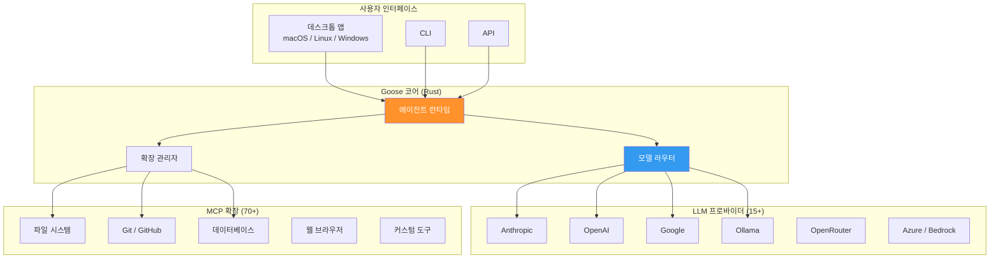
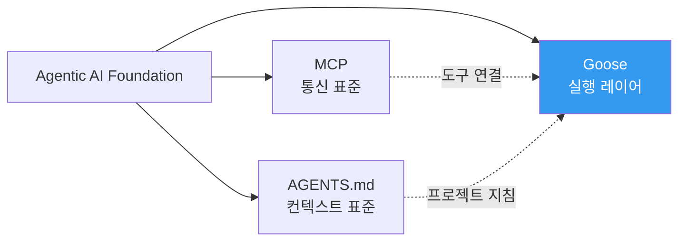

# Goose (Block)

Block(구 Square)이 개발한 오픈소스 범용 AI 에이전트 프레임워크. Rust 기반, Apache 2.0 라이선스로, 15개 이상의 LLM 프로바이더를 지원하며 MCP를 통해 70개 이상의 확장과 연결된다. [[agentic-ai-foundation|AAIF]]의 창립 프로젝트 중 하나다.

## 왜 지금 중요한가

Goose는 코딩 전용 에이전트가 아닌 "범용 AI 에이전트"를 지향하며, 연구, 작성, 자동화, 데이터 분석까지 포괄한다. 41.9K GitHub 스타를 달성한 오픈소스 프로젝트로, AAIF 창립과 함께 MCP 생태계의 핵심 실행 레이어로 자리매김했다.

## 아키텍처

### 3계층 상호운용 설계
Block CTO Dhanji Prasanna가 설명한 모듈식 설계의 세 계층:

1. **사용자 인터페이스** -- 데스크톱 앱(macOS, Linux, Windows), CLI, 또는 맞춤형 UI 선택 가능
2. **언어 모델** -- 사용자가 15+ 프로바이더 중 자유 선택, ACP를 통해 기존 Claude/ChatGPT/Gemini 구독 활용 가능
3. **시스템 연결** -- MCP를 통해 70+ 확장과 통합

### 기술 스택
| 항목 | 내용 |
|------|------|
| 핵심 언어 | Rust 58.8%, TypeScript 33.7% |
| 라이선스 | Apache License 2.0 |
| GitHub 스타 | 41.9K+ (4.2K 포크) |
| LLM 프로바이더 | 15+ (Anthropic, OpenAI, Google, Ollama, OpenRouter, Azure, Bedrock 등) |
| MCP 확장 | 70+ |
| 플랫폼 | macOS, Linux, Windows |

## 주요 기능

### 자동화된 소프트웨어 엔지니어링
- 파일 읽기/쓰기, 코드 실행, 테스트 수행, 의존성 설치 등 자율 처리
- 반복적 유지보수 작업을 자동화하여 창의적 업무에 집중 가능
- 실시간 개발 환경(IDE) 내 직접 작동

### 범용 에이전트 역할
코딩에 한정되지 않고 다양한 도메인 지원:
- **연구** -- 문서 검색, 데이터 수집, 분석
- **작성** -- 보고서, 문서 생성
- **자동화** -- 반복 워크플로 구축
- **데이터 분석** -- 데이터 처리, 시각화

### Block 내부 활용 사례
- 개발자 워크플로우 간소화
- 음악 제작 개선 (TIDAL 연계)
- 쇼핑 경험 개인화 (Cash App / Square)

## AAIF와의 관계

Goose는 Block이 AAIF에 기증한 프로젝트로, 현재 `aaif-goose` 조직 아래로 재구성되었다. MCP(통신)와 AGENTS.md(컨텍스트)가 제공하는 표준 위에서 실제 작업을 수행하는 실행 레이어 역할을 한다.

## 경쟁 환경에서의 위치

| 에이전트 | 개발사 | 주요 특징 | 라이선스 |
|----------|--------|-----------|----------|
| **Goose** | Block/AAIF | 범용, Rust, 15+ LLM | Apache 2.0 |
| Claude Code | Anthropic | 코딩 특화, Node.js | 상용 |
| Codex CLI | OpenAI | 코딩 특화, 샌드박스 | 상용/오픈소스 |
| Cursor | Anysphere | IDE 통합, 코딩 특화 | 상용 |

Goose의 차별점은 **범용성**(코딩 외 연구/작성/자동화)과 **완전한 오픈소스**(Apache 2.0)에 있다.

## 실무 관점

Goose를 도입할 때 고려할 점:
- **모델 유연성** -- 특정 LLM에 종속되지 않아 비용/성능 최적화 용이
- **MCP 생태계** -- 커뮤니티가 새 MCP 통합을 구축하면 자동으로 기능 확장
- **Rust 기반** -- 성능과 이식성이 우수하나, 확장 개발 시 Rust/TypeScript 역량 필요
- **AAIF 거버넌스** -- 단일 기업 종속 없이 장기 지속 가능성 확보

## 관련 페이지

- [[agentic-ai-foundation|Agentic AI Foundation (AAIF)]] -- 상위 거버넌스 재단
- [[a2a-protocol|A2A Protocol]] -- 에이전트 간 통신 프로토콜
- [[agent-skills|Agent Skills]] -- 에이전트 역량 모듈화 표준
- [[how-coding-agents-work|How Coding Agents Work]] -- 코딩 에이전트 작동 원리
- [[xcode-agentic-coding|Xcode 26.3 Agentic Coding]] -- MCP 기반 IDE 통합 사례

## 대표 레퍼런스

- [block/goose -- GitHub](https://github.com/block/goose)
- [Block Open Source Introduces Codename Goose](https://block.xyz/inside/block-open-source-introduces-codename-goose)
- [Goose Documentation](https://goose-docs.ai/)
