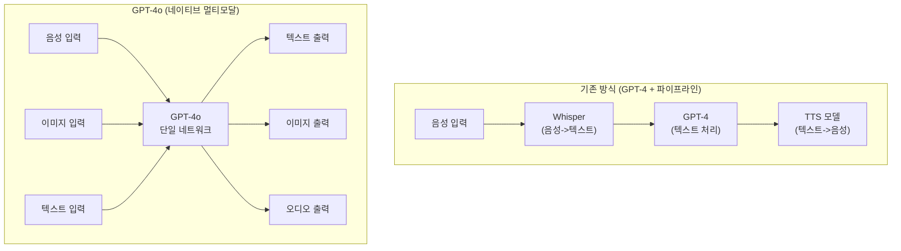
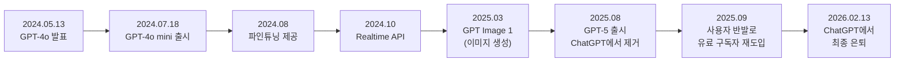

# GPT-4o

## 개요

GPT-4o("o"는 "omni")는 OpenAI가 2024년 5월 13일 발표한 네이티브 멀티모달 생성 사전 학습 트랜스포머 모델이다. 텍스트, 이미지, 오디오를 단일 신경망에서 통합 처리하는 최초의 OpenAI 모델로, 이전 GPT-4가 별도 모델을 통해 음성과 이미지를 처리하던 파이프라인 방식을 하나의 엔드투엔드 아키텍처로 대체했다.

128K 토큰 컨텍스트 윈도우를 지원하며, 50개 이상의 언어를 커버한다. GPT-4 Turbo 대비 2배 빠른 속도와 50% 낮은 비용으로, 발표 시점에 음성, 다국어, 비전 벤치마크에서 최고 성능을 기록했다. 2025년 8월 GPT-5 출시로 ChatGPT에서 제거되었으나, 사용자 반발로 유료 구독자에게 재도입되었고, 2026년 2월 13일 최종 은퇴했다.

## 핵심 아키텍처: 네이티브 멀티모달

GPT-4o의 가장 중요한 기술적 혁신은 멀티모달 통합 방식이다.

기존 GPT-4는 음성, 이미지, 텍스트를 별도 모델(Whisper, CLIP 등)로 전처리한 뒤 텍스트로 변환하여 처리했다. GPT-4o는 모든 모달리티를 하나의 네트워크에서 직접 처리하여 정보 손실과 지연을 줄였다.

### 파이프라인 방식 vs 네이티브 통합

| 측면 | GPT-4 + 파이프라인 | GPT-4o |
|------|------------------|--------|
| 음성 처리 | Whisper -> GPT-4 -> TTS (3단계) | 단일 모델 (1단계) |
| 응답 지연 | 2.8-5.4초 | 평균 320ms (인간 수준 ~230ms) |
| 정보 보존 | 중간 변환에서 톤/감정/억양 손실 | 음성의 감정, 배경 소리 등 직접 인식 |
| 이미지 이해 | 별도 비전 모델 | 네이티브 시각 처리 |

네이티브 통합의 실질적 효과는 음성 대화에서 가장 극적이다. 평균 320ms의 응답 시간은 인간의 평균 반응 시간(230ms)에 근접하며, 음성의 톤, 감정, 배경 소음 등 비언어적 정보도 직접 처리할 수 있다.

## 성능과 벤치마크

| 벤치마크 | GPT-4 | GPT-4o | 비고 |
|---------|-------|--------|------|
| MMLU | 86.5% | 88.7% | 다분야 지식 평가 |
| 음성 인식 (ASR) | - | SOTA | 최초 네이티브 음성 지원 |
| 다국어 | ~80% | 97%+ 화자 커버 | 50+ 언어 |
| 비전 이해 | GPT-4V 수준 | SOTA | 발표 시점 기준 |

## GPT-4o mini

2024년 7월 18일 출시된 경량 변형으로, GPT-3.5 Turbo를 대체하는 포지션이다.

- **비용**: 입력 $0.15 / 출력 $0.6 (100만 토큰당). 원본 GPT-4o 대비 60% 저렴
- **성능**: GPT-3.5 Turbo를 대폭 능가하면서 GPT-4o에 근접
- **용도**: 대량 API 호출, 실시간 애플리케이션, 비용 민감 사용 사례

## 주요 기능과 API

### Advanced Voice Mode

2024년 5월 출시와 함께 ChatGPT Plus/Team 구독자에게 제공된 실시간 음성 대화 기능이다. GPT-4o의 네이티브 음성 처리 능력을 활용하여, 감정 표현, 노래, 다양한 억양의 자연스러운 음성 상호작용을 지원한다.

### Realtime API

2024년 10월 도입된 개발자용 API로, 오디오 입출력을 실시간 스트리밍으로 처리한다. 음성 비서, 실시간 통역, 고객 서비스 등 저지연 음성 애플리케이션 구축에 활용된다.

### 파인튜닝

2024년 8월부터 기업 고객에게 GPT-4o 파인튜닝이 제공되었으며, 특정 도메인이나 스타일에 맞춰 모델을 커스터마이징할 수 있다.

### 이미지 생성

GPT Image 1 모델을 통해 이미지 생성 능력을 갖추었으며, 이는 [[dall-e|DALL-E]] 시리즈의 후속 진화에 해당한다. 대화 맥락에서 이미지를 생성하고 수정하는 통합 경험을 제공한다.

## 타임라인

GPT-4o는 발표부터 은퇴까지 약 21개월의 생애주기를 가졌다. Voice 모드는 GPT-4o 또는 mini로 계속 구동된다.

## 영향과 의의

GPT-4o는 "멀티모달 AI"의 정의를 바꿨다. 이전에는 여러 모델을 연결하는 파이프라인이 멀티모달의 표준이었으나, GPT-4o 이후 "네이티브 멀티모달"(단일 모델에서 모든 모달리티를 통합 학습)이 업계 표준으로 자리잡았다. 이 패러다임은 이후 [[gpt-5-architecture|GPT-5]], Gemini 3 시리즈, [[claude-opus-4-6|Claude Opus 4.6]] 등 주요 모델에 영향을 미쳤다.

| 측면 | GPT-4o 이전 | GPT-4o 이후 |
|------|-----------|-----------|
| 멀티모달 처리 | 파이프라인 (모델 연결) | 네이티브 통합 (단일 모델) |
| 음성 AI | 별도 ASR+TTS 필요 | 실시간 음성 대화 기본 |
| API 비용 구조 | 모달리티별 별도 과금 | 통합 토큰 과금 |
| 응답 지연 | 초 단위 | 밀리초 단위 |

## 한계와 비판

- **지식 컷오프**: 2023년 10월 학습 데이터 기준. 최신 정보는 인터넷 검색에 의존
- **환각(hallucination)**: 자신감 있게 틀린 정보를 생성하는 문제는 GPT-4 대비 개선되었으나 완전히 해결되지 않음
- **이미지 생성 품질**: [[dall-e|DALL-E 3]] / GPT Image 1 기반이지만, [[midjourney|Midjourney]]나 [[stable-diffusion|Stable Diffusion]] 커뮤니티 파인튜닝 결과물 대비 미적 품질에서 열세
- **짧은 수명**: 발표 후 15개월 만에 GPT-5로 교체. 빠른 모델 교체 주기가 API 의존 앱에 불확실성을 부여

## 참고 자료

- [Hello GPT-4o - OpenAI](https://openai.com/index/hello-gpt-4o/)
- [GPT-4o - Wikipedia](https://en.wikipedia.org/wiki/GPT-4o)
- [GPT-4o System Card (PDF)](https://cdn.openai.com/gpt-4o-system-card.pdf)

## 관련 문서

- [[gpt-5-architecture]] -- GPT-4o 후속 모델
- [[dall-e]] -- GPT Image로 진화한 이미지 생성 계보
- [[clip]] -- 이전 세대 멀티모달 비전-언어 모델
- [[vision-transformer]] -- 비전 인코더 아키텍처
