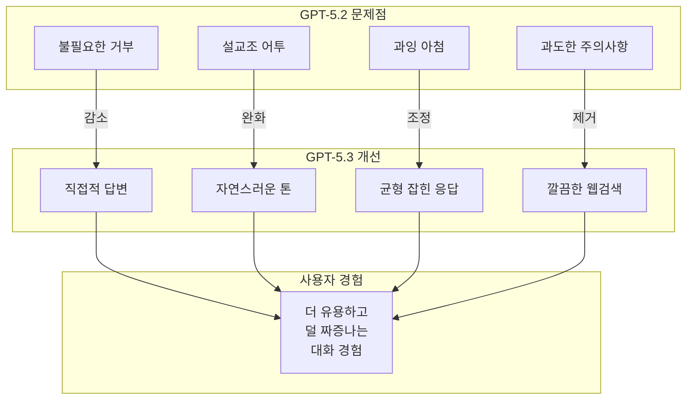

## 개요

GPT-5.3 Instant는 OpenAI가 2026년 3월 3일 출시한 "일상 대화 최적화" 모델이다. 이전 GPT-5.2 Instant에서 지적받던 불필요한 거부(refusal), 설교조 어투, 과잉 사전주의 문구를 대폭 줄이고, 웹검색 품질을 개선한 것이 핵심이다. "ChatGPT가 진정하라고 말하는 것을 멈출 것"이라는 표현으로 주목받았다.

## 핵심 특징

- **불필요한 거부 대폭 감소**: 긴 면책조항 없이 바로 답변 제공
- **설교조/방어적 어투 완화**: "Stop. Take a breath." 같은 과잉 반응 제거
- **자연스러운 대화 스타일**: 불필요한 선언적 표현을 줄이고 집중적이면서도 자연스러운 톤
- **웹검색 품질 향상**: 더 정확하고 풍부한 맥락의 검색 결과, 불필요한 막다른 골목/주의사항 감소
- **과잉 아첨(sycophancy) 완화**: 이전 버전의 과도하게 드라마틱하거나 어색한 응답 스타일 수정

## 기술 상세

### 이전 버전 문제점

GPT-5.2 Instant는 다음과 같은 행동으로 사용자 불만을 야기했으며, "뻔하고 눈살을 찌푸리게 하는 응답"이 인터넷 밈의 주제가 될 정도였다:

- **"Stop. Take a breath."** 같은 불필요한 진정 권유 -- 사용자가 요청하지 않은 감정적 개입
- 정상적인 질문에 대한 불필요한 거부 및 장문의 면책조항
- 과도한 도덕적/윤리적 사전주의 표현 (답변 전 과도한 "방어적 도덕 전주곡")
- 지나치게 열정적이거나 아첨하는 응답 톤 -- "과장되거나 사용자 의도에 대한 부당한 가정"
- 사용자 니즈에 대한 근거 없는 추정
- 웹검색 결과 제시 시 과도한 주의사항/면책조항이 대화 흐름을 방해

### GPT-5.3 Instant 개선 방향

### 웹검색 통합

이전 버전에서 웹검색 결과를 제시할 때 과도한 주의사항과 면책조항이 대화 흐름을 방해하는 문제가 있었다. GPT-5.3 Instant에서는 더 정확한 답변과 풍부한 맥락의 검색 결과를 제공하면서, 불필요한 중단 요소를 최소화했다.

### 모델 철학 전환

OpenAI는 AI 모델의 "안전성"과 "유용성" 사이의 균형점을 재조정했다. 과도한 안전 장치가 오히려 사용자 경험을 해치고 모델의 실용성을 떨어뜨린다는 피드백을 반영하여, 실제로 위험한 요청에만 거부를 적용하고 일반적인 대화에서는 직접적으로 응답하는 방향으로 전환했다.

이는 Anthropic의 [[extended-constitutional-ai]]가 거짓 거부 감소를 위해 상황별 우선순위 규칙을 명시화한 것과 같은 맥락이다. 업계 전반적으로 "안전성 극대화"에서 "안전성과 유용성의 실질적 균형"으로 방향이 전환되고 있음을 보여준다.

### 개선 효과 요약

| 영역 | GPT-5.2 Instant | GPT-5.3 Instant |
|------|-----------------|-----------------|
| 거부 빈도 | 정상 질문에도 빈번한 거부 | 실제 위험 요청에만 거부 |
| 응답 톤 | 과장/설교/아첨 | 직접적/자연스러운 톤 |
| 웹검색 | 주의사항이 결과를 가림 | 깔끔하게 맥락화된 결과 |
| 감정적 개입 | "Stop. Take a breath." | 요청한 내용에만 집중 |
| 면책조항 | 장문의 사전주의 표현 | 필요할 때만 간결하게 |

## 업계 트렌드: 안전성-유용성 균형 재조정

GPT-5.3 Instant의 출시는 AI 업계 전반의 방향 전환을 반영한다. 2024-2025년까지 주요 모델들은 "안전성 극대화" 방향으로 설계되었으나, 이로 인한 과도한 거부, 설교, 면책조항이 사용자 경험을 심각하게 저해했다. 2026년에 접어들면서 주요 제공자들이 동시에 방향을 재조정하고 있다:

- **Anthropic**: [[extended-constitutional-ai]]에서 23,000단어 헌법으로 상황별 우선순위를 명시화하여 거짓 거부를 구조적으로 줄임
- **Google**: Gemini 3.1 Flash Lite에서 효율성과 직접적 응답에 초점
- **Mistral**: [[mistral-small-4]]에서 `reasoning_effort` 파라미터로 불필요한 연산 없이 태스크에 맞는 응답 수준 제공

이는 "안전한 AI"의 정의가 "모든 것을 거부하는 AI"에서 "실제 위험에만 반응하고 나머지는 유용하게 도와주는 AI"로 진화하고 있음을 보여준다.

## 접근 방법

- ChatGPT 앱 및 웹에서 기본 모델로 적용
- OpenAI API를 통한 프로그래밍 접근 가능
- 출시일: 2026년 3월 3일
- "Instant" 라인업은 일상 대화에 최적화된 경량 모델로, GPT-5.4 같은 프론티어 추론 모델과는 별도의 제품 라인

## 관련 문서

- [[gpt-5-4]] - OpenAI의 최신 프론티어 모델
- [[gemini-3-1-flash-lite]] - Google의 효율 모델
- [[claude-opus-4-6]] - Anthropic의 프론티어 모델
- [[mistral-small-4]] - Mistral의 효율적 MoE 모델
