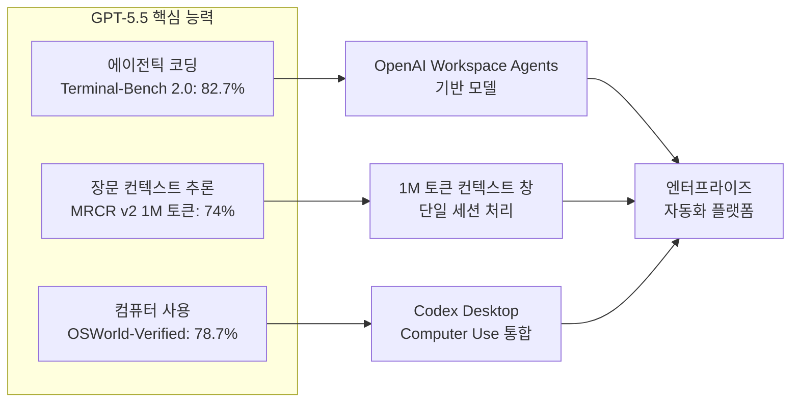

# GPT-5.5 출시 (2026년 4월 23일)

## 개요

GPT-5.5는 OpenAI가 2026년 4월 23일 출시한 모델로, [[gpt-models]] 시리즈에서 GPT-5.4의 후속에 해당한다. OpenAI는 이 모델을 "지금까지 가장 스마트하고 직관적인 모델"로 소개했으며, 에이전틱 코딩(agentic coding), 장문 컨텍스트 추론, 컴퓨터 사용(Computer Use) 세 분야에서 이전 세대 대비 큰 향상을 보였다. 텍스트, 이미지, 오디오, 비디오를 단일 아키텍처로 처리하는 네이티브 멀티모달 모델이다.

GPT-5.5는 단독 모델로서보다 OpenAI의 에이전트 플랫폼([[openai-workspace-agents]], [[codex-cli-april-2026]])을 구동하는 핵심 엔진으로 작동한다.

---

## 벤치마크 성능

### Terminal-Bench 2.0 (에이전틱 코딩)

**Terminal-Bench 2.0**은 터미널 환경에서 에이전트가 실제 코딩 작업을 수행하는 능력을 측정하는 벤치마크다([[terminal-bench-2-0]] 참조):

- GPT-5.5: **82.7%**
- GPT-5.4(추정): 이전 세대 대비 "큰 향상" 명시

Terminal-Bench는 SWE-bench가 GitHub 이슈 해결에 초점을 맞추는 것과 달리, 터미널 명령 실행, 파일 조작, 환경 설정 등 더 폭넓은 개발 작업을 포함한다.

### MRCR v2 (장문 컨텍스트 추론)

MRCR(Multimodal Reasoning and Context Retrieval)은 긴 컨텍스트에서 정보를 정확히 검색하고 추론하는 능력 측정:

- GPT-5.5: **74%** (1,000,000 토큰 컨텍스트에서)
- 1백만 토큰 컨텍스트는 약 750만 영문 단어 또는 수백 시간 분량의 회의록에 해당

### OSWorld-Verified (컴퓨터 사용)

**OSWorld**는 실제 운영체제 환경에서 GUI 기반 작업을 에이전트가 수행하는 능력을 평가하는 벤치마크:

- GPT-5.5: **78.7%**
- 현존 모델 중 최고 수준의 컴퓨터 사용 능력을 주장

---

## 아키텍처 특징

### 단일 네이티브 멀티모달 처리

GPT-5.5는 텍스트, 이미지, 오디오, 비디오를 별도 모달리티 모듈이 아닌 **단일 아키텍처**에서 처리한다. 이는 GPT-4V(텍스트+이미지)에서 GPT-4o(텍스트+이미지+오디오), 그리고 GPT-5.5(전체 멀티모달)로 이어지는 통합 흐름의 완성이다.

아키텍처 상세 내용은 비공개이나 다음이 추정된다:

- 사전 훈련 단계에서 모든 모달리티 데이터를 혼합 학습
- 모달리티 간 어텐션 메커니즘으로 상호 참조 가능
- 단일 토큰 공간에서 모든 모달리티 표현 통합

자세한 아키텍처 원칙은 [[gpt-5-architecture]] 참조.

---

## [[reasoning-llm]] 관점

GPT-5.5는 OpenAI의 "reasoning" 모델 계열(o1, o3 등)과는 다른 라인에 위치한다:

| 구분 | 계열 | 특징 |
|------|------|------|
| GPT 계열 | GPT-5.5 | 범용, 빠른 추론, 멀티모달 |
| o 계열 | o1, o3, o4-mini | 느린 추론, 수학/과학 특화 |

그러나 GPT-5.5는 "extended thinking" 유사 기능을 내장해 두 계열의 경계가 흐려지고 있다. [[reasoning-llm]] 에서 다루는 추론 모델과의 비교는 이 맥락에서 의미를 갖는다.

---

## 제품 포지셔닝

### ChatGPT "슈퍼앱" 전략

OpenAI는 GPT-5.5 출시와 함께 ChatGPT를 단순한 채팅 인터페이스에서 "슈퍼앱(super app)"으로 확장하는 전략을 드러냈다:

- 코딩 에이전트 (Codex)
- 컴퓨터 사용 에이전트 (Codex Desktop)
- 엔터프라이즈 자동화 ([[openai-workspace-agents]])
- 소비자 멀티미디어 (이미지, 비디오, 음성 생성)

GPT-5.5는 이 모든 기능의 공통 기반 모델로 작동한다.

### 가격 및 접근 방식

공개된 정보 기준:

- ChatGPT Plus/Pro 구독자에게 우선 제공
- API는 기존 GPT 가격 구조를 따르는 것으로 알려짐
- GPT-5.4와의 병존 또는 교체 여부는 2026년 4월 기준 명확하지 않음 [교차검증 필요]

---

## 경쟁 맥락

GPT-5.5 출시 시점(2026년 4월 23일)은 경쟁사 동향과 맞물린다:

- **Anthropic**: Claude Opus 4.7 출시(4월 16일), SWE-bench 87.6%
- **Google**: Gemini 3.x 시리즈 지속 업데이트
- **xAI**: Grok 4.3 Beta 출시(4월 17일)

Claude Opus 4.7과의 직접 비교를 위해 [[claude-models]] 참조.

---

## 관련 내부 기능

GPT-5.5 출시와 연동된 OpenAI 제품들:

- [[openai-workspace-agents]] - GPT-5.5 기반 엔터프라이즈 자동화 에이전트
- [[codex-cli-april-2026]] - Codex CLI 4월 업데이트 (GPT-5.5 통합)
- [[terminal-bench-2-0]] - 에이전틱 코딩 벤치마크

---

## 관련 문서

- [[gpt-models]] - OpenAI GPT 시리즈 전체 개요
- [[reasoning-llm]] - 추론 특화 LLM 개념
- [[openai-workspace-agents]] - OpenAI 엔터프라이즈 에이전트 플랫폼
- [[claude-models]] - Anthropic Claude 시리즈 (경쟁 맥락)
- [[multi-agent-orchestration]] - 멀티 에이전트 오케스트레이션
- [[terminal-bench-2-0]] - Terminal-Bench 벤치마크
