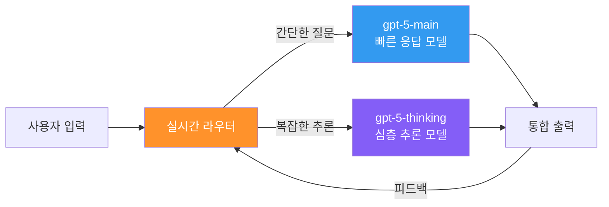
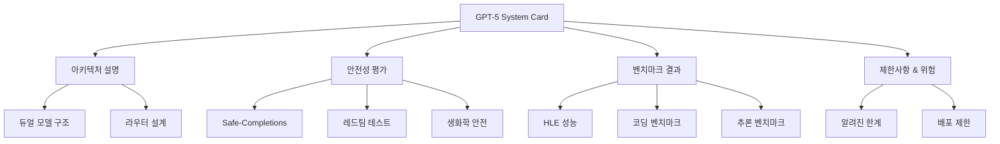

# GPT-5 Architecture & System Card

OpenAI가 2025년 12월 공개한 GPT-5의 시스템 카드 및 아키텍처 문서. 핵심은 gpt-5-main(빠른 응답)과 gpt-5-thinking(심층 추론) 두 모델을 실시간 라우터로 동적 전환하는 듀얼 모델 시스템이며, safe-completions라는 새로운 안전 학습 접근법을 도입했다.

## 왜 지금 중요한가

GPT-5는 단일 모델이 아닌 듀얼 모델 + 라우터 아키텍처를 최초로 상용화한 사례다. 483명 이상의 저자가 참여한 시스템 카드(arXiv 2601.03267)는 환각 감소, 아첨 최소화, safe-completions 등 안전성 접근법을 상세히 공개하여, 프론티어 모델의 투명성 기준을 재설정했다.

## 듀얼 모델 아키텍처

### gpt-5-main
- "스마트하고 빠른 모델"로 대부분의 일반 질문에 응답
- 작문, 코딩, 일상 대화 등 낮은 복잡도 태스크에 최적화
- 낮은 레이턴시와 높은 처리량 우선

### gpt-5-thinking
- 어려운 문제를 위한 깊이 있는 추론 모델
- 수학, 논리, 과학적 분석 등 복잡한 태스크에 투입
- [[cot-monitorability|CoT Monitoring]]과 연계한 추론 과정 투명화

### 실시간 라우터
라우터는 다음 신호를 기반으로 모델을 동적 선택한다:
- **대화 유형** -- 간단 질의 vs 심층 분석
- **복잡도 추정** -- 태스크 난이도 실시간 평가
- **도구 필요성** -- 외부 도구 호출 여부
- **사용자 의도** -- 맥락 기반 의도 파악

라우터는 사용자 전환 패턴, 응답 선호도, 정확성 측정을 통해 지속적으로 학습 개선된다.

## Safe-Completions

GPT-5에서 도입된 최신 안전 학습 접근법이다.

### 핵심 메커니즘
- 모델이 금지된 콘텐츠 생성을 시도할 때 안전한 대안 완성으로 유도
- 기존 RLHF 기반 거부 학습과 달리, 생성 과정 자체에 안전 제약을 내장
- 생물학/화학 등 고위험 영역에서는 예방적 원칙(precautionary principle)을 적용하여 고급 기능으로 분류

### 안전성 개선 영역
- **환각(hallucination)** 현저히 감소
- **명령 이행(instruction following)** 능력 향상
- **아첨(sycophancy)** 최소화 -- 사용자에게 무조건 동의하지 않음
- 작문, 코딩, 건강 관련 분야에서 특화된 안전 가이드라인

## 시스템 카드 구조

시스템 카드는 483명 이상의 저자가 참여했으며, 2025년 12월 19일 arXiv에 공개되었다(arXiv:2601.03267). OpenAI의 프론티어 모델 중 가장 상세한 수준의 안전성 문서화를 달성했다.

## 아키텍처적 의미

### 단일 모델에서 시스템으로의 전환
GPT-5의 듀얼 모델 아키텍처는 "하나의 큰 모델"에서 "특화된 모델들의 협업 시스템"으로의 패러다임 전환을 대표한다. 이는 [[speculative-speculative-decoding|Speculative Decoding]]이나 [[sdsl|SDSL]]과도 연결되는 추론 효율화 트렌드의 일부다.

### 라우팅의 중요성
실시간 라우터는 사실상 또 하나의 모델이며, 라우팅 품질이 전체 시스템 성능을 결정한다. 이는 [[multi-agent-orchestration|Multi-Agent Orchestration]]에서의 오케스트레이터 역할과 유사한 설계 패턴이다.

## 실무 관점

GPT-5 시스템 카드는 모델 자체보다 **시스템 설계 문서**로 읽는 것이 유용하다. 듀얼 모델 + 라우터 패턴은 프로덕션 AI 시스템에서 비용 대비 품질 최적화의 참조 아키텍처가 되고 있다.

## 관련 페이지

- [[cot-monitorability|CoT Monitorability]] -- 추론 과정 모니터링
- [[claude-opus-4-6|Claude Opus 4.6]] -- 경쟁 프론티어 모델
- [[deliberative-alignment|Deliberative Alignment]] -- 안전 정렬 접근법
- [[sdsl|SDSL]] -- 추론 최적화 스케일링 법칙

## 대표 레퍼런스

- [GPT-5 System Card -- OpenAI](https://openai.com/index/gpt-5-system-card/)
- [GPT-5 System Card (PDF) -- OpenAI CDN](https://cdn.openai.com/gpt-5-system-card.pdf)
- [GPT-5 System Card -- arXiv:2601.03267](https://arxiv.org/abs/2601.03267)
