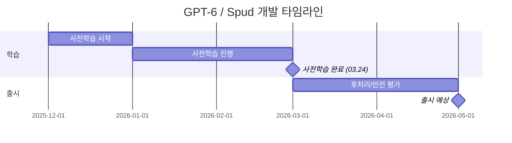

## 개요

GPT-6는 OpenAI가 개발 중인 차세대 파운데이션 모델이다. 내부 코드네임 "Spud"로 알려져 있으며, 2026년 3월 24일 텍사스 에이빌린(Abilene)의 Stargate 데이터센터에서 사전학습을 완료했다. Sam Altman은 학습 완료 후 "몇 주 정도 남았다"고 언급했으며, 2026년 4-5월 출시가 유력하다. Polymarket 예측 시장에서는 4월 30일까지 출시 확률을 78%, 6월 30일까지를 95%로 평가하고 있다.

GPT-6의 설계 철학은 Greg Brockman이 언급한 "경제를 움직이는(move the economy) 모델"로, 벤치마크 성능보다 현실 세계에서의 경제적 가치 창출에 초점을 맞추고 있다. 기존 GPT 시리즈의 보조(assistant) 역할에서 독립적 업무 완료가 가능한 에이전틱 모델로의 전환을 목표로 한다.

## 핵심 특징

- **에이전틱 자율 실행**: 다단계 계획 수립, 도구 조율(orchestration), 브라우저 내비게이션을 독립적으로 수행. Atlas 브라우저와의 통합이 예상된다
- **수조 단위 파라미터**: Mixture-of-Experts(MoE) 아키텍처 기반으로 추정되며, 이전 세대 대비 규모가 대폭 확대
- **확장된 컨텍스트 윈도우**: 1M-2M 토큰으로 확장 예상 ([[gpt-5-4]]의 128K 대비 약 10-15배)
- **강화학습 기반 추론**: Sam Altman에 따르면 GPT-5와 GPT-6는 강화학습(RL)을 활용하며, "새로운 과학 발견(알고리즘, 물리학, 생물학)과 유사한" 패턴을 보인다
- **멀티모달 네이티브 지원**: 텍스트, 이미지 네이티브 처리에 더해 오디오/비디오 처리 능력이 개선
- **개인화 메모리**: 사용자별 장기 메모리 기능이 강화되어 지속적인 개인화 경험 제공

## 기술 상세

### Stargate 학습 인프라

GPT-6 학습에 사용된 Stargate 데이터센터는 OpenAI의 최대 규모 컴퓨팅 인프라다.

| 항목 | 사양 |
|---|---|
| 위치 | 텍사스 에이빌린(Abilene) |
| GPU 규모 | 200만 개 이상 (초기 10만+ H100/H200급) |
| 전력 | 5 GW 이상 |
| 파트너 | Oracle, NVIDIA (GB200 랙) |
| 운영 시작 | 2025년 6월 (초기 워크로드) |

### 학습 일정

### 아키텍처 추정

공식적으로 확인되지 않았으나, 여러 소스에서 다음과 같은 아키텍처를 추정하고 있다.

- **Mixture-of-Experts (MoE)**: 수조 단위의 총 파라미터에서 토큰당 일부 전문가만 활성화하여 효율성 확보
- **강화학습 파이프라인**: 사전학습 후 대규모 RL 단계를 통한 추론/에이전틱 능력 강화
- **멀티모달 조기 융합(Early Fusion)**: 텍스트, 이미지, 오디오를 통합 백본에서 처리하는 구조 예상

### 네이밍

GPT-5.5와 GPT-6 사이에서 최종 제품명이 결정되지 않은 상태다. OpenAI의 마케팅 포지셔닝에 따라 결정될 것으로 보이며, GPT-5 시리즈([[gpt-5-4]] 등)와의 차별화 정도에 따라 달라질 전망이다. "Spud"라는 코드네임은 OpenAI의 내부 명칭으로, 공개 출시 시에는 GPT 또는 o-시리즈 브랜딩으로 변경될 것으로 예상된다.

### 에이전틱 능력 상세

GPT-6/Spud의 에이전틱 능력은 기존 GPT 시리즈의 보조(assistant) 패러다임에서 근본적인 전환을 의미한다. Greg Brockman이 설명한 설계 원칙에 따르면, Spud는 다음과 같은 자율 실행 능력을 목표로 한다.

- **목표 기반 계획**: 최종 목표에서 역방향으로 다단계 행동 계획을 수립하고 순차적으로 실행
- **도구 활용**: 코드 실행, 웹 검색, API 연동을 자율적으로 결정하고 호출
- **오류 복구**: 실행 중 오류 발생 시 접근 방식을 자동으로 조정
- **장기 작업 수행**: 지속적인 인간 개입 없이 수 시간-수일 단위의 복잡한 작업 수행
- **맥락 기반 의사결정**: 축적된 대화/작업 이력에 기반한 자율적 판단

이러한 에이전틱 전환은 OpenAI의 [[codex-cli]] 등 개발자 도구와의 통합을 통해 실질적인 경제적 가치를 창출하려는 전략과 맞닿아 있다. Sam Altman은 GPT-6가 "자동화된 연구자 및 기업 에이전트"를 구현할 것이라고 언급했다.

### GPT-5에서 GPT-6로의 진화

GPT-5 시리즈(5.3, 5.4 등)가 듀얼 모델 시스템(gpt-5-main + gpt-5-thinking)과 실시간 라우터 아키텍처를 도입했다면, GPT-6는 이를 확장하여 완전한 에이전틱 자율성을 추구한다. 핵심적인 차이점은 채팅 인터페이스 중심의 사용 패턴에서 벗어나, 모델이 독립적으로 환경과 상호작용하며 업무를 완수하는 패러다임으로의 전환이다.

## 벤치마크

공식 벤치마크는 아직 발표되지 않았다. 업계에서 추정하는 성능 목표는 다음과 같다.

| 항목 | 추정치 | 비교 대상 |
|---|---|---|
| 코딩/추론 성능 | ~40% 향상 | GPT-5 대비 (미확인) |
| Chatbot Arena | 1위 탈환 예상 | 현재 경쟁 모델 대비 |
| 컨텍스트 길이 | 1M-2M 토큰 | GPT-5.4의 128K 대비 |
| 에이전틱 작업 | 대폭 향상 예상 | SWE-bench, OSWorld 등 |

[교차검증 필요] 위 수치는 루머/리크 기반이며, 공식 발표 전까지 신뢰도 60-70% 수준으로 평가된다.

### 경쟁 모델 비교

2026년 상반기 프론티어 모델 시장에서 GPT-6는 다음 모델들과 직접 경쟁하게 된다.

| 모델 | 개발사 | 컨텍스트 | 특징 |
|---|---|---|---|
| GPT-6/Spud | OpenAI | 1M-2M (예상) | 에이전틱 자율 실행, MoE |
| [[claude-opus-4-6]] | Anthropic | 1M | 코딩/추론 최강 |
| [[deepseek-v4]] | DeepSeek | 1M | 극저가, Engram Memory |
| [[llama-4]] Maverick | Meta | 1M | 오픈소스 MoE, LMArena 1위 |
| [[grok-4-20]] | xAI | 2M | 래피드 러닝, 멀티 에이전트 |

## 관련 문서

- [[gpt-5-4]] - GPT-5.4 모델
- [[gpt-5-3-instant]] - GPT-5.3 Instant
- [[codex-cli]] - OpenAI Codex CLI
- [[claude-opus-4-6]] - 경쟁 모델: Claude Opus 4.6
