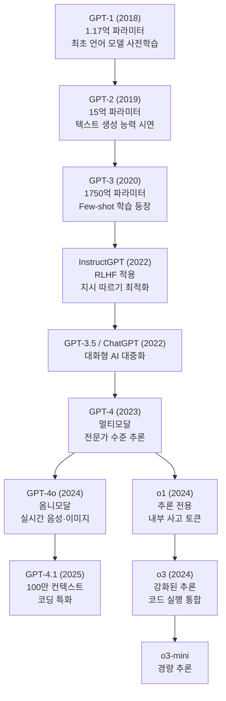
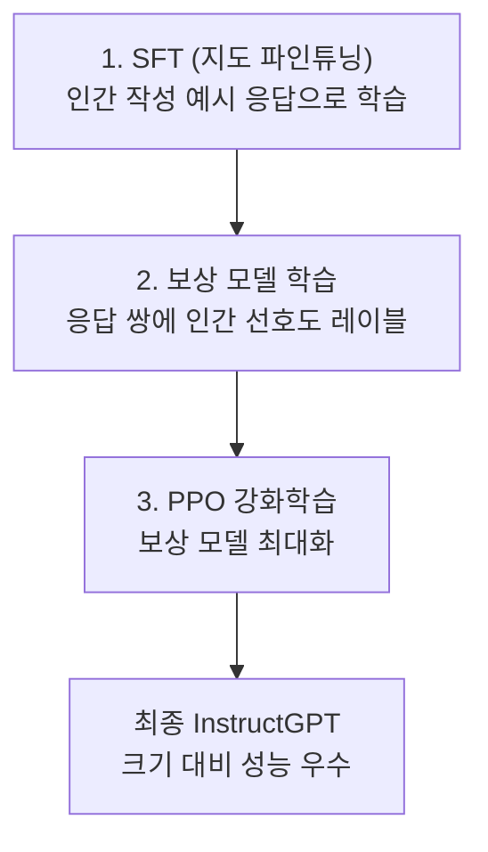
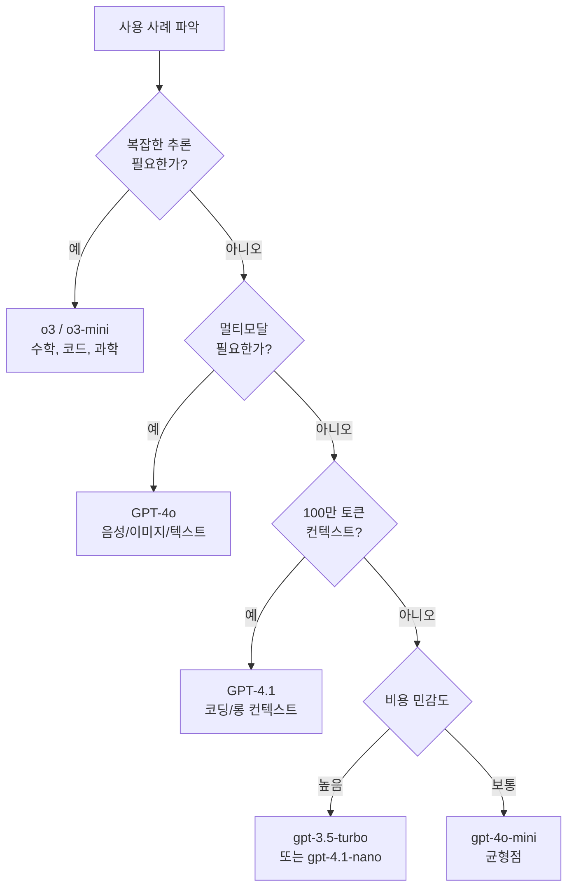

# GPT 모델 패밀리 (GPT Models)

## 개요

GPT(Generative Pre-trained Transformer) 모델 패밀리는 OpenAI가 개발한 대형 언어 모델 시리즈다. 2018년 GPT-1부터 시작하여 현재 GPT-4.1, o3 시리즈까지 이어지며 현대 AI 산업의 표준을 정의했다. 자기회귀적(autoregressive) Transformer 아키텍처를 기반으로, 대규모 텍스트 데이터로 사전학습(pre-training) 후 지시 따르기(instruction following) 파인튜닝을 거쳐 범용 어시스턴트로 완성된다.



위 다이어그램은 2018년부터 2025년까지 GPT 모델 패밀리의 계보를 보여준다. 두 가지 주요 라인 - 표준 언어 모델(GPT 계열)과 추론 특화 모델(o 계열) - 이 병행 발전하고 있다.

---

## 모델별 상세 프로필

### GPT-1 (2018)

**출시**: 2018년 6월  
**파라미터**: 1.17억 (117M)

OpenAI가 "언어 모델의 사전학습이 자연어 이해를 개선한다"는 아이디어를 처음 실증한 모델. 레이블되지 않은 텍스트 데이터로 언어 모델을 학습한 후 소규모 레이블 데이터로 파인튜닝하는 **사전학습-파인튜닝** 패러다임을 확립했다.

- 12층 Transformer 디코더
- BookCorpus (약 4.5GB 텍스트)로 학습
- 4개 NLU 벤치마크에서 당시 SOTA

### GPT-2 (2019)

**출시**: 2019년 2월 (전체 공개: 11월)  
**파라미터**: 15억 (1.5B)

GPT-1의 10배 규모로 확장. "텍스트를 주면 그럴듯하게 이어쓴다"는 능력이 처음으로 인상적인 수준에 도달했다. OpenAI는 초기에 "사회적 위험을 고려해" 전체 모델 공개를 미루며 AI 안전 논쟁의 선례를 만들었다.

- WebText (Reddit 링크 기반, 40GB) 학습
- Zero-shot 설정에서 다양한 태스크 처리
- 스테이지별 공개 (117M → 345M → 762M → 1.5B)

### GPT-3 (2020)

**출시**: 2020년 5월  
**파라미터**: 1750억 (175B)

현대 LLM 시대의 진정한 시작점. **Few-shot 학습(in-context learning)** 이 처음으로 강력하게 작동함을 보여주며 패러다임을 바꿨다. 파인튜닝 없이 몇 개의 예시만 프롬프트에 넣어도 새로운 태스크를 처리할 수 있었다.

- CommonCrawl, WebText2, Books1/2, Wikipedia 등 혼합 데이터 (약 570GB)
- 8가지 모델 크기 (Ada~Davinci, 1.25B~175B)
- GPT-3 API 공개 → AI 스타트업 생태계 폭발적 성장

### InstructGPT (2022)

**출시**: 2022년 1월  
**파라미터**: 1.3B / 6B / 175B

[[RLHF (Reinforcement Learning from Human Feedback)]] 기법을 대규모로 적용한 첫 모델. 인간 평가자의 선호도 데이터를 기반으로 학습해 "더 도움이 되고, 덜 유해하며, 더 정직한" 어시스턴트를 구현했다.

**InstructGPT 학습 파이프라인:**



175B GPT-3보다 1.3B InstructGPT가 인간 평가에서 우수한 결과를 보임 — 규모보다 정렬(alignment)이 중요하다는 것을 실증.

### GPT-3.5 / ChatGPT (2022)

**출시**: 2022년 11월 (ChatGPT)  
**핵심 모델**: text-davinci-003, gpt-3.5-turbo

GPT-3 기반에 InstructGPT 방법론을 적용한 모델. 무료 웹 인터페이스 ChatGPT로 공개되어 **출시 5일 만에 100만 사용자**, 2개월 만에 1억 명 달성. AI의 대중화를 이끈 역사적 순간.

- `gpt-3.5-turbo`: 대화 최적화, 낮은 비용, 빠른 응답
- 16K 컨텍스트 버전 추가 출시
- API 가격 대폭 하락 → 개발자 채택 폭증

### GPT-4 (2023)

**출시**: 2023년 3월  
**파라미터**: 비공개 (추정 ~1조)

**멀티모달**: 텍스트 외 이미지 입력 처리  
**성능**: 각종 전문 시험(변호사, 의사, GRE 등)에서 상위 10-25% 점수

주요 개선 사항:
- 32K 컨텍스트 윈도우 (gpt-4-32k)
- 이미지 이해 능력 (GPT-4V)
- 복잡한 지시 따르기 및 다단계 추론 대폭 향상
- Steerability 개선 — 시스템 메시지로 페르소나 설정 용이

```python
from openai import OpenAI

client = OpenAI()

# GPT-4 비전 사용 예시
response = client.chat.completions.create(
    model="gpt-4-vision-preview",
    messages=[
        {
            "role": "user",
            "content": [
                {"type": "text", "text": "이 이미지에서 무엇이 보이나요?"},
                {
                    "type": "image_url",
                    "image_url": {"url": "https://example.com/image.jpg"},
                },
            ],
        }
    ],
    max_tokens=500,
)
print(response.choices[0].message.content)
```

### GPT-4o (2024)

**출시**: 2024년 5월  
**"o"**: Omni (모든 것을 통합)

텍스트, 이미지, 오디오를 단일 엔드-투-엔드 모델로 처리하는 진정한 옴니모달 모델. 기존에 STT → LLM → TTS로 나뉘던 음성 파이프라인을 단일 모델로 통합해 **~200ms의 실시간 음성 응답** 달성.

- GPT-4 수준 지능 + GPT-3.5 수준 속도 + 더 낮은 비용
- 감정 표현, 음성 톤 조절 지원
- 구조화 출력(Structured Outputs) 기능 추가
- 실시간 비디오 스트림 이해 (제한적)

### GPT-4.1 (2025)

**출시**: 2025년 4월  
**컨텍스트**: 100만 토큰

코딩과 지시 따르기에 특화된 모델. SWE-bench Verified 기준 54.6% 달성 (GPT-4o 대비 +21.4%p). 롱 컨텍스트 처리 능력 대폭 향상.

| 항목 | GPT-4o | GPT-4.1 |
|------|--------|---------|
| 컨텍스트 | 128K | 1M |
| SWE-bench | 33.2% | 54.6% |
| API 입력가 | $2.50/1M | $2.00/1M |
| API 출력가 | $10.00/1M | $8.00/1M |

- nano/mini 버전도 출시 (경량화)
- 에이전트 워크플로우 지원 강화

### o1 / o3 추론 시리즈

추론 전용 모델 라인. 상세 내용은 [[reasoning-llm]] 참조.

| 모델 | 출시 | 특징 |
|------|------|------|
| o1-preview | 2024.09 | 최초 공개 추론 모델 |
| o1-mini | 2024.09 | 경량 추론, 코딩 특화 |
| o1 | 2024.12 | 정식 버전 |
| o3 | 2024.12 | 향상된 추론, 코드 실행 |
| o3-mini | 2025.01 | 비용 최적화 추론 |
| o4-mini | 2025.04 | 멀티모달 추론 |

---

## OpenAI API 핵심 사용 패턴

### 기본 Chat Completions

```python
from openai import OpenAI

client = OpenAI()  # OPENAI_API_KEY 환경변수 자동 사용

response = client.chat.completions.create(
    model="gpt-4.1",
    messages=[
        {"role": "system", "content": "당신은 친절한 AI 어시스턴트입니다."},
        {"role": "user", "content": "파이썬에서 데코레이터란 무엇인가요?"},
    ],
    temperature=0.7,
    max_tokens=1000,
)

print(response.choices[0].message.content)
print(f"토큰 사용량: {response.usage.total_tokens}")
```

### 스트리밍 응답

```python
with client.chat.completions.stream(
    model="gpt-4.1",
    messages=[{"role": "user", "content": "긴 이야기를 써주세요"}],
) as stream:
    for text in stream.text_stream:
        print(text, end="", flush=True)
```

### 구조화 출력 (Structured Outputs)

```python
from pydantic import BaseModel

class CodeReview(BaseModel):
    score: int  # 1-10
    issues: list[str]
    suggestions: list[str]

completion = client.beta.chat.completions.parse(
    model="gpt-4.1",
    messages=[
        {"role": "user", "content": "다음 코드를 리뷰하세요: def add(a,b): return a+b"}
    ],
    response_format=CodeReview,
)

review = completion.choices[0].message.parsed
print(f"점수: {review.score}")
print(f"이슈: {review.issues}")
```

### 함수 호출 (Function Calling / Tool Use)

```python
import json

tools = [
    {
        "type": "function",
        "function": {
            "name": "get_weather",
            "description": "특정 위치의 현재 날씨를 가져옵니다",
            "parameters": {
                "type": "object",
                "properties": {
                    "location": {"type": "string", "description": "도시명"},
                    "unit": {"type": "string", "enum": ["celsius", "fahrenheit"]},
                },
                "required": ["location"],
            },
        },
    }
]

response = client.chat.completions.create(
    model="gpt-4.1",
    messages=[{"role": "user", "content": "서울 날씨 알려줘"}],
    tools=tools,
    tool_choice="auto",
)

if response.choices[0].message.tool_calls:
    tool_call = response.choices[0].message.tool_calls[0]
    args = json.loads(tool_call.function.arguments)
    print(f"호출된 함수: {tool_call.function.name}")
    print(f"인수: {args}")
```

---

## 모델 선택 가이드



| 모델 | 최적 사용 사례 | 비용 수준 |
|------|-------------|---------|
| gpt-3.5-turbo | 단순 대화, 분류, 요약 | 낮음 |
| gpt-4o-mini | 일반 태스크, 대량 처리 | 낮음-중간 |
| gpt-4o | 멀티모달, 복잡한 지시 | 중간 |
| gpt-4.1 | 코딩, 롱 컨텍스트 | 중간 |
| o3-mini | 수학, 논리 추론 (빠름) | 중간 |
| o3 | 어려운 수학, 과학 연구 | 높음 |

---

## Responses API (2025)

2025년 OpenAI가 도입한 새로운 API 레이어. 기존 Chat Completions + Assistants API의 후계자.

- 내장 웹 검색, 파일 검색, 코드 실행 도구
- 멀티턴 대화 상태 서버사이드 관리
- 스트리밍 이벤트 기반 아키텍처

```python
response = client.responses.create(
    model="gpt-4.1",
    tools=[{"type": "web_search_preview"}],
    input="2025년 최신 AI 뉴스 알려줘",
)
print(response.output_text)
```

자세한 내용은 [[openai-agents-sdk-sandbox]] 참조.

---

## 경쟁 구도와 포지셔닝

| 축 | GPT-4.1 | Claude 4 | Gemini 2.5 Pro | Llama 4 |
|----|---------|----------|----------------|---------|
| 코딩 | 최상위 | 최상위 | 최상위 | 상위 |
| 추론 | o3로 분리 | Sonnet Extended | Flash Thinking | - |
| 컨텍스트 | 1M | 200K | 1M | 10M |
| 공개 여부 | 비공개 | 비공개 | 비공개 | **공개** |
| 멀티모달 | 옴니(4o) | 시각 | 네이티브 | 비전 |

---

## 관련 문서

- [[claude-models]] - Anthropic Claude 모델 패밀리
- [[gemini-models]] - Google Gemini 모델 패밀리
- [[meta-llama]] - Meta LLaMA 오픈소스 모델
- [[reasoning-llm]] - o1/o3 추론 모델 아키텍처 상세
- [[openai-agents-sdk-sandbox]] - OpenAI Agents SDK 및 Responses API
- [[scaling-laws-overview]] - 모델 스케일링 법칙
- [[constitutional-ai-paper]] - Anthropic의 안전 AI 접근법 (GPT와 비교)
