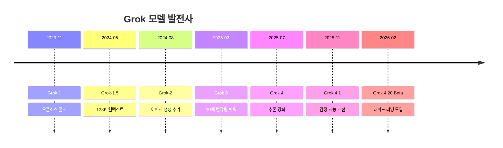
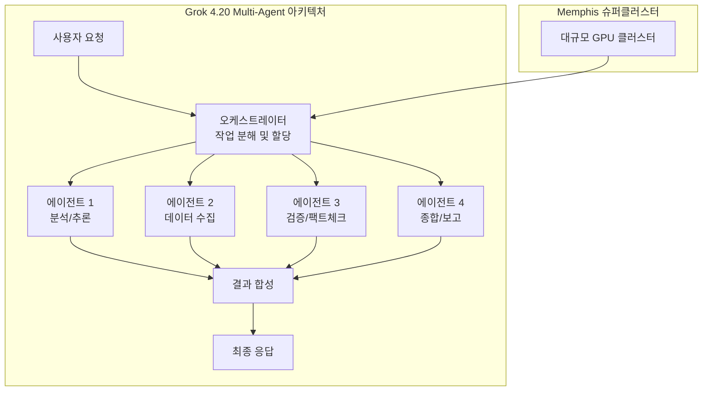

## 개요

Grok 4.20은 xAI가 2026년 2-3월에 베타로 출시한 플래그십 AI 모델이다. "래피드 러닝(Rapid Learning)"을 표방하며, 배포 후에도 지속적으로 학습하는 최초의 Grok 모델로 설계되었다. 4-에이전트 병렬 협업과 의료 문서 분석 등 전문 영역에서의 에이전틱 능력이 강조된다.

Artificial Analysis Intelligence Index에서 49점으로 132개 모델 중 11위를 기록했으며, 출력 속도 171.2 tokens/s로 6위를 달성했다. 2M 토큰 컨텍스트 윈도우와 확장 사고(reasoning) 기능을 갖춘 추론 모델이다.

## 핵심 특징

- **래피드 러닝(Rapid Learning)**: 배포 후 지속 학습하는 첫 Grok 모델. 주간 업데이트를 통해 모델 성능이 점진적으로 향상
- **4-에이전트 병렬 협업**: Multi-agent Beta로 xAI Enterprise API를 통해 제공. 복수 에이전트가 병렬로 작업을 분담하고 결과를 합성
- **의료 문서 분석**: 임상 기록, 의료 영상 판독문, 논문 등 전문 의료 데이터 처리에 특화된 능력
- **확장 사고(Extended Thinking)**: 추론 모델(reasoning model)로 분류되며, 복잡한 문제 해결 시 내부 사고 과정을 거침
- **엄격한 프롬프트 준수**: 도구 호출(tool calling) 시 정확한 프롬프트 준수와 낮은 환각률(hallucination rate)

## 기술 상세

### 모델 사양

| 항목 | 사양 |
|---|---|
| 모델명 | Grok 4.20 0309 v2 (Reasoning) |
| 개발사 | xAI |
| 출시일 | 2026년 2월 (Beta), 2026년 4월 7일 (v2) |
| 컨텍스트 윈도우 | 2M 토큰 (~3,000쪽 A4) |
| 입력 모달리티 | 텍스트, 이미지 |
| 출력 모달리티 | 텍스트 |
| 모델 유형 | 추론(Reasoning) 모델 |

### 가격

| 항목 | 가격 |
|---|---|
| 입력 | $2.00 / 1M 토큰 |
| 출력 | $6.00 / 1M 토큰 |
| 혼합(Blended) | $3.00 / 1M 토큰 |
| 전체 평가 비용 | $514.16 |

### Grok 시리즈 발전 과정

### 래피드 러닝 아키텍처

[교차검증 필요] 래피드 러닝의 구체적인 기술 메커니즘은 xAI가 공식적으로 공개하지 않았다. 배포 후 지속 학습(continual learning)의 구체적인 구현 방식 -- 온라인 학습, 파인튜닝 주기, 데이터 소스 등 -- 은 공식 문서에서 확인되지 않았다.

### 멀티 에이전트 시스템

Grok 4.20 Multi-agent Beta는 xAI Enterprise API를 통해 제공된다. 복수의 Grok 에이전트가 병렬로 작업을 수행하며, 이는 xAI의 Memphis 슈퍼클러스터 인프라 위에서 동작한다.

4개 에이전트가 병렬로 작업을 분담하는 구조로, 복잡한 작업을 분석, 데이터 수집, 검증, 종합의 단계로 나누어 동시 실행한다. 이는 단일 모델 호출 대비 더 정확하고 포괄적인 결과를 생성하는 것을 목표로 한다.

### 의료 문서 분석

Grok 4.20은 의료 분야에서 특화된 분석 능력을 제공한다. 임상 기록(clinical notes), 의료 영상 판독문(radiology reports), 학술 논문 등 전문 의료 데이터를 처리할 수 있으며, 2M 토큰 컨텍스트를 활용하여 환자의 전체 의료 기록을 한 번에 분석하는 것이 가능하다.

의료 문서 분석에서의 주요 활용 사례는 다음과 같다.

- 복수의 임상 기록에서 패턴 추출 및 시계열 분석
- 영상 판독문과 병리 보고서의 교차 참조
- 최신 의학 문헌과 환자 데이터의 연관성 분석
- 약물 상호작용 검토 및 경고

### xAI 인프라

Grok 시리즈는 xAI의 Memphis 슈퍼클러스터에서 학습 및 추론된다. Grok 3 시점에서 이미 이전 세대 대비 10배의 컴퓨팅 파워를 투입했으며, Grok 4.20은 이를 더욱 확장한 인프라에서 동작한다. X(구 Twitter) 플랫폼의 실시간 데이터 접근이 Grok의 차별점 중 하나로, 래피드 러닝의 데이터 소스 중 하나로 활용될 가능성이 있다.

### 경쟁 포지셔닝

2026년 상반기 기준 Grok 4.20의 시장 포지셔닝은 다음과 같다.

| 모델 | 컨텍스트 | Intelligence Index | 특징 |
|---|---|---|---|
| **Grok 4.20** | 2M | 49점 (11위) | 래피드 러닝, 멀티 에이전트 |
| [[gpt-6-spud]] | 1-2M (예상) | 미발표 | 에이전틱, MoE |
| [[claude-opus-4-6]] | 1M | 최상위권 | 코딩/추론 |
| [[deepseek-v4]] | 1M | 미발표 | 극저가, Engram |

## 벤치마크

### Artificial Analysis 평가

| 지표 | 점수 | 순위 (132개 모델) |
|---|---|---|
| Intelligence Index | 49점 | 11위 |
| 출력 속도 | 171.2 tokens/s | 6위 |
| 첫 토큰 지연(TTFT) | 15.94초 | 중앙값(2.71초) 대비 높음 |
| 출력 토큰 수 | 61M | 중앙값(35M) 대비 장황 |

### 강점과 약점

**강점**
- 높은 Intelligence Index 대비 합리적인 가격
- 뛰어난 출력 속도 (132개 모델 중 6위)
- 2M 토큰 대용량 컨텍스트

**약점**
- 첫 토큰 지연(TTFT) 15.94초로 중앙값(2.71초)의 약 6배
- 출력이 장황한 경향 (중앙값 대비 약 1.7배)

## 관련 문서

- [[gpt-6-spud]] - 경쟁 모델: GPT-6/Spud
- [[claude-opus-4-6]] - 경쟁 모델: Claude Opus 4.6
- [[deepseek-v4]] - 경쟁 모델: DeepSeek V4
- [[llama-4]] - 경쟁 모델: Llama 4
