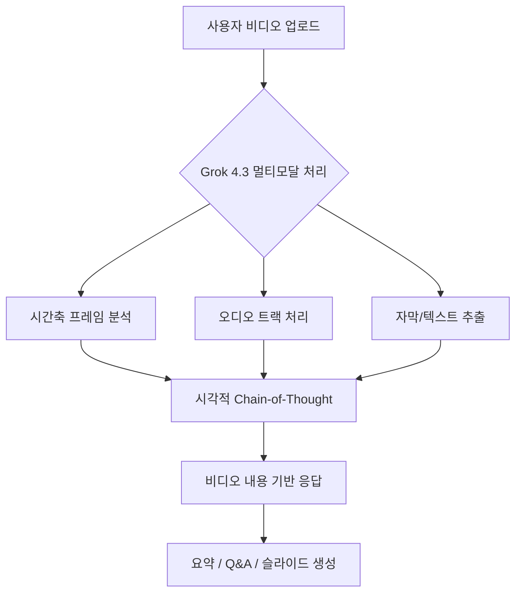
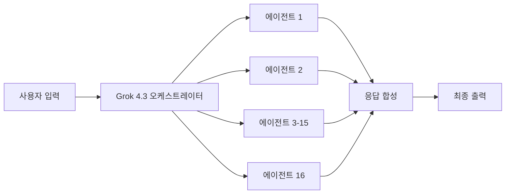
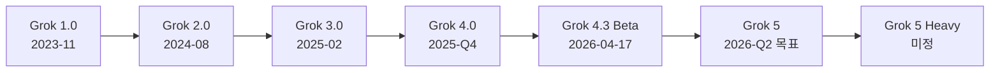

# Grok 4.3 Beta

## 개요

xAI가 2026년 4월 17일 조용히(공식 발표 없이) 출시한 Grok 시리즈의 4세대 마이너 업데이트다. 네이티브 비디오 이해(video understanding), 채팅 내 문서 직접 생성(PDF/PowerPoint/스프레드시트), Grok Computer 에이전트와의 긴밀한 통합이 핵심이다. SuperGrok Heavy 티어($300/월)에서만 조기 접근 가능하며 16-에이전트 Heavy 시스템과 200만 토큰 컨텍스트 창을 유지한다.

## 출시 맥락

Grok 4.3은 이전 Grok 4 시리즈를 기반으로 멀티모달 입력 처리 범위를 텍스트/이미지에서 비디오로 확장한 단계다. 공식 블로그 포스트나 보도자료 없이 SuperGrok 사용자들이 새 기능을 발견하면서 알려졌다는 점이 특이하다. xAI의 제품 출시 패턴이 Grok Computer와의 기능 통합을 우선시하는 방향으로 전환되고 있음을 시사한다.

## 핵심 기능

### 1. 네이티브 비디오 이해

위 다이어그램은 Grok 4.3의 비디오 이해 파이프라인을 보여준다.

**주요 특징:**
- 비디오를 프레임 시퀀스와 오디오로 분리해 멀티모달 처리
- 녹화 강의, 회의 영상, 제품 데모 영상을 직접 입력으로 수용
- 비디오 타임라인 기반 질의응답 가능 (예: "3분 20초에서 설명한 내용은?")

이는 [[multimodal-llm]] 에서 다루는 비디오-언어 모델(Video-Language Model) 패러다임의 실용화 사례다.

### 2. 채팅 내 문서 직접 생성

이전 LLM들이 마크다운 텍스트를 출력하면 사용자가 별도 도구로 변환하던 방식과 달리, Grok 4.3은 채팅 인터페이스 내에서 직접 다음 형식을 생성한다:

| 형식 | 설명 |
|------|------|
| PDF | 포맷된 보고서/문서 |
| PowerPoint (.pptx) | 발표 슬라이드 덱 |
| 스프레드시트 (.xlsx) | 데이터 테이블/분석표 |

**사용 시나리오:**
- 비디오 강의 -> "이 강의를 10장 슬라이드로 요약해줘"
- 텍스트 설명 -> "이 내용을 투자자용 PDF 보고서로 만들어줘"
- 숫자 데이터 -> "이 통계를 스프레드시트로 정리해줘"

### 3. Grok Computer 통합

[[grok-computer-desktop-agent]] (Grok Computer)와의 긴밀한 연동이 4.3의 주요 차별점이다.

- Grok 4.3이 비디오/문서를 분석하면 Grok Computer가 실제 컴퓨터 작업을 실행
- 예: "이 PowerPoint 파일을 분석해서 관련 데이터를 웹에서 검색한 뒤 업데이트된 버전으로 저장해줘"
- Grok Computer의 5초 슬라이딩 윈도우 화면 캡처와 Grok 4.3의 이해 능력 결합

## 모델 아키텍처 특징

### 16-에이전트 Heavy 시스템 유지

Grok 4 시리즈의 특징인 16개 병렬 에이전트 추론(reasoning) 시스템을 4.3에서도 유지한다. 이는 복잡한 문제를 여러 에이전트가 병렬로 탐색하고 최종 응답을 합성하는 구조다. [[reasoning-llm]] 에서 다루는 test-time compute scaling의 실용 구현이다.

### 200만 토큰 컨텍스트

200만 토큰(약 150만 단어) 컨텍스트 창은 긴 비디오 트랜스크립트, 대용량 문서, 멀티턴 대화 이력을 한 번에 처리하기에 충분한 용량이다. Anthropic Claude 3.5 Sonnet의 200K 토큰 대비 10배 수준이다.

## 접근 티어 및 가격

| 티어 | 월 가격 | Grok 4.3 접근 |
|------|---------|--------------|
| Grok 무료 | $0 | 미지원 |
| Grok+ | ~$8 | 미지원 |
| SuperGrok | ~$30 | 제한적 |
| SuperGrok Heavy | $300 | 조기 접근 가능 |

SuperGrok Heavy의 $300/월 가격은 기업용 AI 도구 중에서도 최상위 수준이다. 이는 Grok 4.3의 16-에이전트 병렬 처리와 대용량 컨텍스트 처리에 따른 높은 추론 비용을 반영한다.

## 경쟁 제품 비교

| 모델 | 비디오 이해 | 문서 생성 | 컨텍스트 |
|------|-----------|---------|---------|
| Grok 4.3 Beta | 네이티브 | 직접 생성 | 2M 토큰 |
| GPT-5.5 | 네이티브 | 제한적 | 1M 토큰 |
| Gemini 2.0 Pro | 네이티브 | 제한적 | 2M 토큰 |
| Claude 3.7 Sonnet | 제한적 | 마크다운 | 200K 토큰 |

## Grok 시리즈 로드맵

Grok 5는 600만+ 파라미터를 보유한 역대 최대 공개 발표 AI 모델로 개발 중이며, Colossus 2 슈퍼클러스터에서 훈련 중이다.

## 실무적 의의

- **기업 생산성 도구**: 비디오-to-슬라이드, 미팅 녹화-to-보고서 워크플로우 자동화 가능
- **에이전트 통합 패턴**: 이해 모델(Grok)과 실행 에이전트(Grok Computer)의 결합은 향후 AI 워크플로우의 표준 패턴이 될 가능성
- **비용 장벽**: $300/월 가격이 개인/소규모 팀에게 실질적 접근 장벽

## 관련 문서

- [[grok-computer-desktop-agent]] - Grok Computer 데스크톱 에이전트
- [[multimodal-llm]] - 멀티모달 LLM 일반 개념
- [[reasoning-llm]] - 추론 특화 LLM 아키텍처
