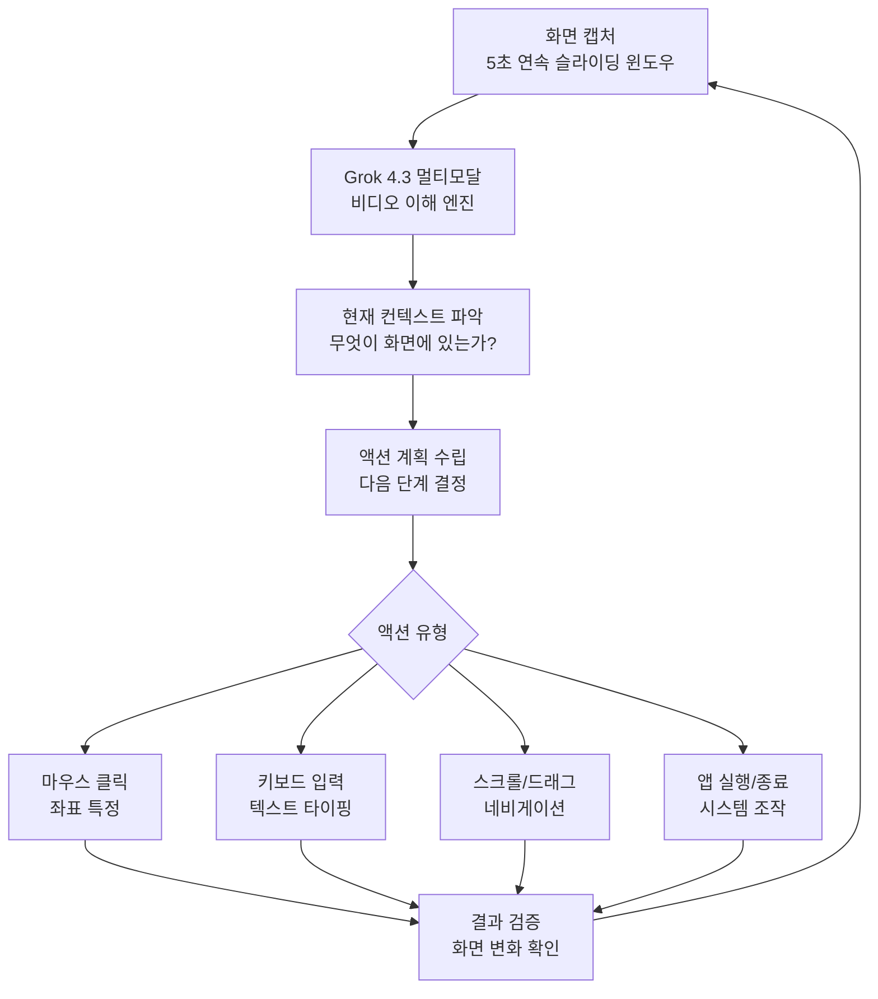
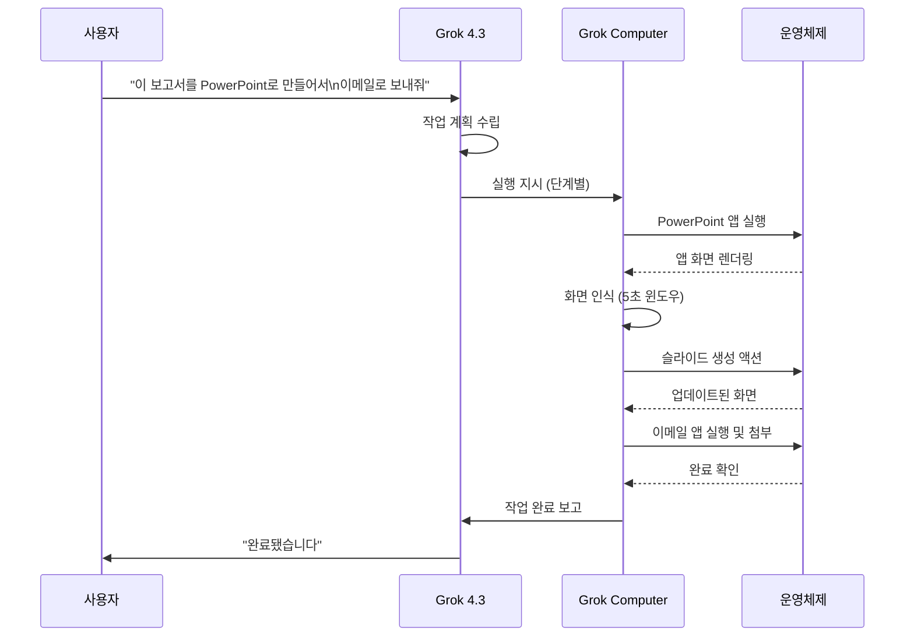
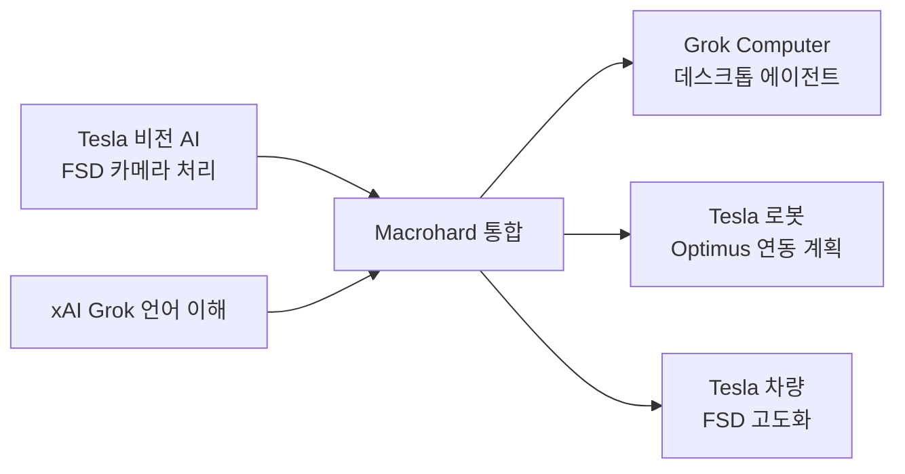

# Grok Computer

## 개요

Grok Computer는 xAI가 개발한 자율 데스크톱 에이전트(autonomous desktop agent)다. 사용자의 컴퓨터를 직접 제어해 앱 조작, 버튼 클릭, 텍스트 입력, 폼 작성 등 사람이 마우스와 키보드로 수행하는 모든 작업을 자율적으로 실행한다. 2026년 4월 기준 타겟 사용자 대상 비공개 베타로 운영 중이며, Tesla-xAI 합작 프로젝트 "Macrohard"의 일환으로 개발됐다.

## 기술 구조

### 화면 인식 파이프라인

Grok Computer의 핵심 인식 메커니즘은 **5초 슬라이딩 윈도우** 화면 캡처다.

위 다이어그램은 Grok Computer의 지각-계획-실행-검증 루프를 보여준다.

**5초 슬라이딩 윈도우의 의미:**
- 단일 스크린샷이 아닌 짧은 영상 클립으로 컨텍스트 파악
- 애니메이션, 로딩 상태, UI 전환 등 동적 요소 인식 가능
- 이전 액션의 결과를 시각적으로 확인하는 피드백 루프 구현

### 컨트롤 레이어

| 제어 방식 | 설명 |
|-----------|------|
| GUI 클릭 | 픽셀 좌표 기반 클릭, 더블클릭, 우클릭 |
| 키보드 | 텍스트 입력, 단축키(Ctrl+C, Alt+Tab 등) |
| 드래그 | 파일 이동, UI 리사이즈, 슬라이더 조작 |
| 스크롤 | 페이지/목록 탐색 |
| 앱 API | 일부 앱은 GUI 대신 네이티브 API 직접 호출 |

### Grok 4.3과의 통합

[[grok-4-3-beta-multimodal]] 모델이 이해 엔진으로 작동하고 Grok Computer가 실행 에이전트로 작동하는 이중 구조다.

## Macrohard 프로젝트

Grok Computer는 Tesla-xAI 합작 프로젝트 "Macrohard"의 핵심 결과물이다. (Macrohard는 Microsoft + Robocop의 합성어로 추정되는 코드명)

- **Tesla 투자**: 20억 달러 투자로 Tesla의 AI 역량을 xAI와 공유
- **목표**: Tesla FSD(Full Self-Driving) 비전 AI 기술과 xAI의 언어 모델 능력 결합
- **비전**: PC 에이전트에서 로봇/자동차까지 확장 가능한 실체화(embodied) AI 플랫폼

## 경쟁 제품 비교

| 제품 | 개발사 | 출시 상태 | 접근 방식 |
|------|---------|---------|----------|
| Grok Computer | xAI | 비공개 베타 | 5초 비디오 슬라이딩 윈도우 |
| [[claude-code]] Anthropic Computer Use | Anthropic | API 공개 | 스크린샷 기반 |
| Codex Desktop (Computer Use) | OpenAI | 일부 공개 | 스크린샷 + 브라우저 |
| [[browser-use-agent-framework]] | 오픈소스 | 공개 | 브라우저 DOM 기반 |
| Operator | OpenAI | 제한 공개 | 브라우저 특화 |

**Grok Computer의 차별점:**
- 브라우저에 국한되지 않고 **OS 전체** 제어
- 비디오 연속 스트림 기반 인식으로 동적 UI 처리 우위
- Grok 4.3과의 긴밀한 통합으로 자연어 지시 -> 복잡 작업 실행

## 접근 방법 및 사용 조건

- **현재 상태**: 2026년 4월 기준 타겟 사용자 비공개 베타
- **예정된 확장**: Elon Musk가 "곧 대규모 공개 테스트" 선언
- **요구 사항**: SuperGrok Heavy 구독($300/월) 필요 예상
- **지원 플랫폼**: macOS, Windows (Linux 미정)

## 보안 및 프라이버시 고려사항

데스크톱 에이전트는 본질적으로 높은 권한이 필요하며, 이는 중대한 보안 위험을 수반한다:

1. **화면 데이터 전송**: 5초 비디오 스트림이 xAI 서버로 전송될 경우 민감 정보 노출 위험
2. **실행 권한**: 시스템 명령 실행 가능한 에이전트는 악의적 프롬프트 인젝션 공격 벡터가 됨
3. **범위 제한**: 어떤 앱/폴더에 접근 허용/금지할지 사용자 제어 필요

## 실무적 의의

- **자동화 패러다임 전환**: 스크립트/RPA(Robotic Process Automation) 기반 자동화에서 자연어 기반 자율 에이전트로
- **접근성**: 코딩 지식 없는 사용자가 복잡한 컴퓨터 워크플로우 자동화 가능
- **기업 활용**: 반복적 데이터 입력, 보고서 생성, 시스템 간 데이터 이동 작업 자동화

## 관련 문서

- [[grok-4-3-beta-multimodal]] - Grok 4.3 이해 엔진
- [[browser-use-agent-framework]] - 브라우저 특화 에이전트 프레임워크
- [[claude-code]] - Anthropic Claude의 컴퓨터 사용 기능
