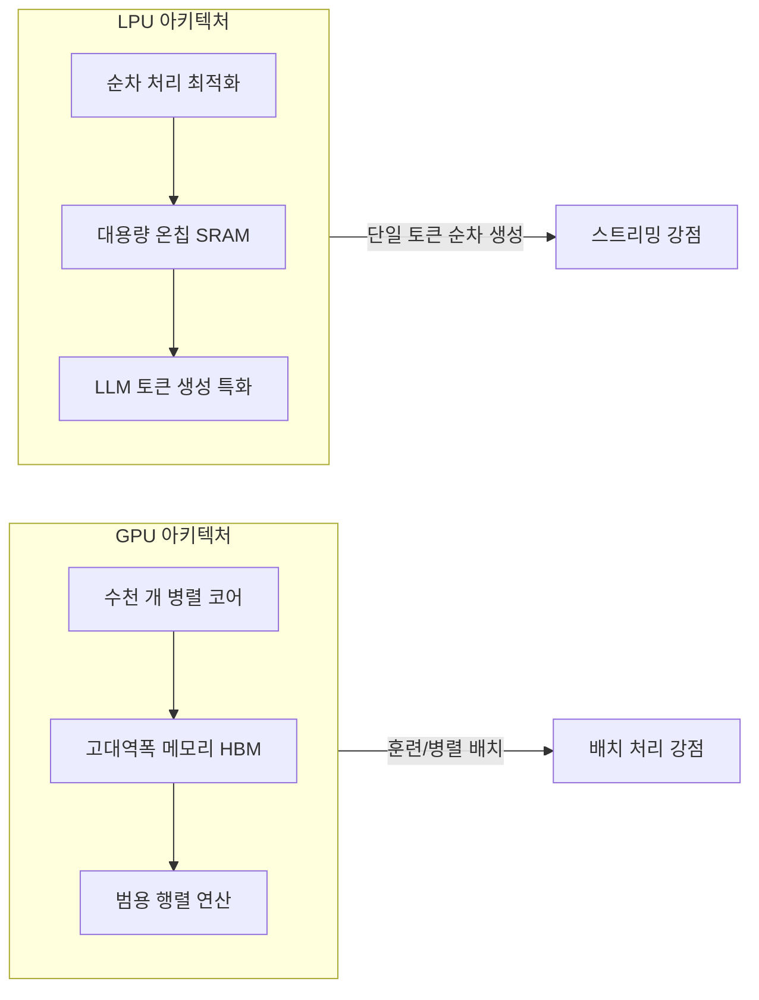
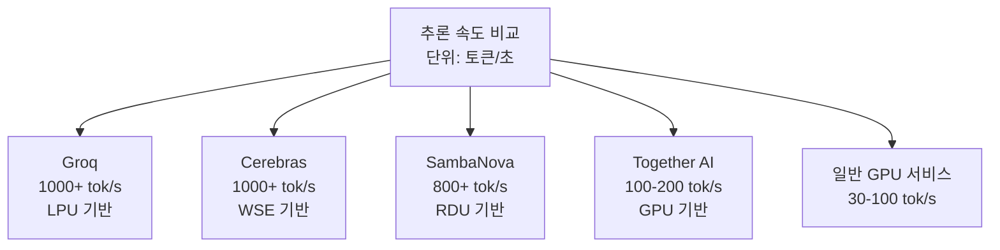
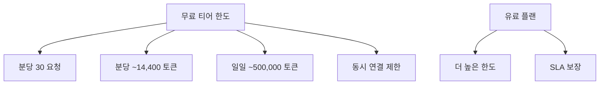

# Groq Cloud - LPU 기반 초저지연 추론 클라우드

Groq Cloud는 LPU(Language Processing Unit, 언어 처리 장치)라는 자체 설계 AI 가속기를 기반으로 하는 LLM 추론 클라우드 서비스다. GPU 기반 서비스 대비 압도적으로 빠른 토큰 생성 속도(1000+ 토큰/초)가 핵심 차별점이며, Llama, Mixtral, Gemma 등 오픈소스 모델을 서비스한다. 초저지연 스트리밍이 필요한 AI 애플리케이션과 실시간 인터랙션 시나리오에 특화되어 있다.

## 정체성

| 항목 | 내용 |
|------|------|
| 공식 명칭 | Groq Cloud (GroqCloud) |
| 회사 | Groq, Inc. |
| 설립 | 2016년 (전직 Google TPU 팀 출신) |
| 핵심 기술 | LPU (Language Processing Unit) |
| API 엔드포인트 | https://api.groq.com/openai/v1 |
| OpenAI 호환 | 네 (완전 호환) |
| 공식 문서 | https://console.groq.com/docs |
| 무료 티어 | 분당/일일 요청 제한 내 무료 |
| 가격 모델 | 토큰 기반 과금 (입력/출력 별도) |

## LPU 아키텍처 개요

LPU는 GPU와 근본적으로 다른 아키텍처 철학을 가진다:



### LPU가 빠른 이유

LLM의 토큰 생성(autoregressive decoding)은 본질적으로 순차적이다. 매 토큰 생성 시 이전 토큰의 KV 캐시(KV cache)를 메모리에서 읽어야 한다. GPU는 HBM(High Bandwidth Memory)과 연산 코어 사이의 메모리 대역폭(memory bandwidth)이 병목이 된다.

LPU는 이 병목을 해결하기 위해:
1. **온칩 SRAM:** KV 캐시를 칩 내부 고속 메모리에 직접 배치 (HBM 왕복 없음)
2. **순차 처리 최적화:** 병렬 배치보다 단일 시퀀스의 순차 생성에 최적화된 회로
3. **결정론적 실행:** 소프트웨어 스케줄링 오버헤드 없이 컴파일된 계획대로 실행

결과적으로 LLM의 디코딩(decoding) 단계에서 GPU 대비 수배 빠른 처리량을 보인다. [교차검증 필요: 구체적 수치는 모델과 조건에 따라 상이]

## 핵심 기능

### 1. OpenAI 완전 호환 API

기존 OpenAI SDK 코드에서 `base_url`과 API 키만 변경하면 Groq으로 즉시 전환된다:

```python
from openai import OpenAI

# OpenAI에서 Groq으로 전환: base_url과 api_key만 변경
client = OpenAI(
    api_key="GROQ_API_KEY",
    base_url="https://api.groq.com/openai/v1"
)

# 이하 코드는 OpenAI API와 동일
응답 = client.chat.completions.create(
    model="llama-3.1-70b-versatile",  # Groq 모델명
    messages=[
        {"role": "system", "content": "당신은 빠르고 정확한 AI 어시스턴트입니다."},
        {"role": "user", "content": "파이썬 제너레이터와 이터레이터의 차이를 설명해줘"}
    ],
    max_tokens=1024,
    temperature=0.7,
)

print(응답.choices[0].message.content)
print(f"\n토큰/초: {응답.usage.completion_tokens / 응답.usage.total_time:.1f}")
```

### 2. 초고속 스트리밍

Groq의 가장 강력한 사용 사례는 실시간 스트리밍이다. 1000+ 토큰/초 속도는 사용자가 응답이 거의 즉시 완성되는 것처럼 느끼게 한다:

```python
import time

시작_시간 = time.time()

스트림 = client.chat.completions.create(
    model="llama-3.1-8b-instant",
    messages=[{"role": "user", "content": "소수를 판별하는 파이썬 함수를 작성해줘"}],
    stream=True,
    max_tokens=500
)

생성된_토큰 = 0
for 청크 in 스트림:
    델타 = 청크.choices[0].delta
    if 델타.content:
        print(델타.content, end="", flush=True)
        생성된_토큰 += 1

경과_시간 = time.time() - 시작_시간
print(f"\n\n토큰 수: {생성된_토큰}, 시간: {경과_시간:.2f}초, 속도: {생성된_토큰/경과_시간:.1f} tok/s")
```

### 3. 지원 모델 목록

Groq Cloud에서 서비스하는 주요 모델:

| 모델 ID | 설명 | 컨텍스트 |
|---------|------|---------|
| `llama-3.1-70b-versatile` | Llama 3.1 70B (고성능) | 128k |
| `llama-3.1-8b-instant` | Llama 3.1 8B (초고속) | 128k |
| `llama3-groq-70b-8192-tool-use-preview` | 도구 사용 특화 70B | 8k |
| `mixtral-8x7b-32768` | Mixtral MoE 모델 | 32k |
| `gemma2-9b-it` | Google Gemma 2 9B | 8k |
| `whisper-large-v3` | 음성 인식 모델 | - |

[교차검증 필요: 모델 목록과 ID는 자주 업데이트되므로 공식 문서 확인 필요]

### 4. 음성 전사 (Whisper)

Groq은 Whisper 음성 인식 모델도 LPU로 가속하여 실시간 수준의 전사 속도를 제공한다:

```python
client = OpenAI(
    api_key="GROQ_API_KEY",
    base_url="https://api.groq.com/openai/v1"
)

with open("audio.mp3", "rb") as 오디오_파일:
    전사_결과 = client.audio.transcriptions.create(
        model="whisper-large-v3",
        file=오디오_파일,
        language="ko",  # 한국어
        response_format="text"
    )

print(전사_결과)
```

### 5. 도구 호출 (Tool Calling / Function Calling)

OpenAI 형식의 도구 호출을 지원한다:

```python
도구_목록 = [
    {
        "type": "function",
        "function": {
            "name": "현재_날씨_조회",
            "description": "특정 도시의 현재 날씨를 조회한다",
            "parameters": {
                "type": "object",
                "properties": {
                    "도시": {
                        "type": "string",
                        "description": "날씨를 조회할 도시명"
                    },
                    "단위": {
                        "type": "string",
                        "enum": ["celsius", "fahrenheit"],
                        "description": "온도 단위"
                    }
                },
                "required": ["도시"]
            }
        }
    }
]

응답 = client.chat.completions.create(
    model="llama3-groq-70b-8192-tool-use-preview",
    messages=[{"role": "user", "content": "서울 현재 날씨 알려줘"}],
    tools=도구_목록,
    tool_choice="auto"
)

# 도구 호출 처리
if 응답.choices[0].message.tool_calls:
    for 도구호출 in 응답.choices[0].message.tool_calls:
        함수명 = 도구호출.function.name
        인자들 = 도구호출.function.arguments
        print(f"도구 호출: {함수명}({인자들})")
```

## 차별점 - 경쟁 서비스 비교



| 항목 | Groq | Cerebras | SambaNova | Together AI |
|------|------|----------|-----------|-------------|
| 하드웨어 | LPU | WSE (Wafer Scale Engine) | RDU | GPU |
| 최대 속도 | 1000+ tok/s | 1000+ tok/s | 800+ tok/s | 100-200 tok/s |
| 오픈소스 모델 지원 | 제한적 선택 | 제한적 | 제한적 | 풍부 |
| GPU 워크로드 | 미지원 | 미지원 | 미지원 | 지원 |
| 무료 티어 | 있음 | 없음 | 없음 | 있음 |
| OpenAI 호환 | 완전 | 있음 | 있음 | 있음 |

Groq는 무료 티어가 있어 개발자 접근성이 좋고, OpenAI 완전 호환으로 기존 코드 전환이 쉽다. Cerebras는 더 큰 모델(405B+)에서 강하다. [[cerebras-cloud-inference]], [[sambanova-systems-cloud]] 참조.

## 실무 활용 패턴

### 실시간 코딩 어시스턴트

```python
from openai import OpenAI
import sys

client = OpenAI(api_key="GROQ_API_KEY", base_url="https://api.groq.com/openai/v1")

def 실시간_코드_리뷰(코드: str) -> None:
    """Groq의 빠른 속도로 실시간 코드 리뷰"""
    
    print("코드 리뷰 중...\n")
    
    스트림 = client.chat.completions.create(
        model="llama-3.1-70b-versatile",
        messages=[
            {
                "role": "system",
                "content": "당신은 시니어 소프트웨어 엔지니어입니다. 코드를 간결하고 명확하게 리뷰해주세요."
            },
            {
                "role": "user",
                "content": f"다음 코드를 리뷰해줘:\n\n```python\n{코드}\n```"
            }
        ],
        stream=True,
        max_tokens=1000
    )
    
    for 청크 in 스트림:
        if 청크.choices[0].delta.content:
            print(청크.choices[0].delta.content, end="", flush=True)
    
    print()

# 사용 예시
테스트_코드 = """
def fibonacci(n):
    if n <= 0:
        return []
    result = [0, 1]
    while len(result) < n:
        result.append(result[-1] + result[-2])
    return result[:n]
"""

실시간_코드_리뷰(테스트_코드)
```

### 레이턴시 민감 에이전트 루프

```python
from openai import OpenAI
import json

client = OpenAI(api_key="GROQ_API_KEY", base_url="https://api.groq.com/openai/v1")

def 빠른_에이전트_루프(질문: str, 최대_스텝: int = 5) -> str:
    """Groq의 빠른 추론으로 에이전트 루프 최소 지연 실현"""
    
    도구_목록 = [
        {
            "type": "function",
            "function": {
                "name": "계산기",
                "description": "수학 계산 수행",
                "parameters": {
                    "type": "object",
                    "properties": {
                        "식": {"type": "string", "description": "계산할 수식 (Python eval 가능)"}
                    },
                    "required": ["식"]
                }
            }
        }
    ]
    
    메시지들 = [{"role": "user", "content": 질문}]
    
    for _ in range(최대_스텝):
        응답 = client.chat.completions.create(
            model="llama3-groq-70b-8192-tool-use-preview",
            messages=메시지들,
            tools=도구_목록,
            tool_choice="auto",
            max_tokens=500
        )
        
        어시스턴트_메시지 = 응답.choices[0].message
        
        if 응답.choices[0].finish_reason == "stop":
            return 어시스턴트_메시지.content
        
        메시지들.append({"role": "assistant", "content": 어시스턴트_메시지.content,
                       "tool_calls": [tc.model_dump() for tc in (어시스턴트_메시지.tool_calls or [])]})
        
        # 도구 실행
        도구_결과들 = []
        for 도구호출 in (어시스턴트_메시지.tool_calls or []):
            인자 = json.loads(도구호출.function.arguments)
            if 도구호출.function.name == "계산기":
                try:
                    결과 = str(eval(인자["식"]))
                except Exception as e:
                    결과 = f"오류: {e}"
                도구_결과들.append({
                    "role": "tool",
                    "tool_call_id": 도구호출.id,
                    "content": 결과
                })
        
        메시지들.extend(도구_결과들)
    
    return "최대 스텝 초과"

print(빠른_에이전트_루프("1부터 100까지의 합과 제곱합을 구해줘"))
```

### Groq을 백업으로 활용하는 폴백 패턴

```python
from openai import OpenAI
import anthropic

기본_클라이언트 = anthropic.Anthropic()
폴백_클라이언트 = OpenAI(api_key="GROQ_API_KEY", base_url="https://api.groq.com/openai/v1")

def 안정적_추론(프롬프트: str) -> str:
    """Claude 우선, 실패 시 Groq으로 폴백"""
    try:
        응답 = 기본_클라이언트.messages.create(
            model="claude-opus-4-5",
            max_tokens=1000,
            messages=[{"role": "user", "content": 프롬프트}]
        )
        return 응답.content[0].text
    except Exception:
        # Groq으로 폴백
        응답 = 폴백_클라이언트.chat.completions.create(
            model="llama-3.1-70b-versatile",
            messages=[{"role": "user", "content": 프롬프트}],
            max_tokens=1000
        )
        return 응답.choices[0].message.content
```

## Rate Limit 및 무료 티어



[교차검증 필요: 무료 티어 구체적 한도는 변동될 수 있으므로 공식 콘솔에서 확인]

## 한계 및 트레이드오프

### 모델 선택 제한
Groq은 자체 하드웨어에서 검증된 모델만 서비스한다. Together AI나 Replicate처럼 수백 개의 커뮤니티 모델을 배포하는 방식이 아니라, 소수의 주요 모델만 최적화하여 제공한다.

### 대규모 배치 처리
LPU는 단일 시퀀스의 빠른 디코딩에 최적화되어 있다. 수천 건의 배치 처리(batch inference)나 긴 프리필(prefill)이 필요한 워크로드는 GPU가 더 효율적일 수 있다.

### 학습(Training) 미지원
Groq Cloud는 추론 전용이다. 파인튜닝, 사전학습 등 학습 워크로드는 지원하지 않는다.

### 컨텍스트 길이
일부 모델은 8k~32k 컨텍스트 창으로 제한된다. 긴 문서 처리에는 128k 컨텍스트 모델을 선택해야 한다.

### GPU 대비 범용성
이미지 생성, 비디오 처리, 임베딩 생성 등 LLM 외 워크로드는 지원하지 않는다. LLM 텍스트/음성 추론에만 특화.

### 가격 경쟁력
무료 티어 한도 내에서는 무료지만, 대규모 프로덕션 워크로드에서는 Together AI, Fireworks AI 등과 비용 비교가 필요하다.

## 관련 문서

- [[cerebras-cloud-inference]] - Cerebras WSE 기반 초고속 추론 (비교 대상)
- [[sambanova-systems-cloud]] - SambaNova RDU 기반 추론 (비교 대상)
- [[ai-accelerators]] - AI 가속기 개요 (LPU, TPU, NPU 비교)
- [[inferless-deployment]] - Inferless 서버리스 GPU 추론
- [[octo-ai-platform]] - OctoAI 모델 호스팅
- [[openrouter]] - OpenRouter 멀티모델 라우팅 (Groq 포함)
- [[text-generation-inference-tgi]] - 자체 호스팅 추론 서버
