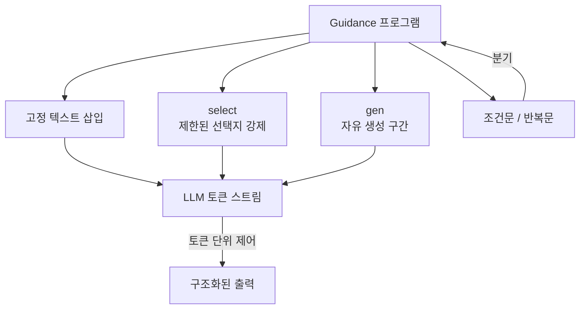

# Guidance

Microsoft가 개발한 LLM 제어 언어(guidance language) 라이브러리. 2023년에 오픈소스로 공개되었으며, "프로그램이 LLM 출력을 템플릿으로 인터리빙(interleaving)한다"는 아이디어를 중심으로 설계되었다. [[outlines]]와 함께 **제약 디코딩(constrained decoding)** 분야의 대표 도구 중 하나다.

## 프로젝트 개요

| 항목 | 내용 |
|---|---|
| 이름 | Guidance |
| 개발사 | Microsoft |
| 공개 | 2023년 초 (오픈소스) |
| 언어 | Python |
| 라이선스 | MIT |
| 저장소 | github.com/guidance-ai/guidance |
| 주요 특징 | 생성 + 로직의 동시 실행 (interleaved execution) |

## 핵심 아이디어: 인터리빙 실행

일반적인 LLM 호출은 "프롬프트 전체를 보내고 응답 전체를 받는" 단방향 패턴이다. Guidance는 이 경계를 허문다. 하나의 guidance 프로그램 안에서 **고정 텍스트(fixture)**, **LLM 생성(generation)**, **조건문/반복문(logic)** 을 자유롭게 섞을 수 있다.

```python
from guidance import models, gen, select

lm = models.OpenAI("gpt-4o")

with lm.chat():
    lm += "아래 텍스트의 감성을 분류하세요: '오늘 날씨가 너무 좋다'\n"
    lm += "감성: " + select(["긍정", "부정", "중립"], name="sentiment")
    lm += "\n이유: " + gen(name="reason", max_tokens=100)
```

이 예시에서 `select`는 세 가지 선택지 중 하나만 생성하도록 강제하고, `gen`은 자유 생성 영역을 정의한다.



Guidance가 LLM과 토큰 단위로 상호작용하며 출력 형태를 제어하는 방식을 보여준다.

## 주요 기능

### select (선택 강제)

미리 정의된 목록 중 하나만 생성하도록 LLM의 디코딩을 제한한다. 분류 태스크, 예/아니오 답변, 열거형(enum) 값 선택에 유용하다. 내부적으로 허용된 토큰만 logit에서 살아남도록 마스킹한다.

### gen (자유 생성)

일반적인 LLM 텍스트 생성 구간. `max_tokens`, `stop`, `regex` 파라미터로 생성 범위를 추가로 제한할 수 있다. `regex`는 정규식 패턴에 맞는 출력만 생성하도록 강제한다.

### json (JSON 스키마 강제)

Pydantic 모델이나 JSON Schema를 기반으로 LLM이 유효한 JSON만 생성하도록 제한한다. [[structured-output]] 구현의 가장 강력한 방식 중 하나다.

## [[outlines]]와의 비교

| 항목 | Guidance | [[outlines]] |
|---|---|---|
| 접근법 | 프로그램 내 인터리빙 | 정규식/문법 기반 샘플링 |
| 주요 강점 | 복잡한 멀티스텝 생성 흐름 | 단일 구조화 출력 (JSON/enum) |
| 모델 지원 | 로컬 + OpenAI | 로컬 중심 (transformers) |
| 추상화 수준 | 프로그래밍 언어 수준 | 제약 조건 수준 |

[[outlines]]가 "이 형태의 출력만 허용"이라는 단순한 제약에 집중한다면, Guidance는 생성 흐름 전체를 프로그래밍하는 더 넓은 비전을 가진다.

## 토큰 힐링 (Token Healing)

Guidance가 도입한 독특한 기법. LLM의 토크나이저는 문맥에 따라 같은 문자열을 다르게 토큰화할 수 있어, 고정 텍스트와 생성 구간의 경계에서 품질 저하가 발생한다. Token Healing은 경계 근처의 토큰을 재처리해 이 문제를 자동으로 해결한다.

## 지원 모델 백엔드

- **로컬**: `transformers` (llama.cpp, GGUF 등), vLLM
- **클라우드**: OpenAI, Azure OpenAI, Anthropic
- **Guidance Server**: HTTP 서버로 배포 가능 (원격 호출)

## 실무 활용 패턴

1. **구조화 데이터 추출**: 자연어에서 Pydantic 스키마 형태의 정형 데이터를 신뢰성 높게 추출
2. **분류 파이프라인**: 복수의 분류 단계를 하나의 프로그램으로 묶어 토큰 낭비 없이 실행
3. **Few-shot 예시 + 강제 형식**: 예시를 제공하고 마지막에 `select`로 형식을 고정

## 관련 문서

- [[outlines]] - 정규식/문법 기반 구조화 생성 라이브러리
- [[structured-output]] - LLM 구조화 출력 일반 개념
- [[semantic-kernel]] - Microsoft의 엔터프라이즈 LLM SDK
