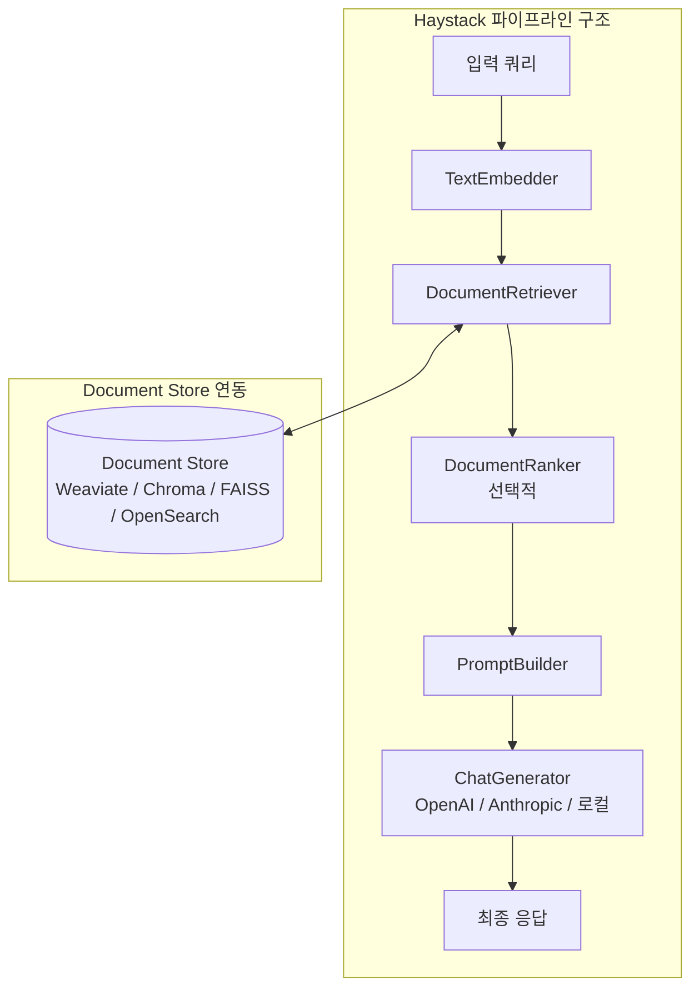

# Haystack

deepset이 개발한 오픈소스 LLM 애플리케이션 프레임워크. RAG(Retrieval-Augmented Generation) 파이프라인을 모듈식 컴포넌트로 조립하여 구축한다. NLP 엔지니어링 관점에서 설계된 프로덕션 지향 프레임워크로, 파이프라인 추상화를 핵심으로 삼는다.

## 개요

| 항목 | 내용 |
|---|---|
| 이름 | Haystack |
| 개발사 | deepset |
| 라이선스 | Apache 2.0 |
| 저장소 | github.com/deepset-ai/haystack |
| 언어 | Python |
| 최신 주요 버전 | Haystack 2.x |

Haystack은 "LLM 애플리케이션을 위한 검색 엔지니어링 프레임워크"를 표방한다. 문서 검색, 질의응답, 요약, 대화형 AI 등 복합 파이프라인을 선언적으로 구성할 수 있다. 단일 목적 도구가 아니라 **컴포넌트를 연결하는 파이프라인 런타임**에 가깝다.

## 아키텍처: 파이프라인 + 컴포넌트

Haystack 2.x의 핵심 설계는 모든 처리 단위를 `Component`로 정의하고 `Pipeline`으로 연결하는 것이다.



### 주요 컴포넌트 카테고리

**Document Stores (저장소)**
- InMemoryDocumentStore, FAISSDocumentStore, OpenSearchDocumentStore
- [[weaviate|WeaviateDocumentStore]], ChromaDocumentStore, [[pinecone|PineconeDocumentStore]]
- 모두 동일한 인터페이스를 구현하여 교체 가능

**Retrievers (검색기)**
- 밀집 검색(임베딩 기반), 희소 검색(BM25), 하이브리드 검색 지원
- `EmbeddingRetriever`, `BM25Retriever`가 대표적

**Generators (생성기)**
- `OpenAIGenerator`, `AnthropicGenerator`, `HuggingFaceLocalGenerator` 등
- 모델 교체 시 파이프라인 구조를 변경하지 않아도 된다

**Converters & Preprocessors**
- PDF, HTML, Markdown 등 다양한 문서 형식을 파싱
- 청킹(chunking), 클리닝, 메타데이터 추출 포함

## 핵심 추상화: Pipeline

Haystack의 파이프라인은 DAG(Directed Acyclic Graph) 구조다.

```python
from haystack import Pipeline
from haystack.components.retrievers import InMemoryBM25Retriever
from haystack.components.builders import PromptBuilder
from haystack.components.generators import OpenAIGenerator

template = """
컨텍스트: {{ doc.content }}
질문: {{ query }}
답변:
"""

pipe = Pipeline()
pipe.add_component("retriever", InMemoryBM25Retriever(document_store=store))
pipe.add_component("prompt_builder", PromptBuilder(template=template))
pipe.add_component("llm", OpenAIGenerator(model="gpt-4o"))

pipe.connect("retriever", "prompt_builder.documents")
pipe.connect("prompt_builder", "llm")

result = pipe.run({"retriever": {"query": "딥러닝이란?"}, "prompt_builder": {"query": "딥러닝이란?"}})
```

컴포넌트 입출력은 타입 검증이 적용되어, 잘못된 연결은 파이프라인 실행 전에 검출된다.

## Haystack vs 경쟁 프레임워크

| 특징 | Haystack | [[llamaindex|LlamaIndex]] | LangChain |
|---|---|---|---|
| 주요 추상화 | Pipeline + Component | Index + Query Engine | Chain + Agent |
| 설계 지향 | NLP 파이프라인 공학 | 데이터 수집/인덱싱 | 범용 LLM 앱 |
| 타입 안전성 | 강함 (컴포넌트 I/O 검증) | 중간 | 약함 |
| 라우팅 지원 | 조건부 라우터 내장 | 없음 (별도 구성) | LCEL로 일부 지원 |
| 평가 통합 | 내장 (RAGAS 연동) | 내장 | 별도 라이브러리 필요 |

## YAML 직렬화

파이프라인을 YAML로 내보내고 불러올 수 있다. 이를 통해 파이프라인 정의를 코드가 아닌 설정 파일로 관리할 수 있다.

```yaml
components:
  retriever:
    type: haystack.components.retrievers.InMemoryBM25Retriever
    init_parameters:
      document_store: ...
  llm:
    type: haystack.components.generators.OpenAIGenerator
    init_parameters:
      model: gpt-4o
connections:
  - sender: retriever.documents
    receiver: prompt_builder.documents
```

이 직렬화 기능은 MLOps 환경에서 파이프라인 버전 관리와 재현성 확보에 유용하다.

## 평가 및 실험

Haystack은 [[rag-pipeline|RAG 파이프라인]] 평가를 위한 도구를 내장한다.

- **EvaluationHarness**: 질문-정답 데이터셋으로 파이프라인 자동 평가
- **RAGAS 통합**: 신뢰성, 답변 관련성, 컨텍스트 정밀도 등 RAGAS 지표를 파이프라인 레벨에서 측정
- **실험 추적**: Weights & Biases, MLflow와 연동 가능

## 실무 관점

Haystack은 실험 단계보다 **프로덕션 파이프라인 구축**에 적합하다. 파이프라인 직렬화, 타입 안전한 컴포넌트 연결, 교체 가능한 Document Store 인터페이스가 시스템 엔지니어링 관점에서 강점이다. 반면 초기 학습 곡선이 LlamaIndex나 LangChain보다 가파른 편이다.

## 관련 문서

- [[rag-pipeline|RAG 파이프라인]]
- [[llamaindex|LlamaIndex]]
- [[weaviate|Weaviate]]
- [[pinecone|Pinecone]]
- [[faiss|FAISS]]
- [[chroma-db|ChromaDB]]
