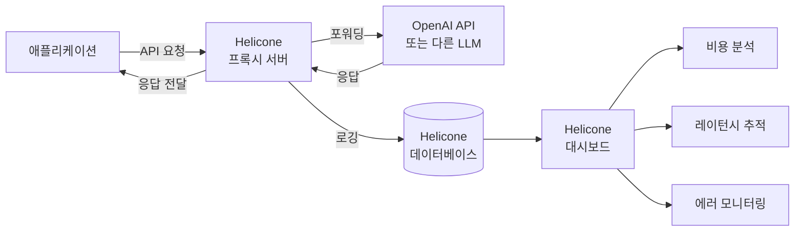

# Helicone

LLM API 호출을 프록시(proxy) 방식으로 중간에서 가로채 로깅, 비용 추적, 캐싱, 레이트 리미팅을 수행하는 오픈소스 관찰성(observability) 도구. 코드 변경을 최소화하면서 LLM 사용 현황을 파악할 수 있도록 설계되었다. OpenAI, Anthropic, Azure OpenAI, Groq 등 주요 프로바이더를 지원한다.

## 프로젝트 개요

| 항목 | 내용 |
|---|---|
| 이름 | Helicone |
| 공개 | 2023년 |
| 언어 | TypeScript, Rust |
| 라이선스 | Apache 2.0 |
| 저장소 | github.com/Helicone/helicone |
| 웹사이트 | helicone.ai |
| 주요 방식 | API 프록시 (URL 교체만으로 연동) |

## 프록시 방식의 장점

Helicone은 SDK 래퍼 방식이 아닌 **HTTP 프록시** 방식을 채택한다. OpenAI SDK의 `base_url`만 교체하면 된다.

```python
from openai import OpenAI

client = OpenAI(
    api_key="sk-...",
    base_url="https://oai.helicone.ai/v1",
    default_headers={
        "Helicone-Auth": "Bearer sk-helicone-...",
    }
)

# 이후 모든 OpenAI 호출이 Helicone을 통과하며 자동 로깅
response = client.chat.completions.create(
    model="gpt-4o",
    messages=[{"role": "user", "content": "안녕하세요"}]
)
```

LangChain, LlamaIndex, Vercel AI SDK 등 OpenAI 호환 클라이언트라면 동일한 방식으로 연동된다.



프록시 구조 덕분에 애플리케이션 코드 변경 없이 모든 LLM 호출 데이터가 Helicone을 통해 기록된다.

## 핵심 기능

### 비용 및 사용량 추적

모든 LLM 호출의 토큰 사용량과 비용을 모델별, 사용자별, 프로퍼티별로 집계한다. 대시보드에서 일별/월별 추이, 모델 믹스, 기능별 비용 분배를 확인할 수 있다.

### 프롬프트 캐싱

동일한 프롬프트에 대한 반복 호출을 캐시해 API 비용을 절감한다. 헤더 하나로 활성화된다.

```
Helicone-Cache-Enabled: true
Helicone-Cache-Bucket-Max-Size: 3
```

### 커스텀 프로퍼티 (Custom Properties)

요청에 메타데이터를 첨부해 대시보드에서 필터링할 수 있다.

```
Helicone-Property-User: user_12345
Helicone-Property-Feature: code-review
Helicone-Property-Environment: production
```

이를 통해 "code-review 기능의 이번 달 비용", "production 환경의 에러율" 같은 분석이 가능하다.

### 레이트 리미팅

사용자별 또는 API 키별 분당 요청 수를 제한할 수 있다. 멀티테넌트 애플리케이션에서 특정 사용자의 과도한 사용을 제한하는 데 유용하다.

### 모델 게이트웨이

단일 Helicone 엔드포인트를 통해 여러 LLM 프로바이더로 라우팅할 수 있다. 프로바이더 장애 시 자동 폴백(fallback) 구성도 가능하다.

## [[langfuse]]와의 비교

[[langfuse]]와 Helicone은 모두 LLM 관찰성 도구이지만 접근 방식이 다르다.

| 항목 | Helicone | [[langfuse]] |
|---|---|---|
| 연동 방식 | HTTP 프록시 (URL 교체) | SDK 계측 (코드 삽입) |
| 설정 복잡도 | 매우 낮음 | 중간 (SDK 초기화 필요) |
| 에이전트 추적 | 기본 수준 | 멀티스텝 트레이스 강력 |
| 프롬프트 관리 | 기본 지원 | 버전 관리 강력 |
| 비용 추적 | 핵심 기능, 강력 | 부가 기능 |
| 셀프호스팅 | 지원 (Docker) | 지원 (Docker) |

## [[braintrust]]와의 차이

[[braintrust]]는 LLM 평가(evaluation)와 실험 추적에 집중하는 반면, Helicone은 프로덕션 모니터링과 비용 관리에 초점을 맞춘다. 두 도구는 서로 다른 문제를 해결하므로 함께 사용할 수 있다.

## 자체 호스팅

Helicone은 완전한 셀프호스팅을 지원한다.

```bash
git clone https://github.com/Helicone/helicone
cd helicone
docker-compose up
```

ClickHouse(분석 데이터베이스)와 MinIO(오브젝트 스토리지)를 포함한 전체 스택이 Docker Compose로 실행된다.

## 관련 문서

- [[langfuse]] - SDK 기반 LLM 옵저버빌리티 (멀티스텝 트레이싱 강점)
- [[braintrust]] - LLM 평가 및 실험 추적 플랫폼
- [[litellm]] - 멀티 프로바이더 LLM 통합 게이트웨이
- [[openrouter]] - 멀티 프로바이더 LLM 라우팅 서비스
