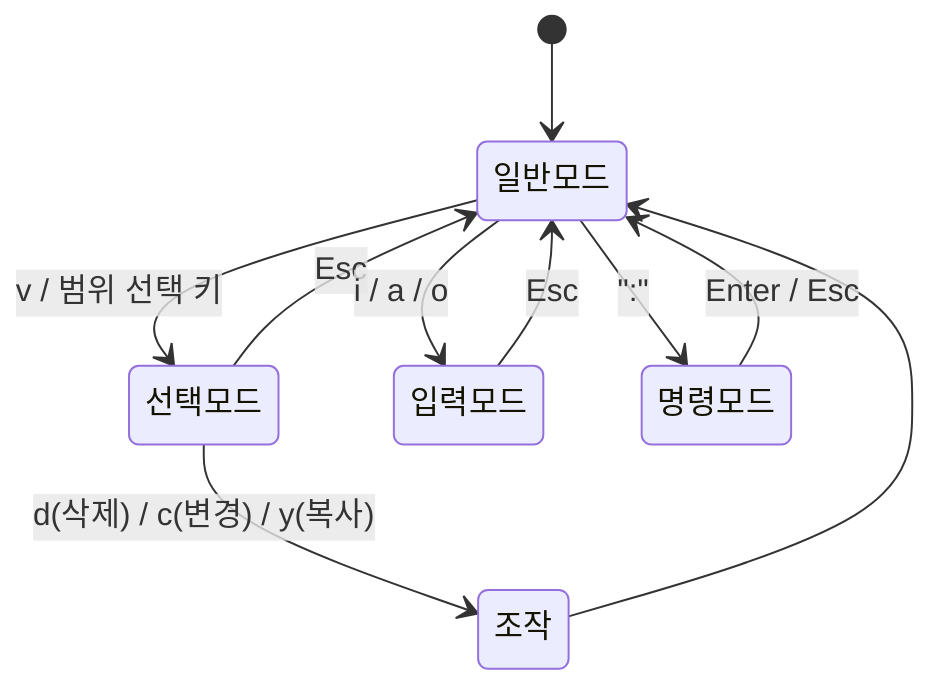
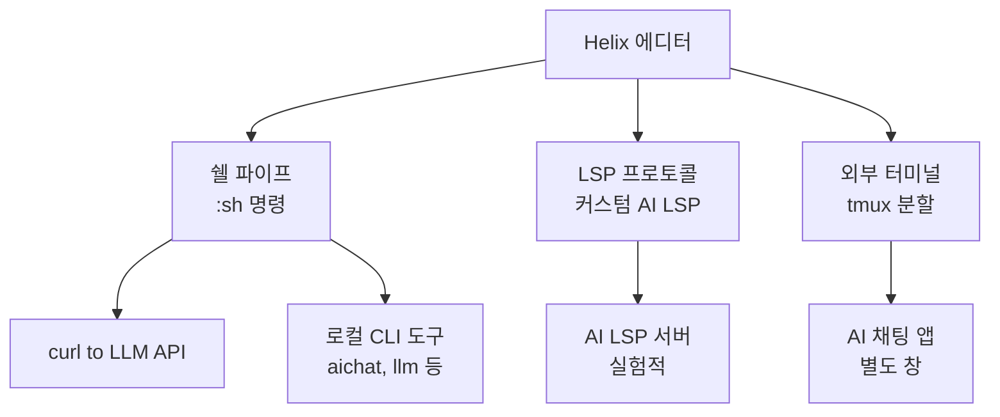

# Helix Editor with AI - 모달 에디터 AI 통합

## 정체성

Helix는 Vim/Neovim과 Kakoune에서 영감을 받아 Rust로 작성된 현대적 모달 에디터(modal editor)다. LSP(Language Server Protocol)와 Tree-sitter를 기본 탑재하여 별도 플러그인 없이 IDE 수준의 코드 인텔리전스를 제공한다. AI 기능 자체는 코어에 포함되지 않지만, 커뮤니티가 외부 통합 방식으로 AI 보조 기능을 구현하고 있다.

| 속성 | 값 |
|------|-----|
| 언어 | Rust |
| 라이선스 | MPL-2.0 |
| 에디터 모델 | 모달 (선택-먼저 패러다임) |
| LSP | 기본 탑재 (플러그인 불필요) |
| Tree-sitter | 기본 탑재 |
| AI 코어 통합 | 없음 (외부 통합) |
| 플러그인 시스템 | 제한적 (스크립팅 없음) |
| 공식 사이트 | helix-editor.com |

---

## Helix의 핵심 철학: 선택-먼저 패러다임

Vim은 "동사-목적어(verb-object)" 방식이다: `dw`는 "삭제(d) + 단어(w)" 순서다.
Helix(와 Kakoune)는 "목적어-동사(object-verb)" 방식이다: 먼저 선택(selection)하고 그 다음 조작한다.



이 패러다임은 선택 범위가 항상 시각적으로 보이므로 실수를 줄이고, 다중 커서(multiple cursors) 작업이 직관적이다.

---

## 핵심 기능 (AI 무관)

### 기본 탑재 LSP

Helix는 언어별 LSP 서버와 자동 연동된다. `hx --health` 명령으로 현재 설치된 LSP 서버 목록을 확인할 수 있다.

```bash
hx --health python
# Python:
#   Configured language servers: pylsp, pyright
#   Installed binaries: pyright-langserver, pylsp
#   Highlight queries: ✓
#   Textobject queries: ✓
#   Indent queries: ✓
```

### Tree-sitter 기반 구문 분석

Helix는 Tree-sitter를 사용하여 파싱 기반 신택스 하이라이팅과 구조 인식 텍스트 객체(textobject)를 제공한다. `mf`(함수 선택), `mc`(클래스 선택) 등의 키로 코드 구조 단위로 선택이 가능하다.

### 다중 커서

Helix의 다중 커서(multiple cursors)는 동일한 패턴을 여러 곳에서 동시에 편집할 때 강력하다.

```
C-d : 같은 단어 다음 발생을 선택에 추가
,   : 메인 커서 외 나머지 제거
;   : 선택을 커서로 축소
```

---

## AI 통합 현황

### 제약: 플러그인 시스템 부재

Helix는 2026년 현재까지 외부 플러그인 스크립팅 시스템이 없다(공식적으로 개발 중). Neovim의 Lua API나 VSCode의 Extension API에 해당하는 것이 없어 AI 기능을 코어에 직접 통합하기 어렵다. 이는 설계 철학적 선택이기도 하다.

### 통합 방식들



#### 방법 1: 쉘 통합 (`:sh`)

Helix의 `:sh` 명령으로 쉘 명령을 실행하고 출력을 버퍼에 삽입할 수 있다.

```bash
# 선택 코드를 LLM에 보내고 결과를 버퍼에 삽입 (개념 예시)
:sh echo "리팩토링해줘:" && cat % | llm "이 코드를 개선해줘"
```

이 방식은 번거롭지만 플러그인 없이 작동한다.

#### 방법 2: `aichat` 또는 `llm` CLI 통합

`aichat`이나 `llm`(Simon Willison의 CLI) 같은 커맨드라인 LLM 도구와 통합하면 터미널에서 AI 보조를 받으면서 Helix에서 편집할 수 있다.

```bash
# tmux 레이아웃: 왼쪽 Helix, 오른쪽 aichat
tmux split-window -h "aichat"
```

#### 방법 3: 커스텀 AI LSP 서버 (실험적)

LSP 프로토콜의 `textDocument/completion` 엔드포인트를 구현하는 AI 서버를 만들어 Helix에 연결하는 시도가 커뮤니티에서 이루어지고 있다. GitHub Copilot의 LSP 어댑터가 이 방식의 선례다.

```toml
# .config/helix/languages.toml (개념 예시)
[[language]]
name = "python"
language-servers = ["pyright", "ai-completion-server"]

[language-server.ai-completion-server]
command = "ai-lsp-server"
args = ["--model", "gpt-4o"]
```

#### 방법 4: tmux + Continue/Aider

[[continue-vscode-extension|Continue]]나 [[aider|Aider]] 같은 도구를 터미널에서 실행하면서 Helix와 동일한 파일을 편집하는 하이브리드 워크플로우. 파일을 저장하면 양쪽이 실시간으로 변경사항을 반영한다.

---

## Neovim과 비교

| 항목 | Helix | Neovim |
|------|-------|--------|
| 플러그인 | 제한/없음 | Lua 기반 풍부한 생태계 |
| AI 통합 | 외부 CLI/tmux 수준 | Avante.nvim, CodeCompanion 등 네이티브 수준 |
| 설정 복잡도 | 낮음 (기본 탑재 많음) | 높음 (플러그인 조합) |
| LSP 설정 | 자동 (별도 설정 없음) | mason.nvim + nvim-lspconfig |
| 학습 곡선 | 중간 | 높음 |
| 성능 | 매우 빠름 (Rust) | 빠름 (LuaJIT) |

Neovim에서 AI를 적극 활용하려면 [[neovim-copilot-ai|Neovim AI 코딩]] 페이지를 참고한다.

---

## 실무 사용 가이드

### 설치

```bash
# macOS
brew install helix

# Linux (패키지 매니저)
# Ubuntu: sudo add-apt-repository ppa:maveonair/helix-editor && sudo apt install helix
# Arch: sudo pacman -S helix

# 소스 빌드
git clone https://github.com/helix-editor/helix
cd helix
cargo install --path helix-term --locked
```

### 기본 설정

```toml
# ~/.config/helix/config.toml
[editor]
line-number = "relative"
mouse = false
auto-save = true

[editor.statusline]
left = ["mode", "spinner", "file-name"]
right = ["diagnostics", "position", "file-type"]

[keys.normal]
# AI 관련 커스텀 키 바인딩 예시
"A-a" = ":sh aichat -e"  # 선택 코드를 aichat에 파이프
```

### AI 보조 워크플로우 (tmux 기반)

```bash
#!/bin/bash
# helix-ai.sh - Helix + AI 워크플로우 세션 스크립트
tmux new-session -d -s dev
tmux rename-window -t dev:0 'editor'
tmux send-keys -t dev:0 'hx .' Enter
tmux split-window -t dev:0 -h -p 35
tmux send-keys -t dev:0.1 'aichat' Enter
tmux attach-session -t dev
```

---

## 한계 / 트레이드오프

### AI 통합의 근본적 한계

Helix는 플러그인 시스템이 없으므로 Neovim의 Avante.nvim처럼 에디터 내부에 AI 채팅 창이 열리거나 인라인 diff를 보여주는 것이 현재로서는 불가능하다. AI 사용 경험이 VSCode/Cursor 계열보다 훨씬 불편하다.

### 사용자층

Helix를 선택하는 개발자는 주로 터미널 중심, 경량 환경, 서버 접속(SSH) 편집을 선호하는 사람들이다. AI 코딩 경험을 극대화하려면 [[cursor|cursor-editor]], [[void-editor-ai|Void]], [[continue-vscode-extension|Continue]] 쪽이 훨씬 현실적이다.

### 플러그인 개발 예정

Helix 공식 로드맵에 스크립팅 시스템(Scheme/Lua 기반) 추가가 포함되어 있다. 구현되면 Neovim 수준의 AI 플러그인 생태계가 형성될 가능성이 있다.

---

## 왜 중요한가

Helix는 AI 코딩 도구 측면에서 아직 성숙하지 않았지만, 다음 관점에서 주목받는다:

1. **순수 편집 성능**: AI 없이도 Rust 기반의 반응성과 Tree-sitter 기반 구문 분석이 뛰어나다.
2. **서버 환경**: GUI 없는 서버에서 LSP 기능을 즉시 사용할 수 있는 드문 에디터다.
3. **미래 가능성**: 플러그인 시스템 추가 시 AI 생태계가 급성장할 수 있다.
4. **학습 투자**: Vim보다 설정이 적어 터미널 편집에 입문하기 좋다.

---

## 관련 문서

- [[zed-ai-editor]] - Rust 기반 GUI 에디터, AI 네이티브 통합
- [[neovim-copilot-ai]] - 모달 에디터 계열의 완성형 AI 통합 사례
- [[continue-vscode-extension]] - VSCode 기반 오픈소스 AI 코딩 도구
- [[void-editor-ai]] - 오픈소스 Cursor 대안
- [[aider]] - 터미널 기반 AI 코딩 도구 (Helix와 병행 사용 가능)
