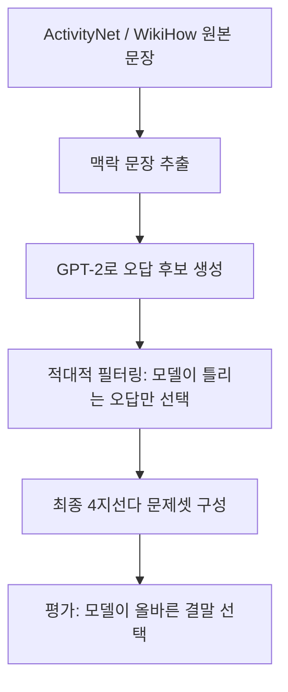
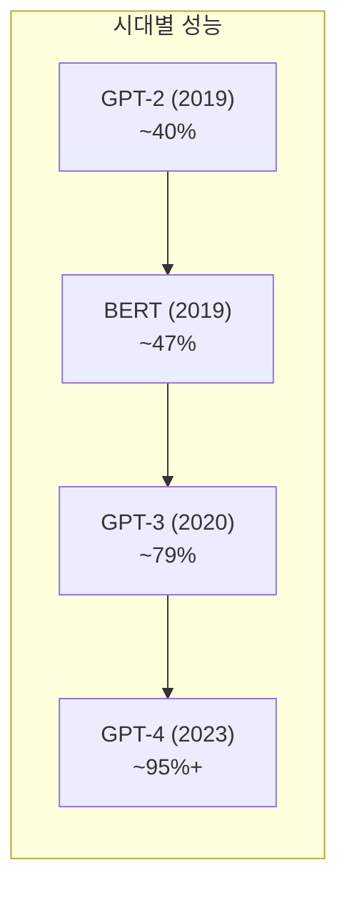

# HellaSwag 벤치마크

HellaSwag(Harder Endings, Longer contexts, and Low-shot Activities For Situations With Adversarial Generations)는 LLM의 **상식 추론(commonsense reasoning)** 능력을 평가하는 데이터셋이다. 2019년 Zellers 외 연구진이 발표한 논문에서 소개되었으며, ActivityNet 캡션과 WikiHow 문서에서 추출한 문장 완성 문제로 구성된다.

## 핵심 개념

HellaSwag의 핵심 아이디어는 **적대적 필터링(adversarial filtering)**이다. 단순히 틀린 보기를 만드는 대신, 언어 모델이 그럴듯하다고 판단할 만한 오답(hard negatives)을 자동으로 생성하고, 모델이 구별하지 못하는 오답만 최종 데이터셋에 포함시킨다. 이 과정을 반복함으로써 인간에게는 쉽지만 당시 모델들에게는 어려운 문제들을 확보했다.



위 파이프라인에서 적대적 필터링 단계가 HellaSwag의 차별점이다. 오답이 언어적으로 자연스럽기 때문에 표면적 패턴 매칭만으로는 정답을 맞힐 수 없다.

## 문제 구조

각 문제는 다음 네 가지 요소로 구성된다.

- **Activity Label**: 활동 카테고리 (예: "요리하기", "자전거 타기")
- **Context**: 짧은 상황 묘사 문장 (1-2문장)
- **Endings**: 4개의 문장 완성 선택지 (1개 정답 + 3개 오답)
- **Source Domain**: ActivityNet 또는 WikiHow 중 출처 표시

예시:

> 맥락: "한 남성이 넥타이를 매고 있다. 그는..."
> 1. 넥타이를 풀고 다른 옷을 입는다.
> 2. 거울을 보며 매듭을 조정한다. (정답)
> 3. 수영장으로 뛰어든다.
> 4. 요리를 시작한다.

## 평가 방법

HellaSwag는 **다지선다(multiple choice)** 형식이므로, 모델은 네 개의 선택지 각각에 대한 로그 우도(log-likelihood)를 계산하여 가장 높은 값을 가진 선택지를 정답으로 고른다. [[evaluation-harness]]의 표준 평가 파이프라인에서도 이 방식을 채택한다.

- 지표: 정확도(Accuracy, %)
- 인간 성능: 약 95.6%
- GPT-3 (175B) 성능: 약 78.9%
- 최신 대형 모델들: 85-95% 수준

## HellaSwag vs. 다른 상식 추론 벤치마크

| 벤치마크 | 초점 | 문제 수 | 특징 |
|---------|------|---------|------|
| HellaSwag | 활동 문장 완성 | ~70K | 적대적 필터링으로 hard negatives |
| [[mmlu]] | 광범위 지식 57개 과목 | ~14K | 지식 폭 측정 |
| WinoGrande | 대명사 해결 | ~44K | 상식 기반 지시 대상 판단 |
| PIQA | 물리적 직관 | ~21K | 도구/물리 세계 추론 |

## 모델 성능 추이



HellaSwag 출시 당시 BERT 계열 모델들이 50% 수준에 머물렀으나, GPT-3 이후 급격히 향상되었다. 현재 최신 대형 모델들은 거의 인간 수준에 도달해 있어, 단독 벤치마크로서의 변별력은 낮아졌다.

## 한계와 비판

**포화(saturation) 문제**: 최신 LLM들이 인간 성능에 근접하면서 변별력이 약해졌다. 2024년 기준 상위 모델들은 모두 90% 이상을 기록한다.

**도메인 편향**: ActivityNet과 WikiHow라는 특정 도메인에서 추출되었기 때문에, 일상 활동 이외의 전문 지식이나 추상적 추론은 다루지 못한다.

**언어 제약**: 영어 전용 데이터셋이며, 다국어 버전은 별도의 크로스링구얼 벤치마크([[mmlu]] 등)로 보완해야 한다.

## 실무 활용

[[evaluation-harness]]를 사용한 평가 실행:

```bash
lm_eval --model hf \
  --model_args pretrained=your-model \
  --tasks hellaswag \
  --num_fewshot 10 \
  --output_path results/
```

10-shot 설정이 표준이며, 제로샷 대비 5-10% 포인트 성능이 향상되는 경향이 있다.

## 관련 문서

- [[evaluation-harness]] - HellaSwag를 포함한 통합 LLM 평가 프레임워크
- [[mmlu]] - 광범위한 지식 평가를 위한 보완 벤치마크
- [[winogrande-benchmark]] - 대명사 기반 상식 추론 평가
- [[bbh-benchmark]] - 더 어려운 추론 문제 모음
