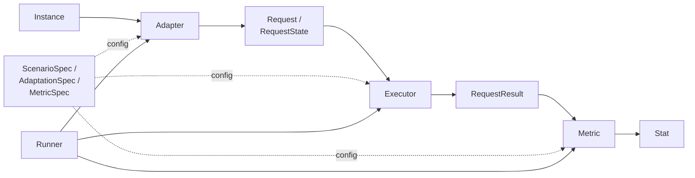

# HELM (Stanford CRFM)

> "Holistic Evaluation of Language Models (HELM) is an open source Python framework created by the Center for Research on Foundation Models (CRFM) at Stanford for holistic, reproducible and transparent evaluation of foundation models, including large language models (LLMs) and multimodal models."

Stanford CRFM 이 만든 holistic 평가 framework. 단일 metric (accuracy) 위주 평가 대신 **7가지 metric 을 16개 scenario 각각에 동시 측정** + Scenario / Adapter / Executor / Metric 의 명시적 4단 분리 아키텍처가 핵심 차별점.

## 한 줄 정체성

Scenario / Adapter / Metric 명시 분리 + 7-metric multi-dim 평가. accuracy 만 보는 [[lm-evaluation-harness]] 와 가장 대비되는 학술 framework.

## 3대 설계 원칙 (HELM blog 인용)

1. **Broad coverage & recognition of incompleteness**: "Given language models' vast surface of capabilities and risks, we need to evaluate language models over a broad range of scenarios."
2. **Multi-metric measurement**: "Societally beneficial systems are characterized by many desiderata, but benchmarking in AI often centers on one (usually accuracy)."
3. **Standardization**: "Our object of evaluation is the language model, not a scenario-specific system. Therefore, in order to meaningfully compare different LMs, the strategy for adapting an LM to a scenario should be controlled for."

## 7가지 metric

각 scenario 에 동일하게 측정:

| Metric | 의미 |
|---|---|
| **Accuracy** | 일반적인 다운스트림 정확도, 16개 다양한 scenario 에서 |
| **Calibration** | 모델 confidence 가 실제 정답률과 얼마나 잘 맞는가 |
| **Robustness** | typo, distribution shift, adversarial 조건에서 성능 |
| **Fairness** | 인구통계 그룹 간 성능 격차 |
| **Bias** | 출력에 들어간 stereotypical association |
| **Toxicity** | 유해/안전하지 않은 출력 빈도 |
| **Efficiency** | latency / cost 효율성 |

> "For each of the 16 core scenarios, it measures these 7 metrics."

## 코드 아키텍처 (`docs/code.md` 인용)

핵심 추상화:



### 추상화 정의

- **Scenario**: "specifies a task and a data distribution. It specifies a set of `Instance`s, where each `Instance` has an input (e.g., question) and a set of `Reference` outputs."
- **Adapter** (with `AdaptationSpec`): instance 를 받아 "adapts it to a set of `Request`s to the API (e.g., the model, temperature, number of in-context training examples)."
- **ScenarioState**: "containing a set of `RequestState`s, where each `RequestState` consists of a `Request` and any metadata."
- **Executor** (with `ExecutionSpec`): "Executes each `Request` in the `RequestState` to produce a `RequestResult` for each one; everything is encapsulated in a `ScenarioState`."
- **Metric** (with `MetricSpec`): "Takes a `ScenarioState` containing `RequestResults`s and produces a set of `Stat`s (e.g., accuracy, accuracy@5, toxicity, bias, etc.)."
- **Runner**: "top-level controller that runs the above steps and is driven by a set of `RunSpec`s."

### 3-tier 클래스 구조

| 분류 | 역할 | 예시 |
|---|---|---|
| **Specifications** | 사용자 정의 (config) | ScenarioSpec, AdaptationSpec, MetricSpec, RunSpec |
| **States** | auto-generated, serializable | Instance, RequestState, ScenarioState |
| **Controllers** | 실행 로직 | Scenario, Adapter, Executor, Metric, Runner |

이 구조의 미덕: scenario 정의 / prompt 변환 / 모델 호출 / 평가가 완전히 분리되어 in-context learning 전략 (5-shot 등) 변경 시 prompt 만 바꿔서 재실행 가능.

## CLI

```bash
# 1) run 실행
helm-run --run-entries mmlu:subject=philosophy,model=openai/gpt2 \
         --suite my-suite \
         --max-eval-instances 10

# 2) 결과 요약
helm-summarize --suite my-suite

# 3) UI 서버
helm-server --suite my-suite
# → http://localhost:8000/
```

## 공식 leaderboard

- **HELM Capabilities**
- **HELM Safety**
- **VHELM** (Vision-Language Models)
- **HELM Lite** -- 최근 lightweight 변형 (HELM Lite blog 2023-12-19)
- 도메인별: **MedHELM** (의료), **Finance**, **Multilinguality**, **Compliance**

## 5-shot 평가

> "For each test instance, models are evaluated using in-context learning with 5 in-context examples and prompts constructed based on the adapter for multiple-choice and free-form generation."

이는 HELM 의 표준 adaptation 패턴.

## 다른 harness 와의 포지셔닝

| 비교 | HELM | [[lm-evaluation-harness]] |
|---|---|---|
| 1차 metric | 7개 (multi-dim) | accuracy 중심 |
| 추상화 분리 | Scenario/Adapter/Executor/Metric 명시적 | Task + LM 백엔드 |
| 출력 | Stat aggregation, web UI | JSON 결과만 |
| 학술적 framing | "holistic" 종합 평가 | "few-shot academic benchmark" |
| reproducibility 강조 | Spec 직렬화 + suite | task.yaml + log_samples |

HELM 의 Scenario/Adapter/Metric 분리는 후속 harness 들에게도 영향 -- [[inspect-ai]] 의 Solver/Scorer 분리, [[lighteval]] 의 task spec 분리에 영향. 자세한 횡단 비교는 [[evaluation-harness-comparison]] 참조.

## 출처

- README: https://github.com/stanford-crfm/helm
- Code architecture: https://github.com/stanford-crfm/helm/blob/main/docs/code.md
- HELM blog (3 principles, 7 metrics): https://crfm.stanford.edu/2022/11/17/helm.html
- HELM Lite: https://crfm.stanford.edu/2023/12/19/helm-lite.html
- Paper: https://arxiv.org/abs/2211.09110 (Liang et al., "Holistic Evaluation of Language Models")
- Live leaderboard: https://crfm.stanford.edu/helm/

## 관련 문서

- [[evaluation-harness]] -- 평가 harness 허브 페이지
- [[evaluation-harness-comparison]] -- 9개 harness 횡단 비교
- [[lm-evaluation-harness]] -- accuracy 중심의 학술 표준
- [[inspect-ai]] -- Scenario/Adapter 분리 영향을 받은 차세대 framework
- [[lighteval]] -- HF 의 차세대 평가 toolkit
