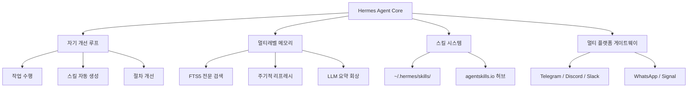

## 개요

Hermes Agent는 NousResearch가 개발한 자기 개선(self-improving) AI 에이전트 프레임워크다. "함께 성장하는 에이전트"를 표방하며, 복잡한 작업을 수행한 후 자동으로 스킬을 생성-저장-개선하는 폐쇄형 학습 루프를 핵심으로 한다. MIT 라이선스로 공개되어 GitHub에서 40K+ 스타를 기록했으며, 영속적 멀티레벨 메모리와 200+ 모델 지원이 특징이다.

## 핵심 특징

- **자기 개선 루프**: 5회 이상 도구 호출이 포함된 복잡한 작업 완료 후, 접근법/엣지 케이스/도메인 지식을 캡처하는 스킬 문서를 자율적으로 생성. 사용 중 절차를 지속 개선
- **영속적 멀티레벨 메모리**: 세션 메모리(현재 대화), 영속 메모리(FTS5 전문 검색 + LLM 요약, 10K+ 스킬 문서에서 ~10ms 검색), 사용자 모델(자동 선호도 프로파일)의 3계층 구조
- **스킬 자동 생성**: `~/.hermes/skills/` 디렉토리에 SKILL.md(YAML 프론트매터 + 마크다운) + 선택적 scripts/references/assets/ 디렉토리로 저장. agentskills.io 오픈 표준과 호환. 기본 **118개 스킬** (96 번들 + 22 선택) 26+ 카테고리 포함
- **Honcho 변증법적 사용자 모델링**: 개별 사용자에 대한 이해를 대화를 통해 점진적으로 심화. 명시적 설정 없이 대화 누적으로 사용자 컨텍스트 자동 구축
- **모델 비의존적**: 200+ 모델 지원 -- Nous Portal(Hermes 4 70B/405B), [[openrouter|OpenRouter]](수백 모델), OpenAI, Anthropic, Google, MiniMax 직접 통합, Ollama/llama.cpp/vLLM 로컬 추론($0 API 비용)
- **멀티 플랫폼 게이트웨이**: 단일 프로세스로 Telegram, Discord, Slack, WhatsApp, Signal, CLI, Matrix(v0.8.0, 리액션/읽음확인), Mattermost(파일 첨부) 동시 서빙. 플랫폼 전환 시 대화 컨텍스트 완전 유지

## 기술 상세

### 아키텍처



### 실행 환경

6가지 터미널 백엔드를 지원하여 다양한 배포 환경에 대응한다:

| 백엔드 | 용도 |
|---|---|
| Local | 로컬 머신 직접 실행 |
| Docker | 컨테이너 격리 실행 |
| SSH | 원격 서버 연결 |
| Daytona | 클라우드 개발 환경 |
| Singularity | HPC/연구 환경 |
| Modal | 서버리스 GPU 환경 |

### 보안 및 운영

- **Zero Agent CVE**: CVE-2026-25253 등 비교 대상 대비 에이전트 취약점 없음
- **커뮤니티 스킬 보안 스캔**: 데이터 탈취, 프롬프트 인젝션, 공급망 위협 자동 탐지
- **Docker 보안 강화**: Capability 드롭, 권한 에스컬레이션 금지, PID 제한
- 명령 승인 시스템과 컨테이너 격리로 안전한 코드 실행
- 내장 크론 스케줄러로 자동화 작업 예약
- 서브에이전트 위임 및 병렬화 지원

### Atropos RL 학습

에이전트 상호작용에서 배치 궤적(trajectory)을 생성하여 도구 호출 모델의 [[long-horizon-rl-training-for-agents|강화학습]] 파인튜닝에 활용한다. 에이전트 사용 데이터를 모델 개선에 직접 피드백하는 폐쇄형 루프를 형성한다.

### 도구 생태계

- **40+ 내장 도구** + [[model-context-protocol|MCP(Model Context Protocol)]] 통합으로 외부 도구 서버 연결 (코어 수정 없이)
- 커뮤니티 측정 결과 API 호출당 ~73%가 고정 오버헤드 -- 예산 모델 사용 시 요청당 ~$0.30 비용
- Progressive disclosure: 스킬 요약을 먼저 로드하여 토큰 오버헤드 최소화

### 배포 요구사항

| 환경 | 최소 사양 | 비용 |
|---|---|---|
| **$5 VPS** | 2코어 CPU, 8GB RAM | $5/월 |
| **Docker** | 보안 강화 컨테이너 | 호스팅 비용만 |
| **서버리스 (Modal)** | GPU 온디맨드 | 사용량 기반 |
| **Hostinger** | 원클릭 설치 | 호스팅 비용 |
| **GPU 클러스터** | 로컬 추론 시 | 하드웨어 비용 |

서버리스 하이버네이션으로 비사용 시 비용 제로에 가까운 운영이 가능하다.

### 5단계 실행 사이클

```
1. 메시지 수신 (플랫폼 게이트웨이)
   |
2. 컨텍스트 검색 (FTS5 영속 스토리지)
   |
3. 추론 + 행동 (로드된 스킬 활용)
   |
4. 결과 문서화 (스킬 파일 자동 생성)
   |
5. 지식 영속화 (향후 검색용 저장)
```

### 경쟁 에이전트 비교

| 항목 | Hermes Agent | OpenClaw | Claude Code | Codex CLI |
|---|---|---|---|---|
| 자기 개선 | O (스킬 자동 생성) | SOUL.md 아이덴티티 | X | X |
| 영속 메모리 | 3계층 (세션/영속/사용자) | 세션 기반 | 프로젝트 메모리 | 세션 기반 |
| 멀티 플랫폼 | 8+ (Telegram/Discord/Slack/...) | 메시징 앱 UI | CLI | CLI |
| 셀프호스팅 | O (Docker/$5 VPS) | O (Docker) | 로컬 | 로컬 |
| 모델 지원 | 200+ (OpenRouter/직접/로컬) | 다수 | Claude 전용 | GPT 전용 |
| 라이선스 | MIT | MIT | 상용 | 상용 |
| GitHub 스타 | 40K+ | 247K+ | - | - |

### OpenClaw과의 차별점

OpenClaw이 메시징 앱 UI와 SOUL.md 아이덴티티 기반의 개인 AI 에이전트에 집중하는 반면, Hermes Agent는 자기 개선 루프와 영속적 메모리를 통한 "함께 성장하는 에이전트"에 특화되어 있다. Hermes의 스킬 자동 생성과 Atropos RL 학습은 에이전트가 사용될수록 성능이 향상되는 폐쇄형 피드백 루프를 형성한다.

## 관련 문서

- [[openclaw]] - 메시징 기반 개인 AI 에이전트
- [[agent-memory-systems]] - 에이전트 메모리 시스템 패턴
- [[agent-skills]] - 에이전트 스킬 사양
- [[composio]] - AI 에이전트 외부 도구 통합 플랫폼
- [[openrouter]] - 200+ 모델 접근을 위한 유니버설 AI API
