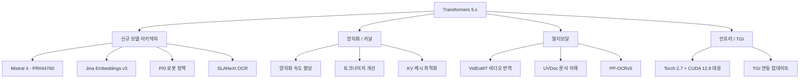

# HuggingFace Transformers 5.x - 멀티모달 확장과 최신 모델 지원

HuggingFace Transformers 5.x 계열(v5.4~v5.6)은 2026년 4월 기준 활발히 릴리스되고 있다. Mistral 4를 비롯한 최신 모델 아키텍처 지원 확대, 양자화 속도 향상, 멀티모달 처리 강화가 핵심이며, TGI(Text Generation Inference)와의 연동도 함께 업데이트됐다.

## Transformers 5.x 구성 개요



5.x 릴리스는 2024년의 4.x 계열과 달리 멀티모달, 로봇공학, OCR 등 비텍스트 도메인으로 지원 범위를 크게 넓혔다.

## 신규 지원 모델

### Mistral 4 (PR #44760)

Mistral Small 4 아키텍처가 Transformers에 공식 통합됐다. Mistral Small 4는 119B 전체 파라미터, 6B 활성 파라미터의 MoE 구조로, 추론·멀티모달·에이전트 코딩 역량을 단일 모델로 통합한 것이 특징이다.

```python
from transformers import AutoModelForCausalLM, AutoTokenizer
import torch

model_id = "mistralai/Mistral-Small-4-Instruct-2503"
tokenizer = AutoTokenizer.from_pretrained(model_id)
model = AutoModelForCausalLM.from_pretrained(
    model_id,
    torch_dtype=torch.bfloat16,
    device_map="auto",
)

inputs = tokenizer("파이썬으로 피보나치를 구현해줘", return_tensors="pt").to("cuda")
outputs = model.generate(**inputs, max_new_tokens=512)
print(tokenizer.decode(outputs[0], skip_special_tokens=True))
```

- 256K 컨텍스트 지원 (Transformers `sliding_window` 파라미터 활용)
- 추론 강도 조절: `thinking_mode` 파라미터로 빠른 응답 ↔ 깊은 추론 선택 가능

### Jina Embeddings v3

Jina AI의 최신 임베딩 모델이 `AutoModel`로 직접 불러올 수 있게 됐다. 태스크 맞춤형 어댑터(LoRA 기반)를 런타임에 교체하는 것이 특징으로, 단일 모델로 검색/분류/재랭킹/클러스터링 태스크를 처리한다.

```python
from transformers import AutoModel

model = AutoModel.from_pretrained("jinaai/jina-embeddings-v3", trust_remote_code=True)

# 태스크별 임베딩 (내부 LoRA 어댑터 교체)
embeddings_retrieval = model.encode(texts, task="retrieval.query")
embeddings_classify = model.encode(texts, task="classification")
```

### PP-OCRv5

PaddleOCR v5 아키텍처가 Transformers 생태계로 편입됐다. 문서 레이아웃 분석(DLA), 텍스트 감지, 텍스트 인식 세 단계를 파이프라인으로 제공하며, 한국어 포함 다국어 OCR 지원이 강점이다.

```python
from transformers import pipeline

ocr_pipe = pipeline(
    "document-question-answering",
    model="PaddlePaddle/PP-OCRv5-det",
)
result = ocr_pipe(image="receipt.jpg", question="총 금액은?")
```

### PI0 (로봇 정책 모델)

물리 로봇 제어를 위한 비전-언어-행동(VLA, Vision-Language-Action) 모델인 PI0이 Transformers에 통합됐다. 이는 Transformers 라이브러리가 로봇공학 도메인으로 확장됨을 의미한다.

```python
from transformers import AutoModelForRobotAction

model = AutoModelForRobotAction.from_pretrained("physical-intelligence/pi0")
# 카메라 이미지 + 언어 명령 → 로봇 관절 제어 액션
action = model.predict(image=camera_frame, instruction="컵을 집어서 왼쪽으로 옮겨줘")
```

### VidEoMT (비디오 번역)

비디오 스트림에서 음성을 추출하고 번역해 동기화된 자막을 생성하는 VidEoMT 모델이 추가됐다. 영어 → 다국어 실시간 비디오 번역에 활용된다.

### UVDoc (문서 이해)

비정형 문서 이미지(영수증, 계약서, 표 등)에서 구조화된 정보를 추출하는 UVDoc 아키텍처가 추가됐다. 기존 LayoutLM 계열과 유사하지만 더 범용적인 문서 레이아웃 이해 능력을 갖췄다.

## 성능 개선

### 양자화 속도 향상

| 양자화 방식 | v4.x 대비 속도 | 비고 |
|-------------|---------------|------|
| AWQ 4-bit | +15~20% | GEMM 커널 최적화 |
| GPTQ 4-bit | +10~15% | 배치 처리 효율화 |
| BnB int8 | +8~12% | CPU 폴백 경로 개선 |
| FP8 (H100) | 신규 지원 | Torch 2.7 FP8 API 연동 |

```python
from transformers import AutoModelForCausalLM, BitsAndBytesConfig

# 4-bit NF4 양자화 (빠른 로딩)
bnb_config = BitsAndBytesConfig(
    load_in_4bit=True,
    bnb_4bit_quant_type="nf4",
    bnb_4bit_compute_dtype=torch.bfloat16,
    bnb_4bit_use_double_quant=True,
)

model = AutoModelForCausalLM.from_pretrained(
    "meta-llama/Llama-3-70B-Instruct",
    quantization_config=bnb_config,
    device_map="auto",
)
```

### KV 캐시 최적화

`StaticCache`와 `DynamicCache` 간 전환이 용이해졌으며, `cache_implementation` 파라미터로 명시적으로 지정할 수 있다.

```python
# 정적 KV 캐시 (고정 배치 크기 서빙에 유리)
model.generate(
    **inputs,
    max_new_tokens=100,
    cache_implementation="static",
)
```

### 토크나이저 개선

- `tiktoken` 기반 토크나이저와의 호환성 향상
- Rust 기반 `tokenizers` 라이브러리 연동 성능 최적화
- 특수 토큰 처리 버그 수정 (일부 멀티모달 모델 관련)

## TGI 연동 업데이트

Transformers 5.x와 함께 TGI(Text Generation Inference)도 Torch 2.7 + CUDA 12.8 환경에 최적화됐다.

```bash
# TGI Docker 이미지 (Torch 2.7 기반)
docker run --gpus all \
  -p 8080:80 \
  ghcr.io/huggingface/text-generation-inference:3.2.0 \
  --model-id mistralai/Mistral-Small-4-Instruct-2503 \
  --max-input-length 65536 \
  --max-total-tokens 131072
```

## [[huggingface-transformers]] 관점에서의 5.x 포지셔닝

Transformers 4.x까지는 주로 텍스트 생성/이해 모델의 통합 허브 역할이었다면, 5.x부터는 다음 방향으로 확장된다:

1. **로봇/체화 AI**: PI0, LeRobot 등 물리 세계 행동 모델
2. **문서/OCR**: PP-OCRv5, UVDoc 등 비정형 문서 처리
3. **비디오**: VidEoMT 등 시간축 멀티모달

이 변화는 HuggingFace가 단순 NLP 라이브러리에서 범용 AI 모델 런타임으로 진화하고 있음을 나타낸다.

## 관련 문서

- [[huggingface-transformers]] — Transformers 라이브러리 전반 개요
- [[huggingface-hub]] — 모델 허브, 데이터셋 허브 연동
- [[peft-library]] — LoRA/QLoRA/DoRA PEFT 어댑터 관리
- [[text-generation-inference-tgi]] — TGI 서빙 엔진
- [[unsloth-v01-update]] — Unsloth v0.1.36 파인튜닝 최적화 (Gemma 4 지원 등)
