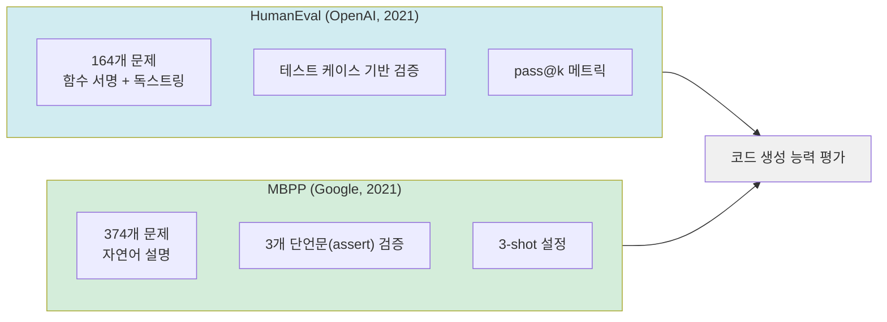

# HumanEval / MBPP

HumanEval과 MBPP(Mostly Basic Programming Problems)는 LLM의 코드 생성 능력을 평가하는 양대 표준 벤치마크다. 두 벤치마크는 서로 다른 난이도와 문제 출처를 가지며, 코드 생성 모델의 종합적 평가를 위해 함께 사용되는 경우가 많다.

## 두 벤치마크 개요



## HumanEval

OpenAI가 2021년 Codex 논문과 함께 공개한 벤치마크. 사람이 직접 작성한(hand-crafted) 164개의 Python 프로그래밍 문제로 구성된다.

### 문제 형식

```python
def has_close_elements(numbers: List[float], threshold: float) -> bool:
    """
    Check if in given list of numbers, any two numbers are closer to each
    other than given threshold.
    >>> has_close_elements([1.0, 2.0, 3.0], 0.5)
    False
    >>> has_close_elements([1.0, 2.8, 3.0, 4.0, 5.0, 2.0], 0.3)
    True
    """
```

모델은 함수 서명과 독스트링(docstring)을 입력받아 함수 본문을 완성해야 한다. 각 문제에는 평균 7.7개의 단위 테스트가 포함되며, 생성된 코드가 **모든 테스트를 통과**해야 정답으로 인정된다.

### pass@k 메트릭

HumanEval은 단순 정확도 대신 **pass@k** 메트릭을 사용한다. 문제당 $n$개의 코드를 생성했을 때, 그 중 적어도 하나가 맞으면 성공으로 계산하는 확률적 지표다.

$$\text{pass@k} = 1 - \frac{\binom{n-c}{k}}{\binom{n}{k}}$$

- $n$: 생성 횟수 (보통 200)
- $c$: 테스트 통과 횟수
- $k$: 허용 시도 횟수

실용적으로 pass@1은 단 1번 생성으로 맞출 확률(greedy decoding에 가까움), pass@10은 10번 시도 중 1번이라도 맞출 확률이다.

## MBPP (Mostly Basic Programming Problems)

Google Research가 2021년 공개한 벤치마크. 크라우드소싱으로 수집된 974개 기초 프로그래밍 문제 중 374개를 테스트셋으로 사용한다.

### 문제 형식

```python
# 자연어 설명
"Write a python function to find the minimum number of
rotations (greater than 0) required to get the same string."

# 3개의 단언문
assert find_Rotations("aaaa") == 1
assert find_Rotations("ab") == 2
assert find_Rotations("abc") == 3
```

HumanEval과 달리 함수 서명 없이 순수 자연어 설명만 주어진다. 평가는 3개의 `assert` 문으로 검증한다.

### 표준 설정

- **3-shot**: 3개의 예시 문제와 풀이를 프롬프트로 제공
- **few-shot**: 예시 없이 순수 능력만 측정

## 두 벤치마크 비교

| 특성 | HumanEval | MBPP |
|------|-----------|------|
| 문제 수 | 164 | 374 |
| 출처 | 수동 제작 (OpenAI) | 크라우드소싱 (Google) |
| 입력 형식 | 함수 서명 + 독스트링 | 자연어 설명만 |
| 테스트 수 | 문제당 ~7.7개 | 문제당 3개 |
| 난이도 | 중급 | 기초 |
| 언어 | Python | Python |
| 메트릭 | pass@k | pass@k / 단순 정확도 |

## 주요 모델 성능

| 모델 | HumanEval pass@1 | MBPP pass@1 |
|------|-----------------|-------------|
| Codex (2021) | 28.8% | 50.0% |
| GPT-4 (2023) | 67.0% | 80.1% |
| Claude 3.5 Sonnet | 92.0%+ | - |
| DeepSeek-Coder-V2 | 90.2% | 82.6% |

2024년 이후 상위 모델의 HumanEval pass@1이 90%를 넘어서면서 포화 징후가 나타나고 있다.

## 한계와 후속 벤치마크

- **HumanEval 포화**: 상위 모델들이 90%+를 달성하면서 변별력 저하
- **데이터 오염**: HumanEval 문제가 사전학습 데이터에 포함됐을 가능성 (특히 GitHub 크롤링 데이터)
- **단순 함수 수준**: 실제 소프트웨어 엔지니어링은 파일 여러 개, 의존성, 테스트 작성 등을 포함

후속 벤치마크:
- **HumanEval+**: EvalPlus 프로젝트, 테스트 케이스를 80배 확장해 강건성 측정
- **SWE-bench**: 실제 GitHub 이슈와 PR 기반, 파일 수정 능력 평가
- **LiveCodeBench**: 경쟁 프로그래밍 플랫폼의 최신 문제를 지속 수집

## 관련 문서

- [[humaneval]] - HumanEval 개념 상위 노드
- [[evaluation-harness]] - HumanEval/MBPP를 자동으로 실행하는 평가 프레임워크
- [[mmlu-benchmark-details]] - 지식 폭을 평가하는 보완적 벤치마크
- [[math-benchmark]] - 수학 추론 능력 평가 벤치마크
