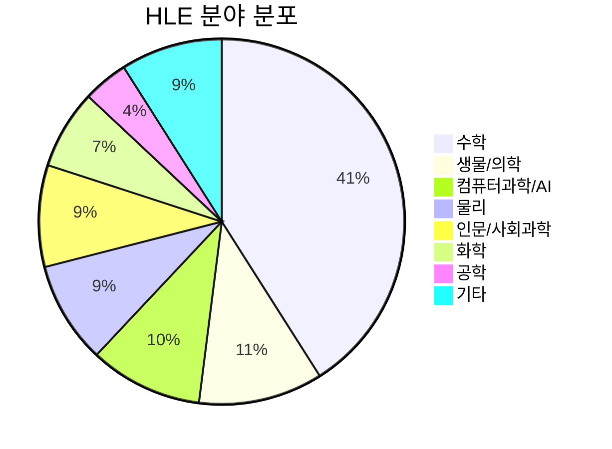
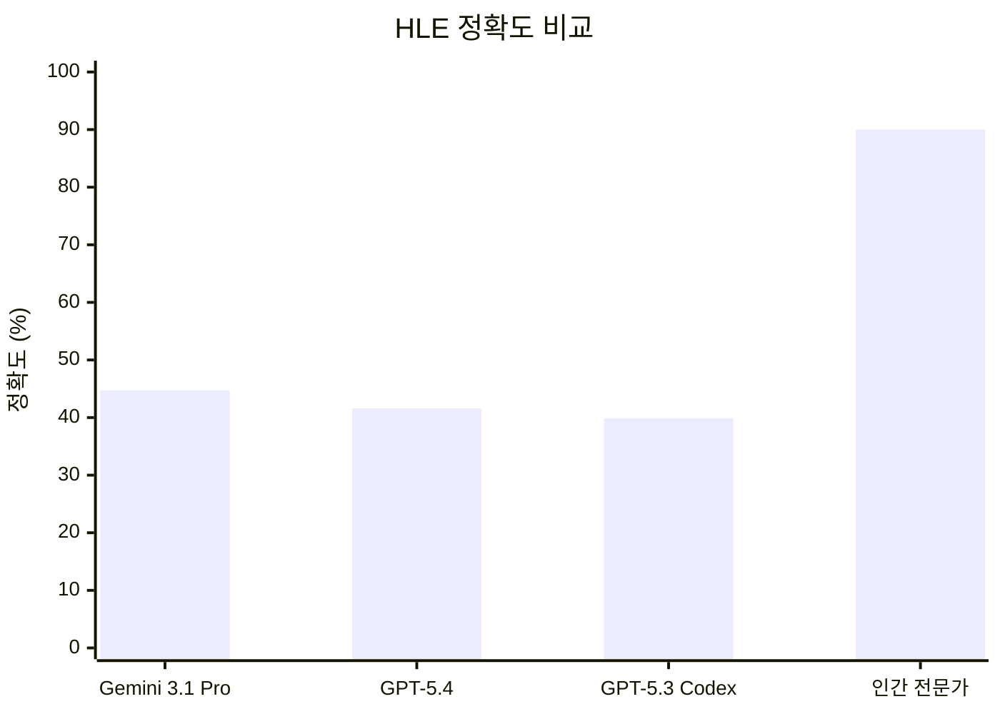

## 개요

Humanity's Last Exam(HLE)은 Center for AI Safety(CAIS)와 Scale AI가 공동 개발한 AI 벤치마크로, 기존 벤치마크([[arc-agi-2|ARC-AGI]]를 포함한 MMLU 등)가 포화 상태에 도달한 상황에서 최첨단 LLM의 한계를 더 효과적으로 측정하기 위해 설계되었다. CAIS 이사 Dan Hendrycks가 주도했으며, 2,500개의 전문가 검증 멀티모달 학술 문항으로 구성된다. 2026년 4월 기준 최고 성적은 [[gemini-3-1-pro|Gemini 3.1 Pro Preview]]의 약 44.7%로, 인간 전문가 추정 정답률(약 90%)과 큰 격차를 보인다. "Google-proof" 문항 설계로, 단순 정보 검색이 아닌 깊은 이해와 추론 능력을 요구한다.

## 벤치마크 구성

### 문항 규모 및 형식

| 항목 | 상세 |
|------|------|
| 총 문항 수 | 2,500개 |
| 난이도 | 대학원 수준 전문 지식 요구 |
| 객관식 | 약 24% |
| 단답형 / 정확한 답변 | 약 76% |
| 멀티모달 문항 | 약 14% (텍스트 + 이미지) |

### 분야 분포

수학이 41%로 가장 큰 비중을 차지하며, 생물/의학(11%), 컴퓨터과학/AI(10%), 물리(9%) 순이다. 특정 분야에 편중되지 않고 폭넓은 학술 영역을 포괄한다.

### 문항 설계 원칙

- **Google-proof**: 단순 검색으로 답을 찾을 수 없는 문항
- **전문가 수준**: 해당 분야 대학원 이상의 전문 지식 요구
- **멀티모달**: 텍스트와 이미지를 함께 이해해야 하는 문항 포함
- **정확한 답변**: 자유 형식 응답으로, 부분 점수 없이 정확한 답만 인정

## 모델별 성적 (2026년 4월 기준)

| 순위 | 모델 | 정확도 |
|------|------|--------|
| 1 | Gemini 3.1 Pro Preview (Google) | ~44.7% |
| 2 | GPT-5.4 xhigh (OpenAI) | ~41.6% |
| 3 | GPT-5.3 Codex xhigh (OpenAI) | ~39.9% |
| - | 인간 전문가 추정 | ~90% |

최고 성능 모델도 인간 전문가 대비 약 절반 수준의 정확도를 보이며, 이는 현재 LLM의 전문 학술 추론 능력에 여전히 큰 개선 여지가 있음을 보여준다.

## 기존 벤치마크와의 차이

| 항목 | MMLU / MMLU-Pro | HLE |
|------|----------------|-----|
| 난이도 | 학부-대학원 | 대학원-연구자 |
| 포화 여부 | 상위 모델 90%+ 도달 | 최고 ~44.7% |
| 문항 형식 | 주로 객관식 | 76% 단답형 |
| 멀티모달 | 텍스트 전용 | 14% 이미지 포함 |
| 검색 방어 | 일부 검색 가능 | Google-proof 설계 |
| 목적 | 일반 지식 평가 | AI 한계 측정 |

## 의의와 한계

[[ai-safety-alignment-2026|AI 안전성]] 연구의 관점에서 HLE는 모델 능력 추적의 주요 지표로 활용된다.

### 의의

- **AI 발전 척도**: 기존 벤치마크 포화 문제를 해결하여, 모델 간 의미 있는 성능 차이를 측정
- **안전성 연구**: CAIS(Center for AI Safety) 주도로, AI 능력 추적을 통한 안전성 연구 기반 제공
- **학술 커뮤니티 검증**: 전문가 검증 문항으로 학술적 신뢰성 확보
- **Nature 게재**: Nature지에 게재되어 학계에서 공식적으로 인정

### 한계

- 수학 편중(41%)으로 언어적/창의적 능력 평가는 제한적
- 정적 벤치마크로, 모델이 문항을 학습하면 시간이 지남에 따라 벤치마크 오염 가능
- 멀티모달 문항 비율(14%)이 낮아 시각적 추론 평가는 제한적

## 관련 문서

- [[arc-agi-2]] - ARC-AGI-2 벤치마크 (추상적 추론 평가)
- [[long-horizon-agent-benchmarks]] - 장기 에이전트 벤치마크
- [[component-level-agent-evaluation]] - 컴포넌트 수준 에이전트 평가
- [[galileo-ai]] - Galileo AI (LLM 평가 플랫폼)
