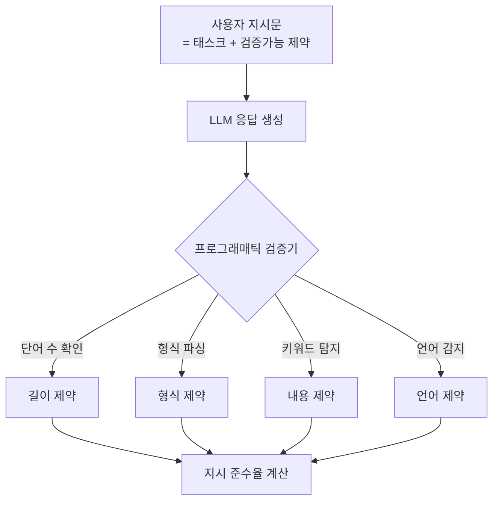
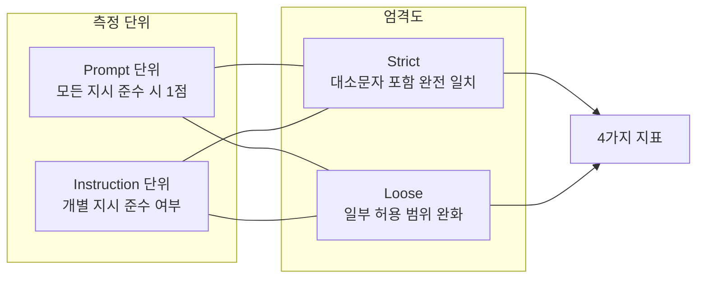

# IFEval 벤치마크

IFEval(Instruction Following Evaluation)은 LLM이 **구체적이고 검증 가능한 지시사항**을 얼마나 정확하게 따르는지 평가하는 벤치마크다. 2023년 Zhou 외 구글 연구진이 발표했으며, 기존 지시 준수 평가의 한계였던 주관적 판단 의존성을 제거하고 **프로그래매틱(programmatic) 자동 검증**으로 대체한 것이 핵심 차별점이다. [[instruction-tuning]] 연구에서 모델의 지시 준수 능력을 객관적으로 측정하는 표준 도구로 자리잡았다.

## 핵심 개념: 검증 가능한 지시사항

IFEval의 접근법은 간단하지만 강력하다. "좋은 답변을 써라"처럼 주관적인 지시 대신, 규칙 기반으로 참/거짓을 판별할 수 있는 구체적 지시사항만 사용한다.

**검증 가능한 지시사항 예시:**
- "답변을 500 단어 이상으로 작성하라" - 단어 수 세기
- "JSON 형식으로 답변하라" - JSON 파싱
- "bullet point를 사용하지 마라" - 마크다운 파싱
- "답변을 영어로 시작하라" - 첫 단어 언어 확인
- "문단을 3개 이상 사용하라" - 문단 수 세기



## 지시사항 유형 분류

IFEval의 지시사항은 25가지 유형으로 분류되며, 크게 4개 카테고리로 묶인다.

| 카테고리 | 예시 지시사항 |
|---------|-------------|
| 길이/형식 | 단어 수, 문장 수, 문단 수, 글자 수 제한 |
| 키워드 | 특정 단어 포함/제외, 키워드 반복 횟수 |
| 언어 | 언어 선택, 대소문자 강제, 구두점 제한 |
| 구조 | 마크다운 형식, JSON 형식, 목록 사용 여부 |

각 프롬프트에는 1-3개의 지시사항이 결합되어, 복합적인 지시 준수 능력을 테스트한다.

## 평가 지표

IFEval은 **4가지 지표**를 동시에 보고한다.



| 지표 | 설명 |
|------|------|
| Prompt-level Strict | 프롬프트 내 모든 지시사항 완전 준수 비율 |
| Prompt-level Loose | 완화된 기준으로 모든 지시사항 준수 비율 |
| Instruction-level Strict | 개별 지시사항 완전 준수 비율 |
| Instruction-level Loose | 개별 지시사항 완화 기준 준수 비율 |

일반적으로 리포트할 때는 **Prompt-level Strict Accuracy**를 대표값으로 사용한다.

## 데이터셋 구성

- 총 541개 프롬프트
- 1,206개 개별 지시사항 (프롬프트당 평균 2.2개)
- 각 프롬프트는 영어로 작성된 다양한 주제의 태스크

작은 규모이지만 자동 검증이 가능해 대규모 모델 비교에 효율적이다.

## 주요 모델 성능 비교

| 모델 | Prompt Strict Acc | Instruction Strict Acc |
|------|-------------------|------------------------|
| GPT-3.5-turbo | ~48% | ~57% |
| GPT-4 | ~76% | ~83% |
| Claude 2 | ~70% | ~78% |
| Gemini Pro | ~59% | ~69% |
| LLaMA-2 70B | ~42% | ~52% |

GPT-4가 기준점 역할을 하며, 지시 준수 능력은 모델 크기보다 [[instruction-tuning]] 품질과 RLHF 세부 조정에 더 크게 의존하는 경향이 있다.

## [[evaluation-harness]]에서의 사용

```bash
lm_eval --model hf \
  --model_args pretrained=your-model \
  --tasks ifeval \
  --output_path results/
```

IFEval은 제로샷으로 평가하는 것이 표준이다. 퓨샷 예시는 오히려 지시사항 해석에 혼란을 줄 수 있다.

## 다른 지시 준수 벤치마크와의 비교

| 벤치마크 | 검증 방법 | 주관성 | 특징 |
|---------|---------|--------|------|
| IFEval | 프로그래매틱 | 없음 | 검증 가능한 명시적 지시 |
| MT-Bench | LLM-as-judge | 있음 | 개방형 대화 품질 |
| AlpacaEval | LLM-as-judge | 있음 | 상대적 품질 비교 |
| FollowBench | 혼합 | 낮음 | 다단계 지시 체계 |

IFEval의 강점은 재현성과 자동화에 있으며, 약점은 검증 가능한 지시사항만 다루기 때문에 창의적 글쓰기나 복잡한 추론 품질은 평가하지 못한다는 점이다.

## 한계

**범위 제한**: 검증 가능한 형식/길이 제약에 초점을 맞추다 보니, 답변의 사실적 정확성이나 논리적 일관성은 평가 대상이 아니다.

**단순 지시 편향**: 복잡하고 모호한 실제 사용자 지시보다 명확하고 단순한 지시에 최적화되어 있다.

**소규모 데이터**: 541개 프롬프트는 통계적으로 충분하지만, 도메인 다양성이 제한적이다.

## 관련 문서

- [[evaluation-harness]] - IFEval을 포함한 통합 평가 프레임워크
- [[instruction-tuning]] - IFEval이 측정하는 능력의 핵심 학습 기법
- [[mmlu]] - 지식 기반 광범위 평가 벤치마크
- [[bbh-benchmark]] - 복잡한 추론 능력 평가
