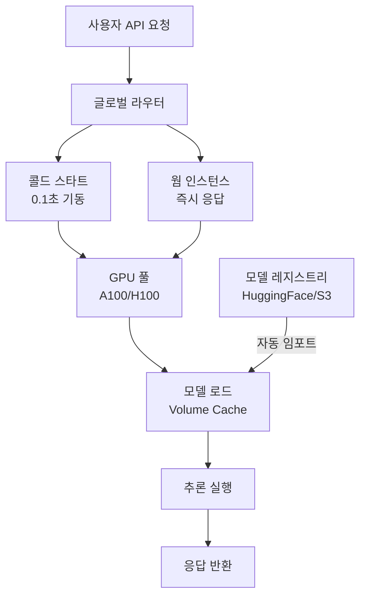

# Inferless - 서버리스 GPU 추론 플랫폼

Inferless는 ML 모델을 위한 서버리스 GPU(Serverless GPU) 추론 플랫폼이다. 콜드 스타트(cold start) 시간을 0.1초 수준으로 낮춘 빠른 기동이 핵심 차별점이며, A100/H100 GPU를 사용량 기반으로 과금한다. 모델 임포트 자동화, 커스텀 런타임 지원, 글로벌 엣지 배포를 통해 LLM 및 Stable Diffusion 계열 모델의 프로덕션 서빙을 단순화한다.

## 정체성

| 항목 | 내용 |
|------|------|
| 공식 명칭 | Inferless |
| 회사 | Inferless, Inc. |
| 설립 | 2022년 |
| 오픈소스 여부 | 클라우드 SaaS (런타임 SDK 일부 오픈소스) |
| 가격 모델 | 사용량 기반 (초당 GPU 시간 과금) / 무료 크레딧 제공 |
| 공식 문서 | https://docs.inferless.com |
| 지원 GPU | A10G, A100-40GB, A100-80GB, H100 |

## 핵심 아키텍처



위 다이어그램은 요청 라우팅부터 콜드/웜 인스턴스 선택, GPU 할당, 모델 로드, 추론 반환까지의 흐름이다.

## 핵심 기능

### 1. 초고속 콜드 스타트 (Cold Start)
Inferless의 가장 강조하는 특징은 콜드 스타트 시간을 업계 최저 수준인 약 0.1초(100ms)로 줄였다는 점이다. 이는 모델 가중치를 메모리에 미리 캐싱하고, 컨테이너 대신 더 경량의 실행 환경을 사용하는 최적화를 통해 달성된다. [교차검증 필요: 공식 벤치마크 수치이며, 모델 크기에 따라 달라질 수 있음]

### 2. 모델 임포트 자동화

Hugging Face Hub, AWS S3, Google Cloud Storage에서 모델을 직접 임포트할 수 있다. 별도의 도커 이미지 빌드 없이 모델 ID 하나로 배포가 가능하다:

```bash
# Inferless CLI로 HuggingFace 모델 배포
inferless deploy \
  --model-name "llama-3-8b-instruct" \
  --runtime "inferless-llama3-8b-vllm" \
  --source "huggingface" \
  --model-id "meta-llama/Meta-Llama-3-8B-Instruct"
```

### 3. 커스텀 런타임 (Custom Runtime)

표준 런타임 외에 사용자 정의 Python 코드를 통해 임의의 전처리/후처리 로직을 추가할 수 있다. `inferless.py` 파일에 입력/출력 스키마와 추론 코드를 정의한다:

```python
# inferless.py - Inferless 커스텀 런타임 진입점
import torch
from transformers import AutoModelForCausalLM, AutoTokenizer

class InferlessPythonModel:
    """Inferless 커스텀 모델 클래스"""
    
    def initialize(self) -> None:
        """콜드 스타트 시 1회 실행 - 모델 로드"""
        모델_경로 = "meta-llama/Meta-Llama-3-8B-Instruct"
        
        self.tokenizer = AutoTokenizer.from_pretrained(모델_경로)
        self.model = AutoModelForCausalLM.from_pretrained(
            모델_경로,
            torch_dtype=torch.bfloat16,
            device_map="auto"
        )
        self.model.eval()
    
    def infer(self, inputs: dict) -> dict:
        """각 요청마다 호출되는 추론 함수"""
        프롬프트 = inputs.get("prompt", "")
        최대_토큰수 = inputs.get("max_new_tokens", 512)
        온도 = inputs.get("temperature", 0.7)
        
        # 채팅 템플릿 적용
        메시지들 = [{"role": "user", "content": 프롬프트}]
        텍스트 = self.tokenizer.apply_chat_template(
            메시지들,
            tokenize=False,
            add_generation_prompt=True
        )
        
        입력_ids = self.tokenizer(텍스트, return_tensors="pt").to("cuda")
        
        with torch.no_grad():
            출력_ids = self.model.generate(
                **입력_ids,
                max_new_tokens=최대_토큰수,
                temperature=온도,
                do_sample=온도 > 0
            )
        
        # 입력 토큰 제외하고 생성된 부분만 디코딩
        생성_ids = 출력_ids[:, 입력_ids["input_ids"].shape[1]:]
        응답 = self.tokenizer.decode(생성_ids[0], skip_special_tokens=True)
        
        return {"response": 응답}
    
    def finalize(self) -> None:
        """리소스 정리 (선택적)"""
        del self.model
        del self.tokenizer
```

### 4. 입출력 스키마 정의

`input_schema.py`와 `output_schema.py`로 API 계약(contract)을 명시적으로 정의한다:

```python
# input_schema.py
INPUT_SCHEMA = {
    "prompt": {
        "datatype": "STRING",
        "required": True,
        "shape": [1],
        "example": ["안녕하세요, 오늘 날씨가 어떤가요?"]
    },
    "max_new_tokens": {
        "datatype": "INT16",
        "required": False,
        "shape": [1],
        "default": [512]
    },
    "temperature": {
        "datatype": "FP32",
        "required": False,
        "shape": [1],
        "default": [0.7]
    }
}
```

### 5. 자동 스케일링 (Auto-Scaling)

트래픽에 따라 GPU 인스턴스 수를 자동으로 조절한다. 최소/최대 인스턴스 수를 설정하고, 유휴 시 0으로 스케일 다운도 가능하다 (콜드 스타트 활성화 조건).

```yaml
# inferless.yaml - 배포 설정
version: "1.0"
name: "llama-3-8b-instruct"
runtime:
  source: "python"
  spec:
    scaling:
      min_replicas: 0    # 0으로 설정하면 유휴 시 완전 종료 (비용 절약, 콜드 스타트 발생)
      max_replicas: 10   # 최대 10개 인스턴스
    resources:
      gpu: "A100-80GB"
      cpu: "4"
      memory: "32Gi"
```

### 6. 스트리밍 응답

LLM 텍스트 생성에서 토큰 단위 스트리밍을 지원한다:

```python
import requests

def 스트리밍_추론(프롬프트: str) -> None:
    """Inferless API에서 스트리밍 응답 받기"""
    응답 = requests.post(
        "https://api.inferless.com/v1/your-model/infer",
        headers={"Authorization": "Bearer YOUR_API_KEY"},
        json={"prompt": 프롬프트, "stream": True},
        stream=True
    )
    
    for 청크 in 응답.iter_content(chunk_size=None):
        if 청크:
            print(청크.decode("utf-8"), end="", flush=True)
```

## 차별점 - 경쟁 서비스 비교

| 항목 | Inferless | Modal | Baseten | Replicate |
|------|-----------|-------|---------|-----------|
| 콜드 스타트 | ~0.1초 (주장) | 0.2-1초 | 1-5초 | 2-10초 |
| GPU 종류 | A10G, A100, H100 | T4~H100 | A10G, A100 | A40, A100 |
| 모델 임포트 | HF/S3/GCS 자동 | 코드로 정의 | HF/커스텀 | GitHub/커스텀 |
| 커스텀 코드 | 네 (inferless.py) | 네 | 네 | 네 (cog) |
| 스트리밍 | 지원 | 지원 | 지원 | 지원 |
| 과금 단위 | 초당 GPU 시간 | 초당 GPU 시간 | 초당 GPU 시간 | 예측 단위 |
| 최소 과금 | 없음 (0으로 스케일) | 없음 | 없음 | 없음 |

Inferless는 콜드 스타트 속도와 간단한 모델 임포트 자동화가 강점이다. Modal과 비교하면 ML 추론에 더 특화된 인터페이스를 제공하지만 범용 클라우드 컴퓨팅 기능(태스크, 크론, 복잡한 파이프라인)은 Modal이 더 풍부하다.

## 지원 런타임 및 프레임워크

Inferless는 주요 추론 최적화 백엔드를 런타임으로 제공한다:

```mermaid
flowchart LR
    Inferless[Inferless 런타임] --> vLLM[vLLM\nLLM 최적화]
    Inferless --> TGI[TGI\n(Text Generation Inference)]
    Inferless --> TRT[TensorRT-LLM\nNVIDIA 최적화]
    Inferless --> Python[Python 커스텀\n임의 프레임워크]

    vLLM --> LLM서빙[LLM 서빙 최적화\nPagedAttention]
    TGI --> HF모델[HuggingFace 모델\n직접 서빙]
    TRT --> NVIDIA[NVIDIA GPU 최대 성능\n커널 최적화]
    Python --> 디퓨전[Stable Diffusion\n기타 모델]
```

- **vLLM 런타임:** PagedAttention 기반 고효율 LLM 서빙. 동시 요청 처리 최적화
- **TGI 런타임:** Hugging Face Text Generation Inference. HF 모델과 최고 호환성
- **TensorRT-LLM 런타임:** NVIDIA 전용 커널 최적화. A100/H100에서 최대 처리량
- **Python 커스텀:** Stable Diffusion, 음성 모델, 멀티모달 등 임의 모델

## 실무 배포 가이드

### 빠른 시작 (CLI)

```bash
# 1. Inferless CLI 설치
pip install inferless

# 2. 인증
inferless login

# 3. 새 모델 프로젝트 초기화
inferless init --name "my-llm" --framework "python"

# 4. inferless.py 작성 (위 코드 참조)

# 5. 의존성 명시
cat > requirements.txt << 'EOF'
torch==2.2.0
transformers==4.40.0
accelerate==0.29.3
EOF

# 6. 배포
inferless deploy

# 7. 테스트 요청
inferless infer --model "my-llm" --data '{"prompt": "안녕하세요"}'
```

### GitHub Actions CI/CD 연동

```yaml
# .github/workflows/deploy-inferless.yml
name: Inferless 배포

on:
  push:
    branches: [main]

jobs:
  deploy:
    runs-on: ubuntu-latest
    steps:
      - uses: actions/checkout@v4
      
      - name: Python 설정
        uses: actions/setup-python@v5
        with:
          python-version: "3.11"
      
      - name: Inferless CLI 설치
        run: pip install inferless
      
      - name: 모델 배포
        env:
          INFERLESS_API_KEY: ${{ secrets.INFERLESS_API_KEY }}
        run: |
          inferless login --api-key $INFERLESS_API_KEY
          inferless deploy --name "production-llm"
```

## 한계 및 트레이드오프

### 콜드 스타트 검증
공식 0.1초 콜드 스타트는 특정 조건(소형 모델, 사전 캐싱 완료 상태)에서의 수치일 가능성이 높다. 70B 이상 대형 LLM은 가중치 로드 시간이 더 필요하다. [교차검증 필요]

### GPU 재고 가용성
인기 GPU(H100)는 피크 시간대 가용성이 제한될 수 있다. 중요한 프로덕션 워크로드는 최소 인스턴스 수를 1 이상으로 유지하는 것을 권장.

### 범용성 제한
Inferless는 ML 추론에 특화되어 있다. 데이터 파이프라인, 크론 작업, 웹 서비스 등 범용 서버리스 컴퓨팅은 [[modal-com-runtime]] 같은 범용 플랫폼이 더 적합.

### 에코시스템 성숙도
Modal, Baseten 등에 비해 오픈소스 생태계와 통합 예제가 상대적으로 적다. 커뮤니티 지원이 제한적일 수 있다.

### 데이터 지역성 (Data Residency)
글로벌 배포가 가능하지만 특정 규제(GDPR, HIPAA) 환경에서는 데이터 처리 지역을 확인해야 한다.

## 관련 문서

- [[modal-com-runtime]] - Modal 범용 서버리스 플랫폼 (비교 대상)
- [[e2b-ai-sandbox]] - E2B 코드 실행 샌드박스 (다른 유형의 GPU 환경)
- [[octo-ai-platform]] - OctoAI 모델 호스팅 플랫폼
- [[groq-cloud-api]] - Groq LPU 기반 초저지연 추론
- [[text-generation-inference-tgi]] - Hugging Face TGI (자체 호스팅)
- [[bentoml]] - BentoML 모델 서빙 프레임워크
