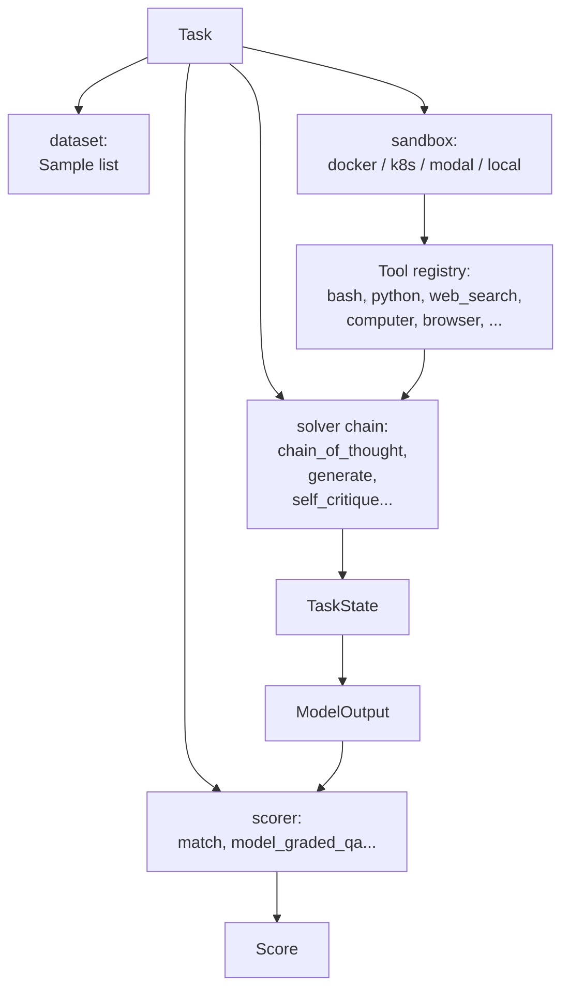

# Inspect AI (UK AISI)

> "Inspect AI is an open-source LLM evaluation framework from the UK AI Security Institute"

UK AI Security Institute 가 공개한 차세대 LLM eval framework. 핵심 추상화는 **Task → Solver → Scorer** 로 분리하고, 여기에 **Tool + SandboxEnvironment** 를 first-class 로 통합. **METR 이 자체 Vivaria framework 에서 Inspect 로 마이그레이션** 한 사실이 채택의 무게를 보여준다 (METR Time Horizon 1.1, 2026-01-29).

## 한 줄 정체성

Solver/Scorer/Tool/Sandbox first-class. **static eval 세대와 agent eval 세대를 잇는 차세대 표준** -- METR HCAST 와 [[lighteval]] 이 모두 Inspect 를 backend 로 채택한 것이 단적 증거.

## 핵심 primitives



```python
from inspect_ai import Task, task
from inspect_ai.dataset import example_dataset
from inspect_ai.solver import chain_of_thought, generate, self_critique
from inspect_ai.scorer import model_graded_fact

@task
def theory_of_mind():
    return Task(
        dataset=example_dataset("theory_of_mind"),
        solver=[
          chain_of_thought(),
          generate(),
          self_critique()
        ],
        scorer=model_graded_fact()
    )
```

CLI 실행:
```bash
inspect eval theory.py --model openai/gpt-4
```

## 1) Task

`Task(dataset, solver, scorer, sandbox=...)` 로 정의. 주요 필드:
- `dataset`: 라벨 있는 sample 모음
- `solver`: solver chain (모델을 호출/변형)
- `scorer`: solver 결과 평가
- `sandbox`: 격리 실행 환경 (Docker, k8s, etc.)

## 2) Solver -- 모델 호출/변형 단계

> "A solver is fundamentally a Python function implementing this pattern."

```python
async def solve(state: TaskState, generate: Generate) -> TaskState:
    # transform state, possibly calling generate()
    return state
```

`@solver` 데코레이터:
```python
@solver
def my_solver(parameter: str):
    async def solve(state: TaskState, generate: Generate) -> TaskState:
        # modify state
        return state
    return solve
```

### TaskState 주요 필드

| Member | Type | Purpose |
|---|---|---|
| `messages` | `list[ChatMessage]` | Chat history |
| `user_prompt` | `ChatMessageUser` | 첫 user message convenience |
| `output` | `ModelOutput` | 모델 최종 출력 |
| `input` / `input_text` | str / list[ChatMessage] | 원본 sample 입력 |

### Built-in solvers

- `generate()` -- 모델 호출 (`return await generate(state)`)
- `prompt_template()` -- `{prompt}` 치환 + metadata variable 치환
- `chain_of_thought()` -- "Standard chain of thought template with `{prompt}` substitution variable. Asks the model to provide the final answer on a line by itself at the end for easier scoring."
- `system_message()` -- system role 프리펜드
- `self_critique()` -- 모델에게 자기 비판 → 재생성

self_critique 시그니처:
```python
def self_critique(
    critique_template: str | None = None,
    completion_template: str | None = None,
    model: str | Model | None = None,
) -> Solver:
```

> Solvers must be `async` to "participate in Inspect's optimised scheduling for expensive model generation calls."

조기 종료: `state.completed = True`.

## 3) Scorer -- 평가 단계

```python
async def score(state: TaskState, target: Target) -> Score:
    # Compare state/model output with target
    return Score(value=...)
```

`@scorer(metrics=[...])` 데코레이터로 등록.

### Built-in scorers

- `includes()` -- output 안에 target 이 포함되는지 (case-sensitive 옵션)
- `match()` -- output 의 시작/끝에 target 일치
- `pattern()` -- regex 로 답 추출
- `answer()` -- `"ANSWER:"` prefix 답 형식
- `exact()` -- normalize 후 정확 일치
- `f1()` -- F1 score
- `choice()` -- multiple-choice 전용
- `math()` -- SymPy 기반 수식 비교 (optional dependency)
- `perplexity()` / `target_perplexity()` -- per-token NLL

### Model-graded scorers

`model_graded_qa()`:
> "Have another model assess whether the model output is a correct answer based on grading guidance contained in `target`."

주요 인자:
- `template` -- `{question}`, `{answer}`, `{criterion}`, `{instructions}` 치환
- `instructions` -- 기본은 `GRADE: C` / `GRADE: I` 형식 요청
- `model` -- grading 모델 override
- `partial_credit` -- 0.5 점 허용

`model_graded_fact()`: 사실 일치 여부에 특화. 인터페이스 동일.

Grading 모델 우선순위: explicit `model` > `model_role` binding > evaluated model.

### Score 객체

| 필드 | 의미 |
|---|---|
| `value` | str/int/float/bool 또는 시퀀스/매핑 |
| `answer` | output 에서 추출한 텍스트 (선택, 권장) |
| `explanation` | 추론 근거 / grader 출력 |
| `metadata` | 로깅용 추가 데이터 |

`Score.unscored()` -- 평가 불가 시 컨텍스트만 기록.

### Metrics

기본 metric: `accuracy()`, `mean()`, `stderr()`, `std()`, `bootstrap_stderr()`. `@metric` 데코레이터로 커스텀 가능. `grouped()` 로 metadata 별 분리, `stderr(cluster="field")` 로 클러스터 SE.

## 4) Tool -- 모델 도구 사용

```python
from inspect_ai.tool import tool

@tool
def add():
    async def execute(x: int, y: int):
        """Add two numbers."""
        return x + y
    return execute
```

> "Type annotations and descriptions are _required_ for tool declarations"

### 표준 built-in tools

**Computing tools**: web search, bash, python, bash_session (stateful), text editor, computer (스크린샷 데스크톱), code execution (sandboxed), web browser (headless Chromium)

**Agentic tools**: skill, update_plan (progress tracking), memory, think

Solver 에 통합:
```python
solver=[use_tools([list_files()]), generate()]
```

## 5) SandboxEnvironment -- 격리 실행

### API

```python
async def exec(
    self,
    cmd: list[str],
    input: str | bytes | None = None,
    cwd: str | None = None,
    env: dict[str, str] = {},
    user: str | None = None,
    timeout: int | None = None,
    timeout_retry: bool = True,
    concurrency: bool = True
) -> ExecResult[str]:
    ...

async def read_file(self, file: str, text: bool = True) -> Union[str | bytes]:
    ...

async def write_file(self, file: str, contents: str | bytes) -> None:
    ...
```

제한치:
- exec output 10MB (`INSPECT_SANDBOX_MAX_EXEC_OUTPUT_SIZE`)
- read_file 100MB (`INSPECT_SANDBOX_MAX_READ_FILE_SIZE`)

### 지원 sandbox provider

| Type | Package | Dockerfile |
|---|---|---|
| `docker` | built-in | yes |
| `k8s` | `inspect-k8s-sandbox` | yes |
| `daytona` | `inspect-sandboxes` | yes |
| `modal` | `inspect-sandboxes` | yes |
| `ec2` | `inspect_ec2_sandbox` | no |
| `proxmox` | `inspect_proxmox_sandbox` | no |
| `local` | built-in | no |

### Docker compose 예

```yaml
services:
  default: 
    build: .
    init: true
    command: tail -f /dev/null
    cpus: 1.0
    mem_limit: 0.5gb
    network_mode: none
```

`init: true` 종료 신호 응답, `network_mode: none` 인터넷 격리.

다중 환경:
```yaml
services:
  default:
    image: ctf-agent-environment
    x-local: true
  victim:
    image: ctf-victim-environment
    x-local: true
```

코드에서 `sandbox()` (default) / `sandbox("victim")` 으로 접근.

### Task / Sample 설정

```python
Task(
    dataset=dataset,
    solver=[use_tools([list_files()]), generate()],
    sandbox="docker",
    scorer=includes(),
)
```

샘플별 파일 + setup script:
```python
Sample(
    input='Check for "bar.txt"',
    target="Yes",
    files={"bar.txt": "hello"},
    setup="chmod +x script.sh"
)
```

### 동시성

- `max_sandboxes` -- 병렬 컨테이너 (기본 2 × CPU 수)
- `max_subprocesses` -- 동시 subprocess (기본 CPU 수)
- `max_samples` -- 동시 sample (기본 max_connections + 1)

> "Because of its async architecture, a single node can run dozens of evaluations in parallel with minimal resource usage."

## 채택 사례 (왜 차세대 표준인가)

1. **METR Vivaria → Inspect 마이그레이션** (2026-01-29 Time Horizon 1.1)
   -- long-horizon agent eval 의 reference 가 자체 framework 를 버리고 Inspect 로 이전
2. **HuggingFace [[lighteval]] 의 1차 backend**
   -- HF 가 자체 평가 framework 의 추천 backend 로 Inspect 채택
3. **UK AISI 자체 운영**
   -- 정부 산하 AI safety 기관의 공식 평가 인프라

## 다른 harness 와의 포지셔닝

| 측면 | Inspect AI | [[lm-evaluation-harness]] | [[openai-evals]] |
|---|---|---|---|
| 1차 추상화 | Task/Solver/Scorer | Task/LM | Eval/CompletionFn |
| Tool 통합 | first-class | 없음 | partial |
| Sandbox | first-class (Docker/k8s/Modal...) | 없음 | 없음 |
| Async 스케줄링 | first-class | 부분 (vLLM/HF) | 없음 |
| Agent eval 적합도 | very high | low | medium |
| 채택 사례 | METR, UK AISI | HF Leaderboard | OpenAI 내부 |

**METR migration 시사점**: long-horizon agent eval 인프라로는 Inspect 가 사실상 표준. METR Time Horizon 1.1 (2026-01-29) 보고에서 Vivaria→Inspect 전환 시 GPT-4o, o3 두 모델만 통계적으로 유의미하게 다른 결과 -> "scaffold sensitivity" 이슈 인정 (자세한 내용 [[long-horizon-eval-metr-gdpval]]).

## 출처

- 공식 docs: https://inspect.aisi.org.uk/
- Tasks: https://inspect.aisi.org.uk/tasks.html
- Solvers: https://inspect.aisi.org.uk/solvers.html
- Scorers: https://inspect.aisi.org.uk/scorers.html
- Tools: https://inspect.aisi.org.uk/tools.html
- Sandboxing: https://inspect.aisi.org.uk/sandboxing.html
- METR migration: https://metr.org/blog/2026-1-29-time-horizon-1-1/

## 관련 문서

- [[evaluation-harness]] -- 평가 harness 허브 페이지
- [[evaluation-harness-comparison]] -- 9개 harness 횡단 비교
- [[long-horizon-eval-metr-gdpval]] -- METR HCAST + GDPval (Vivaria→Inspect 마이그레이션)
- [[long-horizon-agent-benchmarks]] -- 장기 실행 agent 벤치마크
- [[lighteval]] -- HF 의 차세대 평가 toolkit (Inspect 를 1차 backend)
- [[lm-evaluation-harness]] -- 학술 baseline 표준
- [[agent-evaluation-framework]] -- agent 평가 프레임워크 개념
- [[agent-trajectory-evaluation]] -- 궤적 평가
- [[agent-sandbox-infrastructure]] -- 샌드박스 인프라
